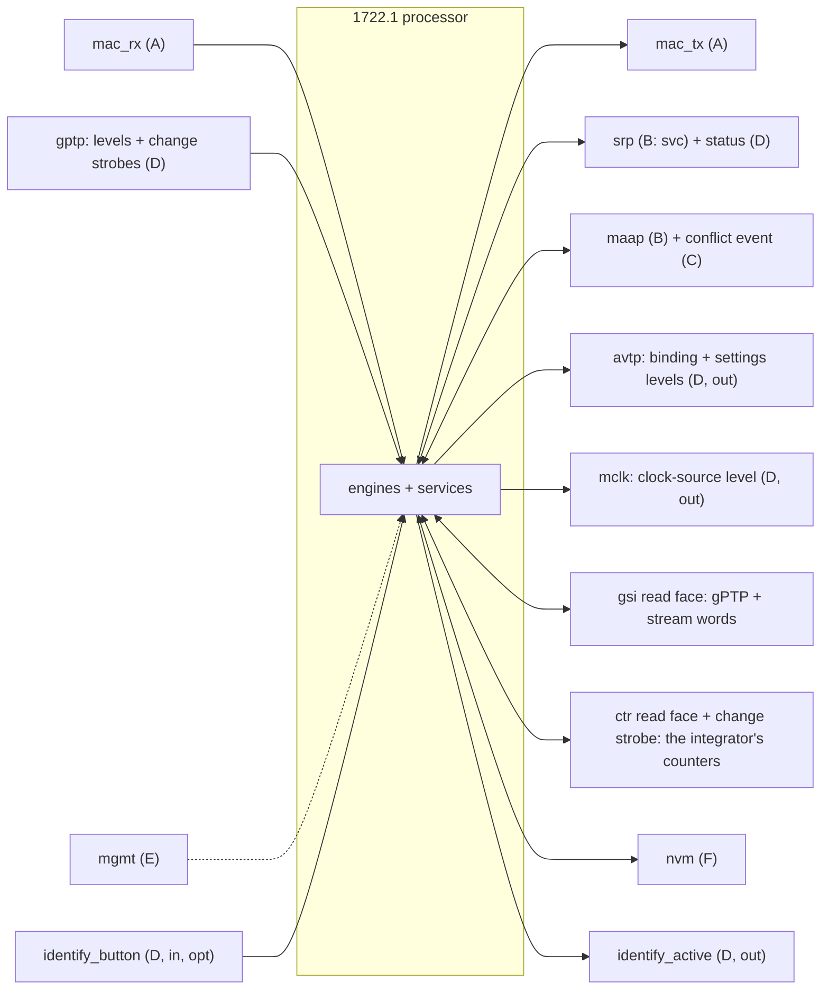
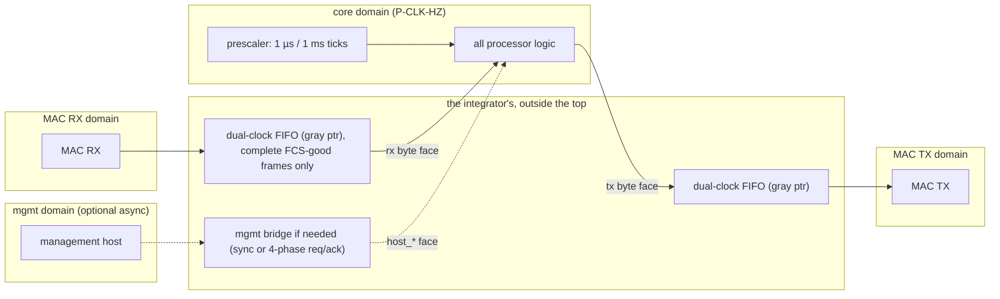
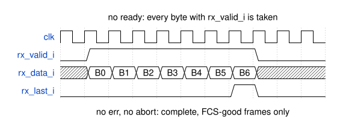
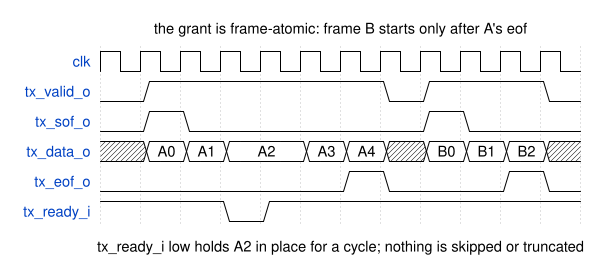
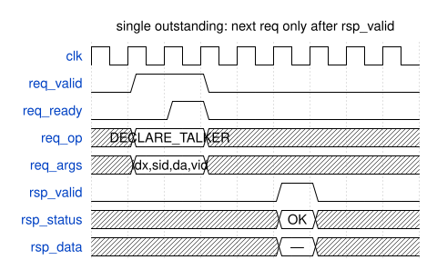
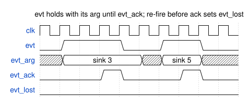
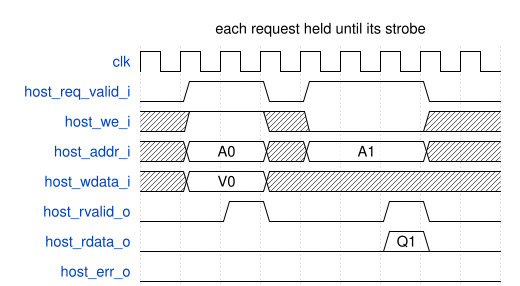
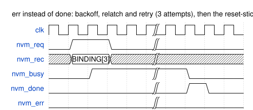

<!-- SPDX-License-Identifier: CERN-OHL-W-2.0 -->
# 02 — External Interfaces

Every contract the processor presents to the outside world. Interfaces are grouped in
six **classes**; each class has one template handshake (waveform) and per-instance
signal/operation tables. Nothing outside this document names an external signal — other
documents reference the instance names and the dictionary
[F02.10](#fig-02-statusdict).

## 1. Interface taxonomy

| Class | Kind | Instances | Template |
|---|---|---|---|
| **A** | Packet streaming (byte-wide frames: valid and last; TX adds sof and a ready) | `mac_rx`, `mac_tx` | [F02.3](#fig-02-rxwave)/[F02.4](#fig-02-txwave) |
| **B** | Request/response engine API (single outstanding) | `srp` (the `svc_*` face), `maap` | [F02.5](#fig-02-apiwave) |
| **C** | Event pulse with ack (sticky until acked) | the event router's internal events and timer expiries; at the top only the `maap` conflict pair | [F02.6](#fig-02-evtwave) |
| **D** | Level status (synchronized, sampled) | status dictionary | [F02.10](#fig-02-statusdict) |
| **E** | Memory-mapped side-port | `mgmt` | [F02.7](#fig-02-memwave) |
| **F** | NVM commit/restore | `nvm` | [F02.8](#fig-02-nvmwave) |

**The landed shape of `gptp`, `avtp` and `mclk`.** The original design gave each of
these a class-B op table and class-C events. The landed top serves them instead with
class-D levels in both directions, one-cycle change strobes, and two word-at-a-time
read faces the AECP engine gathers from (`gsi_*` and `ctr_*`); §4.3 to §4.6 give the
landed shape of each and name no op or event that no port serves. Exposing the adapters
is not a Milan requirement: Milan v1.2 states the wire behaviour of GET_STREAM_INFO,
SET/GET_CLOCK_SOURCE, START/STOP_STREAMING, GET_AVB_INFO, GET_AS_PATH and GET_COUNTERS
(§5.4.2.10, §5.4.2.15/.16, §5.4.2.19/.20, §5.4.2.23 to .25) and their Table 5.22
notifications, never an internal adapter API, and these faces serve all of it.

<a id="fig-02-landscape"></a>**F02.1 — Interface landscape**



<a id="fig-02-catalog"></a>**F02.9 — Instance catalog**

| Instance | Class | Dir | Clock domain | Consumers | Notes |
|---|---|---|---|---|---|
| `mac_rx` | A | in | core; the integrator's dual-clock FIFO crosses from MAC RX (§2) | packet engine | `rx_valid_i`, `rx_data_i[7:0]`, `rx_last_i`, no ready (§3); one trunk at the landed top (P-N-AVB-INTERFACES) |
| `mac_tx` | A | out | core; the integrator's dual-clock FIFO crosses to MAC TX (§2) | TX arbiter | `tx_valid_o`, `tx_sof_o`, `tx_data_o[7:0]`, `tx_eof_o`, `tx_ready_i` (§3); one trunk |
| `srp` | B+C+D | both | core | ACMP, AECP gather, NOTIF | talker/listener attribute ops; served by the internal SRP engine ([10](10_srp_engine.md)) or an external stack (`P-EN-SRP-ENGINE`) |
| `maap` | B+C | both | core | talker DA management | allocation + conflict events; served internally by [11](11_maap_engine.md) when `cfg_maap_internal_i` = 1 |
| `gptp` | D + strobes | in | core | ADP, NOTIF | `gm_id_i`, `gptp_domain_i`, `gm_change_i`; asCapable, propagation delay and the path are `gsi` words (§4.3) |
| `avtp` | D (out) | out | core | the integrator's stream datapath | binding, started and settings levels; the stream words are `gsi` words (§4.4) |
| `mclk` | D (out) | out | core | the integrator's media-clock selection | `aecp_clk_src_index_o` (§4.5); MVU MCR deferred ([06 §6.9](06_aecp_engine.md#69-mvu-commands)) |
| `gsi` | read face + strobes | both | core | AECP gather (GET_STREAM_INFO, GET_AVB_INFO, GET_AS_PATH, the SET_STREAM_FORMAT verdict), NOTIF | one word per beat, `gsi_wait_i` a hold (§4.3) |
| `ctr` | read face + strobe | both | core | AECP (GET_COUNTERS), NOTIF | the integrator's counters (§4.6) |
| `mgmt` | E | in | core: the `host_*` ports are in `clk_i`; a bridge from a management clock (sync or 4-phase req/ack) is the integrator's | model store, NVM, debug, ctrl/status | optional at runtime, needed for image load unless ROM |
| `nvm` | F | both | core | NVM manager | record-level, device-agnostic |
| `identify_active` | D | out | core | device indicator | level, 1 = identifying |
| `identify_button` | D | in | core (2FF sync) | identify sequencer (`KL_aecp_notify`) | optional (P-EN-IDENTIFY-NOTIFICATION, default 0): the top port `identify_button_i`, read only when the parameter is 1; debounced by the integrator |

## 2. Clocking, reset, CDC

<a id="fig-02-cdc"></a>**F02.2 — Clock/reset domains**



Rules (behavioral — no vendor primitives):

1. **One core clock domain** for the entire processor. `P-CLK-HZ` is free; the
   prescaler retunes the 1 µs/1 ms ticks ([08 §3](08_timing.md)).
2. MAC boundaries cross via **dual-clock FIFOs** (gray-coded pointers or equivalent),
   and the FIFOs are the **integrator's**: the top has one clock and no dual-clock
   FIFO, and its MAC faces are byte streams in the core domain (§3,
   [integrator guide §1](../guides/integrator.md#1-clocking-and-reset)). The handoff is
   frame-atomic: a frame is visible only when complete + good, or dropped. The RX face
   has no `err` and no abort, so the RX FIFO presents only complete, FCS-good frames
   ([integrator guide §3](../guides/integrator.md#3-the-mac-faces)).
3. `mgmt` is either synchronous to core or bridged by a 4-phase req/ack; single-bit
   inputs pass 2-flop synchronizers. The landed top takes link status already
   synchronized (`link_up_i`); `identify_button_i` is the one input whose 2-flop
   synchronizer is inside the core, and only with P-EN-IDENTIFY-NOTIFICATION = 1.
4. **Quasi-static configuration** (descriptor image, identity registers, parameters
   loaded via `mgmt`) is written only while `entity_enable = 0` and is treated as
   stable afterwards — no CDC needed post-enable. The configuration index is the
   one such value a controller supersedes at run time: `current_cfg_i` is the image
   default, and while the dynamic overlay's configuration row is written (by
   SET_CONFIGURATION, or by the boot restore of a saved configuration) the ADPDU
   carries that instead ([04 §3](04_adp_engine.md#3-pdu-handling)).
5. Reset: asynchronous assert, synchronous release, released in the boot-sequencer
   order ([01 §5](01_overview.md)); `entity_enable` is the master gate implementing
   ADP start gating (Milan §5.6.1), a request the processor forwards to ADP only once
   both restore walks are done (`restore_done_o`, [07 §5.3](07_memory_maps.md#fig-07-nvmflow)).

<a id="sec-02-class-a"></a>
## 3. Class A — packet streaming

The two MAC faces of `protocol_processor_top` are **byte** streams in the core clock
domain: one frame stream in, one out. Byte 0 of each frame is the first
destination-address octet. The dual-clock FIFOs that cross to the MAC clock domains are
the integrator's (§2 rule 2); the [integrator guide §3](../guides/integrator.md#3-the-mac-faces)
gives the wiring obligations.

| Signal | Dir | Width | Meaning |
|---|---|---|---|
| `rx_valid_i` | in | 1 | a frame byte is on `rx_data_i` this cycle, and the processor takes it |
| `rx_data_i` | in | 8 | the byte |
| `rx_last_i` | in | 1 | with `rx_valid_i`: the final byte of the frame |
| `tx_valid_o` | out | 1 | a frame byte is on `tx_data_o` |
| `tx_sof_o` | out | 1 | with `tx_valid_o`: the first byte of a frame |
| `tx_data_o` | out | 8 | the byte |
| `tx_eof_o` | out | 1 | with `tx_valid_o`: the final byte of the frame |
| `tx_ready_i` | in | 1 | the MAC side takes the byte; a byte moves on `tx_valid_o ∧ tx_ready_i` |

**RX has no backpressure.** There is no RX ready: the processor takes a byte in every
cycle `rx_valid_i` is 1. There is no `err` and no abort either, so a frame cannot be
poisoned once its first byte has gone in: the RX FIFO presents only complete frames whose
FCS checked good, and drops every other frame whole (§2 rule 2).

**TX stalls on `tx_ready_i`.** A granted frame streams from `tx_sof_o` to `tx_eof_o` with
no preemption (F02.4); holding `tx_ready_i` low holds the current byte in place and never
truncates the frame.

The RX stream carries frames already filtered on DA ∈ {unicast MAC, `91-E0-F0-01-00-00`}
and EtherType 0x22F0 when the external MAC can filter; the parser re-checks regardless
([03 §3](03_packet_engine.md)).

The original design specified this class as a 32-bit word stream with `ready`, `empty`
and `err`. No port of the landed top carries it; the contract and its two waveforms
are kept in [the class-A word-stream history](../history/02-class-a-word-stream.md).

<a id="fig-02-rxwave"></a>**F02.3 — RX byte face: no ready, end of frame on `rx_last_i`**



<details>
<summary>WaveDrom source (editable)</summary>

```wavedrom
{"signal": [
  {"name": "clk",        "wave": "p.........."},
  {"name": "rx_valid_i", "wave": "01......0.."},
  {"name": "rx_data_i",  "wave": "x=======x..", "data": ["B0", "B1", "B2", "B3", "B4", "B5", "B6"]},
  {"name": "rx_last_i",  "wave": "0......10.."}
],
 "head": {"text": "no ready: every byte with rx_valid_i is taken"},
 "foot": {"text": "no err, no abort: complete, FCS-good frames only"}}
```

</details>

<a id="fig-02-txwave"></a>**F02.4 — TX byte face: a granted frame runs sof to eof, stalled in place by `tx_ready_i`**



<details>
<summary>WaveDrom source (editable)</summary>

```wavedrom
{"signal": [
  {"name": "clk",        "wave": "p..........."},
  {"name": "tx_valid_o", "wave": "01.....01..0"},
  {"name": "tx_sof_o",   "wave": "010.....10.."},
  {"name": "tx_data_o",  "wave": "x===.==x===x", "data": ["A0", "A1", "A2", "A3", "A4", "B0", "B1", "B2"]},
  {"name": "tx_eof_o",   "wave": "0.....10..10"},
  {"name": "tx_ready_i", "wave": "1..01......."}
],
 "head": {"text": "the grant is frame-atomic: frame B starts only after A's eof"},
 "foot": {"text": "tx_ready_i low holds A2 in place for a cycle; nothing is skipped or truncated"}}
```

</details>

## 4. Class B — engine request/response APIs

One template contract for the two class-B instances that cross the landed top, `srp`
(the `svc_*` service face, §4.1) and `maap` (§4.2): **single outstanding request per
instance**; `req_valid ∧ req_ready` accepts; exactly one `rsp_valid` follows with
`rsp_status ∈ {OK, FAIL, UNSUPPORTED}` and instance-specific `rsp_data`. The other three
instances of the original design, `gptp`, `avtp` and `mclk`, are not class B in the
landed top (§1): §4.3 to §4.5 give their landed shape, and §4.6 the counters face.

**The read faces** (`gsi_*`, §4.3; `ctr_*`, §4.6; and GET_AUDIO_MAP's `amap_*`,
[06 §6.5](06_aecp_engine.md)). The AECP engine asks for one word at a time and holds its
selector outputs while it waits. `*_wait_i` is a **hold**, not a ready: 1 keeps the
beat, 0 says the word is on `*_data_i` now, so an unwired face answers zero at once,
and every gather is bounded by the AECP memory watchdog, `DESC_MEM_TMO_CYC_P` (the
engine's `MEM_TIMEOUT_CYC_P`, [06 §8.1](06_aecp_engine.md)). The engine reads these
faces and the class-D levels instead of issuing requests.

<a id="fig-02-apiwave"></a>**F02.5 — Engine-API template (all class-B instances)**



<details>
<summary>WaveDrom source (editable)</summary>

```wavedrom
{"signal": [
  {"name": "clk",       "wave": "p........"},
  {"name": "req_valid", "wave": "01.0....."},
  {"name": "req_ready", "wave": "0.10....."},
  {"name": "req_op",    "wave": "x=.x.....", "data": ["DECLARE_TALKER"]},
  {"name": "req_args",  "wave": "x=.x.....", "data": ["idx,sid,da,vid"]},
  {"name": "rsp_valid", "wave": "0....10.."},
  {"name": "rsp_status","wave": "x....=x..", "data": ["OK"]},
  {"name": "rsp_data",  "wave": "x....=x..", "data": ["—"]}
],
 "head": {"text": "single outstanding: next req only after rsp_valid"}}
```

</details>

### 4.1 `srp` — SRP/MSRP adapter operations

This contract is served by the **in-scope SRP engine** ([10](10_srp_engine.md)) when
`P-EN-SRP-ENGINE` selects it (the [F01.5](01_overview.md#7-parameter-master-table-f015) default), or by an external SRP stack otherwise — the ops, events
and status signals below are identical either way; no consumer can tell the
difference. That includes the shaper: the contract publishes the granted
per-source idleSlope and admission (class-D) because IEEE 802.1Q §34.6.1 runs
the credit-based shaper on `operIdleSlope` ("used by the credit-based shaper
algorithm (8.6.8.2) as its idleSlope"), §34.3(c) makes SRP the source of that
value whenever SRP is in operation, and §34.6.1.1 defines the per-stream
idleSlope this field carries — an external stack must publish the same two
fields or it cannot serve this contract.

| Op | Args | Result | Used by |
|---|---|---|---|
| `DECLARE_TALKER` | source idx, stream_id, dest MAC, VLAN, tspec (from format, Milan Table 4.4) | OK/FAIL | talker DA-gate ([05 §6bis](05_acmp_engine.md)) |
| `WITHDRAW_TALKER` | source idx | OK | MAAP conflict / PCP change flow |
| `DECLARE_LISTENER` | sink idx, state ∈ {READY, ASKING_FAILED, NONE} | OK | listener SM settle/teardown |
| `WITHDRAW_LISTENER` | sink idx | OK | unbind/teardown |
| `GET_DOMAIN` | SR class | {priority, default VID} | GET_AVB_INFO gather |

Class-C events from `srp`: `TK_ATTR_REGISTERED{sink, adv|failed}` /
`TK_ATTR_UNREGISTERED{sink}` (matched on the sink's settled {stream_id, DA, VLAN} —
exact match per Milan §5.3.8.9, matching done in the adapter),
`LISTENER_REG_CHANGE{source, state}`, `DOMAIN_CHANGE{class}`. Class-D status: see
[F02.10](#fig-02-statusdict).

### 4.2 `maap` — address allocation

| Op | Args | Result |
|---|---|---|
| `ALLOC_DA` | source idx | {dest MAC} or FAIL |
| `RELEASE_DA` | source idx | OK |

Events: `MAAP_CONFLICT{source}` → drives the withdraw → 2×LeaveAll → re-alloc →
re-declare flow ([05 §6bis](05_acmp_engine.md), backoff `T-SRP-LEAVEALL2`).

This face is a **processor-top port group** by default, and — since the MAAP
engine landed ([11](11_maap_engine.md)) — also an internal seam: the quasi-static
`cfg_maap_internal_i` selects whether the fabric's allocator answers through the
port group (0, the landed default, byte-identical) or `KL_pp_maap` answers
internally under this same contract with the port group quiesced and the claim
published on `maap_addr_o`/`maap_addr_valid_o`. Either way `GS_DECLARING` is
reachable only through `GS_DA_OK`, which is only ever written on an `ALLOC_DA`
success. An unconnected face with the internal engine disabled therefore pins the
published talker DA gate at 0 and stops every engine-driven `DECLARE_TALKER` — the
processor's talker half would be dead by construction.

**Degrade rule.** An allocator that is absent, slow or broken is a legal wiring.
**Both** halves of the transaction are bounded, because both can hang and they
hang differently:

| half | bound | what an unbounded version costs |
|---|---|---|
| request never ACCEPTED | `P-MAAP-ACCEPT-CYC` core clocks ([F01.5](01_overview.md#fig-01-params)), well inside `T-BUDGET-ACMP-RESP` | the one event-serialized walker parks in the request state — and it also answers `PROBE_TX` / `DISCONNECT_TX` / `GET_TX_STATE` for every source, so the talker half of ACMP *and* SRP goes silent |
| request accepted, never ANSWERED | `P-MAAP-RSP-MS` ([F01.5](01_overview.md#fig-01-params)) | the single-outstanding tracker is GLOBAL, so allocation stops for **every** source: no `GS_DA_OK`, no DA gate, no `DECLARE_TALKER`. Nothing wedges: command service continues while no stream can start |

Both abandons leave the source exactly where a refused `ALLOC_DA` leaves it — no
DA, no declaration, `PROBE_TX` answered `TALKER_DEST_MAC_FAILED` — and enabled
sources retry in paced, rotating rounds. The retry and command-service bounds
are specified in [05 §6bis](05_acmp_engine.md#6bis-talker-side-stateless-responder).
No allocator-availability event or new interface signal is required.
A `PROBE_TX` no longer forces an immediate `ALLOC_DA` in a round that already
attempted. Every enabled in-block source auto-acquires, so consumers allow one
`T-ACMP-DA-RETRY` round plus the source sweep and key each response by the source
index of its accepted request, rather than treating the last grant as source 0.

`P-MAAP-RSP-MS` is derived from **IEEE Std 1722-2016 Annex B**, because
`ALLOC_DA` maps onto a real MAAP claim walk. Table B.8 gives
`MAAP_PROBE_RETRANSMITS` = 3, so the Table B.7 walk acquires the address after
exactly 3 `probe_timer` intervals (`T-MAAP-PROBE`, B.3.4.2) per attempt, and a
conflicting probe/defend/announce restarts it (B.3.5.3). The
[F01.5](01_overview.md#fig-01-params) default covers a clean acquisition plus
four conflict restarts. It must also stay **below `T-SRP-DAFRESH`**: a
grant arriving after a demand-triggering `PROBE_TX` has gone stale cannot open
the gate without a registered Listener. Enable and periodic retry rounds now
request allocation independently of probes; the existing watchdog is retained.
The announce interval (`T-MAAP-ANNOUNCE`) is *not* in the bound —
the address is acquired on entry to `DEFEND`, before the first announce.

**`RELEASE_DA` is owed, not attempted.** The degrade rule above applies to
`ALLOC_DA` only. An allocation that cannot reach the face is safe to drop because
the stimulus that asked for it comes again (a probe, a listener, a timer); a
release has no such stimulus, and the DA-gate record naming the address is wiped
by the same event that asks for the release. So a release skipped because the
single-outstanding face was busy (the *normal* state for seconds at a time,
since `ALLOC_DA` is a real claim walk) leaves the address allocated with nothing
left to notice. The processor therefore books the debt per source and retries
until the face **accepts** it, which also covers the `P-MAAP-ACCEPT-CYC` abandon
(the flag is cleared by the accept, never by the offer). **IEEE Std 1722-2016**
permits the delay and forbids the loss: B.3.5.2 attaches no deadline to
`Release!`, Table B.7 leaves the machine legally in DEFEND (announcing and
defending an address it still holds) until the event arrives, and footnote c
makes the range free only once `Release!` has reached INITIAL. Releases are
ordered **ahead of** allocations, so a source that leaves and rejoins hands back
its old address before it asks for a new one. The teardown itself never waits:
`WITHDRAW_TALKER`, the record wipe and the timer cancel all land in the removal
event's own cycle whatever the face is doing.

**Stale responses.** A shim that accepted a request will answer it even after the
processor abandoned it. That answer must never install a DA: the source it was
for has moved on, and the tracker may already name a different one — installing
it would give two sources the same stream destination address. Responses are
therefore matched FIFO against a stale credit taken at each abandon, and swallowed
while one is outstanding. Under the single-outstanding rule above at most one can
ever be owed.

### 4.3 `gptp` — time-sync data

**Landed shape on `protocol_processor_top`** (interface 0; `P-N-AVB-INTERFACES` is 1).
No request reaches a gPTP stack: the integrator publishes the gPTP pair as levels,
strobes its changes, and answers the GET_AVB_INFO and GET_AS_PATH words on the `gsi_*`
read face.

| What it serves | Landed as | Dir |
|---|---|---|
| the ADPDU's `gptp_grandmaster_id` and `gptp_domain_number`, and the talker-discovery guard (Milan §5.6.2, §5.6.4.5.1) | `gm_id_i[63:0]`, `gptp_domain_i[7:0]`, class D | in |
| GM_CHANGE: the ADP re-advertise (Milan §5.6.3.5.7) and the GET_AVB_INFO notification (Milan Table 5.22) | `gm_change_i`, one cycle after a changed `gm_id_i` **or** `gptp_domain_i` is published | in |
| the link state, for ADP, the SRP Domain and the GET_AVB_INFO notification | `link_up_i`, a level already synchronised | in |
| GET_AVB_INFO's words (IEEE 1722.1-2021 §7.4.40.2): the grandmaster id, propagation delay, domain, flags (AS_CAPABLE and the rest of Table 7-148) and the msrp mappings | `gsi_*` kind 1: selector 0 the grandmaster id; 1 `{propagation_delay, domain, flags, msrp_mappings_count}`; 8 the msrp mapping of ordinal `gsi_ord_o` ([06 §6.10](06_aecp_engine.md#sec-06-gsi)) | out / in |
| a changed integrator-owned GET_AVB_INFO word (asCapable, propagation delay) | `gsi_avb_chg_i`, one-cycle strobe | in |
| GET_AS_PATH's words (§7.4.41.2): the path count and each ClockIdentity | `gsi_*` kind 2: selector 0 the count; 8 the path entry of ordinal `gsi_ord_o` | out / in |
| a changed path sequence, entry 0 on a new grandmaster included: the GET_AS_PATH notification | `gsi_asp_chg_i`, one-cycle strobe | in |
| the AVB_INTERFACE LINK_UP, LINK_DOWN and GPTP_GM_CHANGED counters | the integrator's, on the `ctr_*` face (§4.6) | — |

The `gsi_*` face, shared with §4.4:

| Signal | Dir | Meaning |
|---|---|---|
| `gsi_req_o` | out | a word is being asked for |
| `gsi_kind_o[1:0]` | out | 0 GET_STREAM_INFO, 1 GET_AVB_INFO, 2 GET_AS_PATH |
| `gsi_desc_type_o[15:0]`, `gsi_desc_index_o[15:0]` | out | the addressed descriptor |
| `gsi_sel_o[3:0]` | out | the word within the kind ([06 §6.2](06_aecp_engine.md#sec-06-stri), [06 §6.10](06_aecp_engine.md#sec-06-gsi)); bit 3 marks a record word |
| `gsi_ord_o[7:0]` | out | the record ordinal of a record word |
| `gsi_prop_fmt_o[63:0]` | out | the proposed stream format while SET_STREAM_FORMAT asks for its verdict (kind 0 selector 15) |
| `gsi_data_i[63:0]` | in | the word |
| `gsi_wait_i` | in | **HOLD** the beat |
| `gsi_avb_chg_i`, `gsi_asp_chg_i` | in | the two change strobes above |

The GET_AS_PATH µprogram reads the count and each entry from the face itself. asCapable
and path changes reach the processor only as the two `gsi` strobes, and no counter tick
leaves it.

### 4.4 `avtp` — streaming engine control

**Landed shape on `protocol_processor_top`.** The processor sends the streaming
datapath no requests. It publishes what that datapath needs as per-index levels (flat
packed vectors, index s at `[W·s +: W]`), and the integrator answers the GET_STREAM_INFO
words on the `gsi_*` face (§4.3).

| What it serves | Landed as |
|---|---|
| the bound stream of each Stream Input, to arm its RX filter and stream table at settle and disarm them at teardown (Milan §5.3.8; dropping AVTPDUs of another format, §4.4.2.2, is the integrator's) | `acmp_bound_o` (debounced), `acmp_bound_eid_o`, `acmp_bound_sid_o`, `acmp_bound_dmac_o`, `acmp_bound_vlan_o` |
| started or stopped, per Stream Input (Milan §5.3.8.7; START/STOP_STREAMING, §5.4.2.19/.20) | `aecp_strm_started_o` |
| the current format of each input and output (SET_STREAM_FORMAT, Milan §5.4.2.7) | `aecp_fmt_in_o` / `aecp_fmt_in_v_o`, `aecp_fmt_out_o` / `aecp_fmt_out_v_o`; the integrator's verdict on a proposed format is `gsi_prop_fmt_o` with kind 0 selector 15 |
| the presentation-time offset of each Stream Output (SET_STREAM_INFO, Milan §5.4.2.9) | `aecp_pt_offset_o` / `aecp_pt_offset_v_o` |
| the talker's transmit licence (Milan §4.3.3.1, §5.3.7.3) | `acmp_declaring_o`, `srp_active_o`, `srp_sr_admitted_o`, per source |
| whether a Stream Output is streaming, and every other GET_STREAM_INFO word the integrator owns (Milan §5.4.2.10) | `gsi_*` kind 0, selectors 0 to 7; an input's selectors 5 and 7 and selector 4's failure-code byte are served inside the processor ([06 §6.2](06_aecp_engine.md#sec-06-stri)) |
| the stream-health events Milan Tables 5.4 and 5.6 count | not processor events: the integrator counts them and serves the counts on the `ctr_*` face (§4.6) |

### 4.5 `mclk` — media clocking

**Landed shape on `protocol_processor_top`.**

| What it serves | Landed as |
|---|---|
| the clock source a controller selected for CLOCK_DOMAIN 0 (SET_CLOCK_SOURCE, Milan §5.4.2.15; saved, §5.3.11.1): the integrator switches its media clock to it | `aecp_clk_src_index_o[15:0]`, a level |
| the Milan media-clock reference defaults | no face: the MVU MEDIA_CLOCK_REFERENCE commands are waived ([06 §6.9](06_aecp_engine.md#69-mvu-commands)) |
| whether the domain's media clock is locked | the integrator's own level; its LOCKED and UNLOCKED counters are on the `ctr_*` face (§4.6, Milan Table 5.7) |

No clock request and no lock event crosses the top.

<a id="sec-02-ctr"></a>
### 4.6 `ctr` — the GET_COUNTERS read face and change strobe

**Landed shape on `protocol_processor_top`.** The counters GET_COUNTERS reports for
AVB_INTERFACE, CLOCK_DOMAIN, STREAM_INPUT and STREAM_OUTPUT are the **integrator's**
(owner decision 2026-09-19, processor issues #44 and #79): the events they count happen
in its datapath, and mirroring them here would cost a second copy of every tally. The
processor keeps no bank ([07 F07.10](07_memory_maps.md#fig-07-ctrmap)). GET_COUNTERS
READS this face, and the integrator's change strobe drives the Table 5.22 push
([06 §6.6](06_aecp_engine.md#sec-06-counters)):

| Signal | Dir | Meaning |
|---|---|---|
| `ctr_req_o` | out | a quadlet of a GET_COUNTERS response is being asked for |
| `ctr_desc_type_o` / `ctr_desc_index_o` | out | the object, straight off AECPDU @24 / @26 |
| `ctr_word_o` | out | 0..31 = `counters_block` quadlet at block byte 4·n (IEEE Table 7-157 for STREAM_INPUT); 32 = the `counters_valid` word itself |
| `ctr_data_i` | in | that quadlet, 32-bit unsigned, wrapping |
| `ctr_wait_i` | in | **HOLD** the beat; 0 means the answer is on `ctr_data_i` now |
| `ctr_change_i` | in | one-cycle strobe: a counter of the descriptor below changed (an increment, or a reset rule that cleared it); one descriptor per cycle |
| `ctr_change_desc_type_i` / `ctr_change_desc_index_i` | in | that descriptor, valid with the strobe |

The hold polarity is the contract's safety property: an integrator who leaves the
face unwired drives 0, every quadlet reads 0, `counters_valid` reads 0, and the
response says "this entity keeps no counters for that object" — which is what
§7.4.42.2 means by a clear valid bit. Claiming a bit whose quadlet never moves
is the one answer the face must never be able to produce by accident. A face
that holds forever is bounded by `DESC_MEM_TMO_CYC_P` (the engine's `MEM_TIMEOUT_CYC_P`, [06 §8.1](06_aecp_engine.md)).
The change strobe is the push's only trigger: tied 0, no unsolicited GET_COUNTERS is
ever sent.

What each descriptor type carries, what each counter counts, its wrap and reset rules,
and the integrator's AVB_INTERFACE duty (the edges of `link_up_i` and the grandmaster
identity changes) are the [integrator guide §7.1](../guides/integrator.md#counters-face).
The face is keyed by `{descriptor_type, descriptor_index}`, so a second AVB interface is
a second AVB_INTERFACE index on the same face.

## 5. Class C — events

The class-C template below is the **event router's** contract, inside the processor
(`KL_pp_event_router`): an event holds with its first argument until it is
acknowledged, and a re-fire before the ack coalesces into it and sets `evt_lost`, which
the router counts. One class-C pair crosses the landed top: the MAAP conflict
(`maap_conflict_valid_i` and `maap_conflict_src_i`, acknowledged on
`maap_conflict_ack_o`). Every other event the integrator raises is a one-cycle strobe,
or the edge of a level, on a port of its own; and no counter tick crosses the top in
either direction, because the counters are the integrator's (§4.6).

<a id="fig-02-evtwave"></a>**F02.6 — Event pulse with ack**



<details>
<summary>WaveDrom source (editable)</summary>

```wavedrom
{"signal": [
  {"name": "clk",      "wave": "p........."},
  {"name": "evt",      "wave": "01..0.1.0."},
  {"name": "evt_arg",  "wave": "x=...x=.x.", "data": ["sink 3", "sink 5"]},
  {"name": "evt_ack",  "wave": "0..10..10."},
  {"name": "evt_lost", "wave": "0........."}
],
 "head": {"text": "evt holds with its arg until evt_ack; re-fire before ack sets evt_lost"}}
```

</details>

Event catalog of the landed top: each event, what produces it, its form and its
consumers.

| Event | Produced by | Form | Consumers |
|---|---|---|---|
| `LINK_UP/DOWN` | `link_up_i` (the integrator, interface 0) | the edges of a level | ADP advertise SM, SRP Domain re-declare, NOTIF (GET_AVB_INFO); traced by the router; the internal MAAP engine (PortOperational!, [11](11_maap_engine.md)); the PRNG seed latch (first rise) |
| `GM_CHANGE` | `gm_change_i` (the integrator) | one-cycle strobe | ADP advertise SM, NOTIF (GET_AVB_INFO); traced by the router |
| a changed GET_AVB_INFO word (asCapable, propagation delay) | `gsi_avb_chg_i` (the integrator) | one-cycle strobe | NOTIF (GET_AVB_INFO) |
| a changed path sequence | `gsi_asp_chg_i` (the integrator) | one-cycle strobe | NOTIF (GET_AS_PATH) |
| a served counter changed | `ctr_change_i` with `ctr_change_desc_type_i` / `ctr_change_desc_index_i` (the integrator) | one-cycle strobe | NOTIF (GET_COUNTERS, `T-CTR-NOTIF`-limited) |
| `MAAP_CONFLICT{src}` | `maap_conflict_valid_i` / `maap_conflict_src_i` (the external allocator) | sticky until `maap_conflict_ack_o` | talker DA flow ([05 §6bis](05_acmp_engine.md)) |
| `TK_ATTR_REGISTERED/UNREGISTERED{sink}` | internal: the SRP engine | router, sticky until acked | ACMP listener SM (`EVT_TK_REGISTERED/UNREGISTERED`) |
| `EVT_TK_DISCOVERED/DEPARTED{sink}` | internal: the ADP engine | router, sticky until acked | ACMP listener SM |
| `TK_FAILURE_CHANGE{sink}` | internal: the SRP engine | strobe, wired directly and NOT routed | NOTIF (GET_STREAM_INFO) only: never the ACMP listener, never a Listener re-declaration ([10 §6.4](10_srp_engine.md)) |
| `TK_LATENCY_CHANGE{sink}` | internal: the SRP engine | strobe, wired directly and not routed | a committed `acc_latency[sink]` change on a registering Talker attribute; NOTIF (GET_STREAM_INFO) only; unchanged refreshes are silent ([10 §6.4](10_srp_engine.md)) |
| `LISTENER_REG_CHANGE{src}` | internal: the SRP engine | strobe; traced by the router | talker DA-gate, NOTIF (GET_STREAM_INFO), GET_TX_STATE data |
| `DOMAIN_CHANGE{class}` | internal: the SRP engine, also published on `srp_domain_change_o` | strobe; traced by the router | NOTIF (GET_AVB_INFO), talker PCP flow |
| timer expiries `{owner tag}` | internal: the timer service's expiry bus | bus | owning SM/engine ([08 §3](08_timing.md)) |

Stream-health changes and media-clock lock changes are not processor events at all:
the integrator counts them (§4.4, §4.5, §4.6).

## 6. Class D — level status dictionary

Table-only by design: these are synchronized levels with no transaction protocol; a
waveform would show nothing. Single source of truth for status names; the
GET_x gather paths ([06 §6.2](06_aecp_engine.md)) cite these names. Rows marked
internal are consumed inside the processor and add no top-level ports.

<a id="fig-02-statusdict"></a>**F02.10 — External status dictionary**

| Signal (per instance) | Width | Source | Sample rule | Consumed by | Landed as |
|---|---|---|---|---|---|
| `link_up[if]` | 1 | MAC/PHY | 2FF sync (the integrator's) + edge inside | ADP SM, SRP Domain, GET_AVB_INFO notification (the integrator's LINK_UP/LINK_DOWN count the same level, §4.6) | `link_up_i` (interface 0) |
| `gm_id[if]` | 64 | gptp | stable between GM_CHANGE events | ADPDU, discovery-SM match | `gm_id_i`; GET_AVB_INFO reads its own copy, `gsi` kind 1 selector 0 (§4.3) |
| `gptp_domain[if]` | 8 | gptp | idem | ADPDU, discovery-SM match | `gptp_domain_i`; GET_AVB_INFO: `gsi` kind 1 selector 1, bits [31:24] |
| `as_capable[if]` | 1 | gptp | level + change event | GET_AVB_INFO + notification | no port: the AS_CAPABLE bit of the flags byte (IEEE 1722.1-2021 Table 7-148), `gsi` kind 1 selector 1, bits [23:16]; change strobe `gsi_avb_chg_i` |
| `prop_delay_ns[if]` | 32 | gptp | read live at the gather beat | GET_AVB_INFO | no port: `gsi` kind 1 selector 1, bits [63:32]; change strobe `gsi_avb_chg_i` |
| `path_count[if]` | 16 | gptp | read at each GET_AS_PATH gather | GET_AS_PATH | no port: `gsi` kind 2 selector 0, the entries selector 8 at ordinal `gsi_ord_o`; change strobe `gsi_asp_chg_i` |
| `class_a_prio` / `class_a_vid` | 3 / 12 | srp | level + DOMAIN_CHANGE event | GET_AVB_INFO, talker declare | `srp_class_a_prio_o`, `srp_class_a_vid_o` |
| `tk_decl_state[src]` | 2 | srp | {NONE, ADVERTISE, FAILED — self-declared, permitted but unused by this profile ([10 §6.3](10_srp_engine.md))} | GET_STREAM_INFO(out), GET_TX_STATE | `srp_tk_decl_state_o` |
| `lstn_reg_state[src]` | 2 | srp | the registered Listener's FourPackedEvent (802.1Q §35.2.2.7.4): 0 NONE (Ignore), 1 ASKING_FAILED, 2 READY, 3 READY_FAILED. These codes live in ONE place, [`srp_pkg::srp_decl_e`](../../hdl/srp/srp_pkg.sv), and no module keeps a second copy; READY and READY_FAILED share bit 1, which is what the streaming reduction tests | GET_TX_STATE and GET_STREAM_INFO(out) REGISTERING_FAILED, DA-gate, the Milan §5.3.7.3 streaming reduction | `srp_lstn_reg_state_o` |
| `tk_reg_state[sink]` | 2 | srp | {NONE, ADVERTISE, FAILED} for the settled match | GET_STREAM_INFO(in), GET_RX_STATE | `srp_tk_reg_state_o` |
| `msrp_fail_code[x]` / `msrp_fail_bridge[x]` | 8 / 64 | srp | valid with FAILED states; zero outside them, except the internal sink bridge, which is the raw registrar latch gated once on `tk_reg_state[sink]` FAILED after the processor's index mux; input values read live per gather beat ([06 F06.13](06_aecp_engine.md#fig-06-lineage)) | GET_STREAM_INFO: input failure-code byte of selector 4 and bridge selector 5 are processor-owned; selector 5 has no external request for inputs | `srp_src_fail_code_o`, `srp_src_fail_bridge_o`, `srp_snk_fail_code_o`; the sink bridge is internal |
| `pbsta[sink]` / `acmpsta[sink]` | 3 / 5 | ACMP listener record (internal) | committed record RAM write; acmpsta zero outside PROBING_ACTIVE (Milan §5.3.8.6) | GET_STREAM_INFO input selector 7, served internally with no external request; changed commits trigger notification | internal, no port |
| `granted_slope_bps[src]` | 32 | srp | per-stream granted idleSlope while `sr_admitted[src]` = 1, else 0 (802.1Q §34.6.1.1) | CBS slope MUX, per-talker gate | `srp_granted_slope_bps_o` |
| `sr_admitted[src]` | 1 | srp | reservation admitted against the Σ-slope port ceiling | AVTP per-talker gate | `srp_sr_admitted_o` |
| `acc_latency[sink]` | 32 | srp | registered talker attr value | GET_STREAM_INFO(in) (+ P-INTERNAL-INGRESS-DELAY-NS) | `srp_acc_latency_o` |
| `streaming[src]` | 1 | avtp | level | GET_STREAM_INFO(out) derivation | no port: the integrator's STREAM_OUTPUT answers on `gsi` kind 0 (selector 0 flags, selector 6 flags_ex) carry it, and its STREAM_START / STREAM_STOP counters count its edges (§4.6) |
| `mc_locked[domain]` | 1 | mclk | level, the integrator's | the integrator's CLOCK_DOMAIN counters | no port: the LOCKED / UNLOCKED counters it drives are `ctr_*` quadlets 0 and 1, mask `0x00000003` (§4.6) |
| `identify_active` | 1 | identify handler | out; level | device indicator | `aecp_identify_o` (0 or 255) |
| `identify_button` | 1 | pin (optional) | 2FF in the core; debounce by the integrator (Milan §5.4.5.4 leaves its mapping to the user's action vendor-specific) | identification notification ([06 F06.16](06_aecp_engine.md#fig-06-identify)), `identify_button_i` | `identify_button_i` |

## 7. Class E — management side-port

Bus-agnostic single-master register/memory port; any host bridge (APB/AXI-lite/Avalon/
JTAG/testbench) maps 1:1 onto it. Word addressed, 32-bit data. The landed top presents it
as the `host_*` ports:

| Signal | Dir | Width | Meaning |
|---|---|---|---|
| `host_req_valid_i` | in | 1 | a request is present; hold it unchanged through the cycle of its `host_rvalid_o` (still 1 in the next cycle is a new request) |
| `host_we_i` | in | 1 | 1 = write |
| `host_addr_i` | in | 20 | word address |
| `host_wdata_i` | in | 32 | write data |
| `host_rdata_o` | out | 32 | read data, valid with `host_rvalid_o`; 0 on a refused access |
| `host_rvalid_o` | out | 1 | completion strobe, exactly one per request, at least one cycle after the request is taken (wait states allowed) |
| `host_err_o` | out | 1 | with `host_rvalid_o`: the access was refused and nothing was forwarded |

An APB bridge maps `psel` to `host_req_valid_i`, `pwrite` to `host_we_i`, `paddr` to
`host_addr_i`, `pwdata` to `host_wdata_i`, `prdata` to `host_rdata_o`, `pready` to
`host_rvalid_o` and `pslverr` to `host_err_o`. Unlike `pready`, `host_rvalid_o` is 0
while no request is in flight.

<a id="fig-02-memwave"></a>**F02.7 — Side-port: a write, then a read with one wait state**



<details>
<summary>WaveDrom source (editable)</summary>

```wavedrom
{"signal": [
  {"name": "clk",              "wave": "p........"},
  {"name": "host_req_valid_i", "wave": "01.01..0."},
  {"name": "host_we_i",        "wave": "x1.x0..x."},
  {"name": "host_addr_i",      "wave": "x=.x=..x.", "data": ["A0", "A1"]},
  {"name": "host_wdata_i",     "wave": "x=.x.....", "data": ["V0"]},
  {"name": "host_rvalid_o",    "wave": "0.10..10."},
  {"name": "host_rdata_o",     "wave": "0.....=0.", "data": ["Q1"]},
  {"name": "host_err_o",       "wave": "0........"}
],
 "head": {"text": "each request held until its strobe"}}
```

</details>

Address windows (word offsets; full map in [07 §5.5](07_memory_maps.md)):

| Window | Access | Contents |
|---|---|---|
| `0x00000` | W (pre-enable only) | descriptor image + identity load |
| `0x10000` | RO | dynamic-overlay debug view |
| `0x20000` | RO | registry + counters snapshot |
| `0x30000` | RW | control/status: `entity_enable`, `shutdown_req`, boot status, profile select |
| `0x40000` | RO | trace ring: 128-bit event records, each read as four 32-bit lanes, lane 0 = record bits [127:96] (shape `P-TRACE-RING`, [F01.5](01_overview.md#7-parameter-master-table-f015)) |
| `0x50000` | RW | firmware mailbox (only if `P-EN-FIRMWARE-ASSIST`; [GAP-13](../00_MILAN_COMPLIANCE_REVIEW.md#gap-13)) |

Lock interaction: side-port writes that mirror ATDECC state changes (names, sampling
rate, …) pass the **lock manager** check like any front-panel change and generate
notifications when unlocked (Milan §5.4.5.2) — enforced in the overlay write path, not
left to the host.

## 8. Class F — NVM port

Record-level, device-agnostic: an NVM manager presents {record id, payload}; the
backing implementation (SPI flash controller, EEPROM, host filesystem via `mgmt`) is
free. Long busy periods expected; the device's commits are asynchronous to protocol
responses ([03 §6](03_packet_engine.md) ordering rule d). What is not asynchronous is
the D3 writer's **latch**: to capture a coherent row it holds AECP dispatch briefly,
from ACQUIRE until one state-bus read completes (at most the running command's own
duration plus a few clocks), never across a media commit ([07 §5.3](07_memory_maps.md#fig-07-nvmflow)).

At the landed top both managers are inside the processor (§8.2), so this record-level
**manager face** is an internal seam: `KL_pp_nvm_port`'s `nvm_*` ports, directions as a
manager sees them, drawn by F02.8. The class-F ports of `protocol_processor_top` are the
port's **device face** below, which the integrator's backend serves.

| Manager face (inside the top) | Dir | Width |
|---|---|---|
| `req` / `we` | out | 1 / 1 |
| `record_id` | out | 8 |
| `wdata` / `rdata` | out / in | streamed bytes (record framing per [07 §5](07_memory_maps.md)) |
| `busy` / `done` / `err` | in | 1 each |
| `err_cause` | in | 2 — valid with `err`, 0 otherwise: **1** DEVICE, **2** UNFRAMED, **3** DEADLINE |

| Device face (top ports) | Dir | Width | Meaning |
|---|---|---|---|
| `nvm_dev_req_o` | out | 1 | command request, held until `nvm_dev_gnt_i` or withdrawn at the deadline (below) |
| `nvm_dev_gnt_i` | in | 1 | the backend accepted {op, region, offset, length} |
| `nvm_dev_op_o` | out | 2 | 0 READ, 1 WRITE, 2 ERASE (3 reserved) |
| `nvm_dev_region_o` | out | 8 | region id = record id |
| `nvm_dev_offset_o` / `nvm_dev_len_o` | out | 16 / 16 | byte offset within the region / byte count (ERASE: 0 = the whole region) |
| `nvm_dev_wvalid_o` / `nvm_dev_wready_i` / `nvm_dev_wdata_o` | out / in / out | 1 / 1 / 8 | the write byte stream |
| `nvm_dev_rvalid_i` / `nvm_dev_rready_o` / `nvm_dev_rdata_i` | in / out / in | 1 / 1 / 8 | the read byte stream |
| `nvm_dev_busy_i` | in | 1 | backend busy, informational: `done` and `err` delimit a command |
| `nvm_dev_done_i` / `nvm_dev_err_i` | in | 1 / 1 | one-cycle pulse: the device command completed / failed |

`err_cause` says what an `err` was, so a manager restoring a record can tell a failing
device from a record that is not there (processor issue #93). **DEVICE** is every error
the device raised, in any state, and every command the device ended short: a completion
before the command's final byte moved, in any data phase, the header read's eight bytes
included. **UNFRAMED** is a header the port itself refused after the device delivered it
whole, or a commit header the manager streamed, that failed the magic or length gate.
UNFRAMED does not prove erased media; it says the device answered with something that is
not a record. **DEADLINE** is an operation the port's own deadline ended: the device said
nothing, beside DEVICE's said no. Both managers read a zero-byte DEADLINE as they read
DEVICE: a failed walk, a failed write attempt ([07 §5.3](07_memory_maps.md#fig-07-nvmflow)).

<a id="sec-02-nvm-deadline"></a>**The port's deadline** (processor issue #15,
`T-NVM-PORT-DEADLINE`, `P-NVM-MEM-TMO-CYC`). The device face is free, but not silent: the
device presents each event it **owes** the port within `P-NVM-MEM-TMO-CYC` owed clocks of
the previous one. It owes one in every cycle the port waits on it (a grant while a request
is up, a write byte the port presents, a read byte the port is ready for, the terminal of a
command whose data phase is over, unless that terminal is already latched) and nothing
while the port or the manager holds the operation. Every grant, byte and terminal restarts
the count, so a slow device that keeps moving is never refused. A clock in which the device
owes nothing **pauses** the count and never restarts it, and each operation starts from
zero, so no handshake pattern on the manager face, `wvalid` or `rready` dropped however
often, keeps a silent device from the deadline. On the (`P-NVM-MEM-TMO-CYC` + 1)-th owed
clock without its event the operation ends: one `err`, cause DEADLINE, never `done`,
`busy` low at the pulse. The deadline ends the **operation**, never the device's command: a command the
device accepted and has not ended stays **owed**, the port requests nothing over it, takes
and discards the bytes an owed READ still owes (its length less those that moved before the
deadline) and no more, and takes the device's next `done` or `err` as its end, credited to
no operation. A request that arrives meanwhile is answered within the deadline: served once
the device has ended the abandoned command, one `err` DEADLINE while it stays silent or
presents bytes past the READ's length, which the port does not take. Nothing is released
on time; only the device's own terminal or a reset
ends the owed state, so a WRITE the port abandoned on a device that waits for its next byte
for ever is **contained**: every later request ends DEADLINE until reset. `nvm_dev_gnt_i`
means the device accepted the command, and it comes at most one cycle after the edge that
sampled the request: a backend that registers its grant can take a request on the very
edge the deadline withdraws it, and that command is then owed.

<a id="fig-02-nvmwave"></a>**F02.8 — NVM commit on the manager face (broken axis over the busy period)**



<details>
<summary>WaveDrom source (editable)</summary>

```wavedrom
{"signal": [
  {"name": "clk",      "wave": "p....|...."},
  {"name": "nvm_req",  "wave": "01.0.|...."},
  {"name": "nvm_rec",  "wave": "x=.x.|....", "data": ["BINDING[3]"]},
  {"name": "nvm_busy", "wave": "0.1..|.0.."},
  {"name": "nvm_done", "wave": "0....|.10."},
  {"name": "nvm_err",  "wave": "0....|...."}
],
 "head": {"text": "err instead of done: backoff, relatch and retry (3 attempts), then the reset-sticky alarm"}}
```

</details>

Boot restore is the mirror image (`we = 0`), in two walks: the binding manager's, then,
from the listener's release, the D3 writer's. The D3 walk first proves the descriptor
image, reads every record twice, validates the frame and the value, and ends COMPLETE,
DEFAULTS (done and failed, rolled back if pass 1 had applied anything) or CLOSED (an
unprovable image: never done). ADP's enable is `entity_enable_i && restore_done_o`, the
done of both walks; CLOSED never releases it. Which failures are one record's default and
which fail a walk is [07 §5.3](07_memory_maps.md#fig-07-nvmflow)'s tables.

### 8.1 What the integrator reads while a commit is outstanding

The device face above says a transaction is running; it does not say whether any
state is waiting to be written. An integrator that publishes a "saved state
pending" bit observes the following top-level outputs. They do not change behaviour.

| Signal | Dir | Width | When |
|---|---|---|---|
| `nvm_unflushed_o` | out | `P-N-STREAM-IN` | the binding manager's: bit k is 1 from the cycle the manager ACCEPTS a changed binding for sink k (a write-back that moves no persisted field never raises it) until that record commits with `done`, or until it gives up after three attempts — which is the same cycle `nvm_alarm_o` rises. A capture that lands mid-flush holds the bit: the burst re-serializes. |
| `d3_unflushed_o` | out | 1 | the D3 writer's: 1 from the cycle after the dynamic-state store accepts a write that changes a persisted row's `{value, valid}`, or the descriptor store accepts a name-lane write (`aecp_name_wr_o`), until every such record's WRITE has ended with an untainted `done` or its attempts are exhausted. The integrator's pending is `(|nvm_unflushed_o) | d3_unflushed_o`. |
| `nvm_alarm_o` | out | 1 | either producer exhausted a record's three write attempts; set until reset, whatever later writes do. |
| `aecp_dyn_dirty_o` | out | 1 | a sticky diagnostic of the dynamic-state store (any row written since reset); not pending and not a persistence trigger. |
| `aecp_name_wr_o` | out | 1 | one `clk_i` cycle per accepted live 64-bit name-lane write, sampled at the same rising edge that writes the descriptor store. Multi-lane names pulse once per written lane; unchanged lanes, boot loading, the D3 writer's restore of a saved name, refused/out-of-range commands and writes aborted before acceptance do not pulse. Earlier accepted writes remain visible if a command later aborts. No ready/ack; leave unused with an explicit `.aecp_name_wr_o()` connection. |
| `aecp_nvm_stb_o` / `aecp_nvm_mark_o` | out | 1 / 8 | one `clk_i` cycle per committed command that carries the µCPU's `NVM_MARK` effect, with the mark code naming the record group: **1** a dynamic-state field (sampling rate, clock source, configuration index, stream format, stream info), **6** channel maps, **7** user names. The code is meaningful only while the strobe is 1. A mark is a **completion notification**: it selects no record and triggers no persistence. |

Two record producers live inside this processor: the binding manager and the D3 writer
(the scalar records: configuration, sampling rates, clock sources, both stream-format
directions, presentation offsets; and the user names, one record per name-table entry).
Each is triggered by its accepted live write, never by a mark: a name by the accepted
name-lane write (`aecp_name_wr_o`, which precedes the unchanged group-7 mark). The
channel maps are **the integrator's to persist** (the manager's ruling on processor issue
#83, which amends the saved-state contract's map stage): it writes records `0x60`/`0x70`
from the phase-5 edit commit beat (`amap_edit_req_o` with `amap_edit_phase_o == 5`),
restores them after `restore_done_o` and before it requests the enable, and puts each
port's reset set back when the D3 walk rolls back (`restore_rb_o`). The D3 roll-back
resets the two AECP stores only, and neither pending output covers a map
([07 §5.1](07_memory_maps.md#51-persisted-vs-volatile-normative-set-req-per-001002)).

The top's restore verdicts are combined over both walks ([07 §5.3](07_memory_maps.md#fig-07-nvmflow)):
`restore_done_o`, `restore_busy_o`, `restore_fail_o`, `restore_blank_o` (done and not
failed, nothing validated by either walk), `restore_closed_o`, `rs_cause_o[2:0]` (the D3
walk's cause), `restore_rb_o` (a D3 roll-back ended DEFAULTS) and `restore_cause_o[1:0]`
(the binding walk's cause). Inside the processor, the D3 writer owns AECP dispatch from
reset to its terminal, reads the descriptor store's validated-image level for its image
proof, and holds its roll-back of both stores while the descriptor-memory guard's debt is
set; none of these is a top port.

These signals are in the `clk_i` domain. Consumers in another clock domain
own the crossing; single-cycle events need pulse capture or an event handshake.

### 8.2 Two record managers, one port

[`KL_pp_nvm_mgr_arb`](../../hdl/packet_engine/KL_pp_nvm_mgr_arb.sv) sits between the
port's manager face and its managers: the binding manager is manager 0, and manager 1 is
the processor's D3 saved-state writer (`KL_aecp_nvm_writer` inside the AECP engine). The
device face keeps exactly one sequential initiator.

| Rule | Realization |
|---|---|
| Ownership is per operation. | the manager whose request the port accepted owns every data phase and the `done` or `err` (with its cause) that ends it; the other sees none of them |
| A manager-0 request only ever meets an idle port. | manager 0 raises a registered one-cycle request after it reads the port idle, so the busy it reads also covers the cycle manager 1 is granted. Manager 1 holds its request until its grant; on a tie at an idle port manager 0 wins |
| An abandoned READ is **drained**, never handed on. | the port's answers name no operation, so when a read's owner abandons it (either walk's deadline, [07 §5.3](07_memory_maps.md#fig-07-nvmflow)) the arbiter keeps the operation: it holds `rready`, discards the late bytes, swallows the `done` or `err`, and grants neither manager until then. An abort presented with the READ's own strobe, in the cycle the arbiter issues it, arms the drain in that cycle, for either manager: the binding walk's registered strobe can meet the aggregate deadline there. Only reads are abandoned: a write stream is never cut |
| The drain ends **only** on that operation's own `done` or `err`. | never on time here. A device that never ends the abandoned read is answered by the port's own deadline ([§8](#sec-02-nvm-deadline)): its `err`, cause DEADLINE, ends the drain, and the port keeps the read **owed**, requesting nothing over it, until the device ends it or a reset. Every later change is then attempted three times, each ended DEADLINE with no device command, and given up with `nvm_alarm_o`, which drops its pending bit in `nvm_unflushed_o` or `d3_unflushed_o`. Nothing is released on time: the port serves again only after the device's own terminal (processor issue #15) |

## 9. Parameterization

Widths/depths referenced here: `P-N-AVB-INTERFACES`, `P-N-STREAM-IN/OUT` (dictionary
array sizes), `P-CLK-HZ` (prescaler), `P-EN-FIRMWARE-ASSIST`,
`P-EN-IDENTIFY-NOTIFICATION` — values in [F01.5](01_overview.md#fig-01-params).
