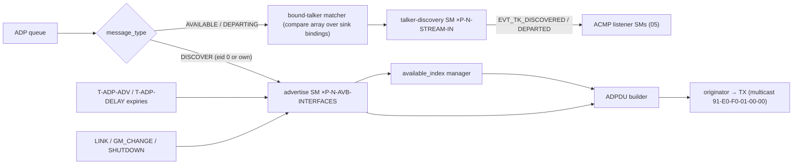
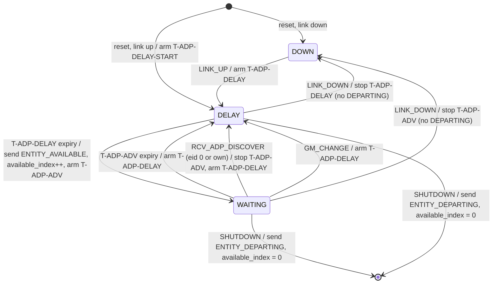
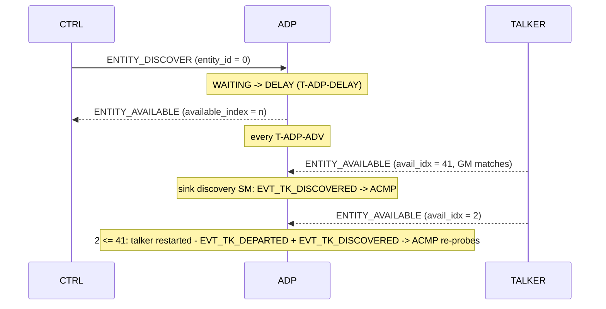

<!-- SPDX-License-Identifier: CERN-OHL-W-2.0 -->
# 04 — ADP Engine (discovery)

## 1. Role and scope

Advertises this entity and tracks the availability of **bound talkers** for the ACMP
listener machines. Pure hardwired FSMs — no microcode (3 message types, one fixed
68-byte PDU, all fields register-sourced).

| Responsibilities | Non-goals |
|---|---|
| ENTITY_AVAILABLE advertising per AVB interface (Milan §5.6.3) | a general network entity table with aging — that is a *controller* concept, deliberately absent ([GAP-16](../00_MILAN_COMPLIANCE_REVIEW.md#gap-16)) |
| ENTITY_DISCOVER responses; ENTITY_DEPARTING on shutdown | discovery of anything other than bound talkers |
| `available_index` management | |
| Per-bound-sink talker-discovery SM feeding ACMP | |

## 2. External contract

Consumes: ADP queue transactions ([03 §4](03_packet_engine.md)); timer expiries
`T-ADP-*`; events `LINK_UP/DOWN{if}`, `GM_CHANGE{if}`; `SHUTDOWN` request; class-D
`gm_id[if]`, `gptp_domain[if]` ([F02.10](02_interfaces.md#fig-02-statusdict)).
Produces: ADP TX requests to the originator; `EVT_TK_DISCOVERED{sink}` /
`EVT_TK_DEPARTED{sink}` to the ACMP listener SMs. It counts nothing: the
AVB_INTERFACE LINK_UP, LINK_DOWN and GPTP_GM_CHANGED counters are the integrator's,
counted from the same `link_up_i` it drives and from its own grandmaster identity
changes ([02 §4.6](02_interfaces.md#sec-02-ctr); owner decision on processor issue
#44).

## 3. PDU handling

<a id="fig-04-adpdu"></a>**F04.5 — ADPDU** (68 B, cdl = 56, IEEE Fig 6-1; lanes
bottom→top = wire order; `@n` byte offsets authoritative)


<details>
<summary>WaveDrom source (editable)</summary>

```wavedrom
{"reg": [
  {"bits": 8,  "name": "subtype @0 = 0xFA"},
  {"bits": 1,  "name": "h=0"},
  {"bits": 3,  "name": "ver=0"},
  {"bits": 4,  "name": "message_type @1"},
  {"bits": 5,  "name": "valid_time @2 (Milan: 10)"},
  {"bits": 11, "name": "cdl = 56"},
  {"bits": 64, "name": "entity_id @4"},
  {"bits": 64, "name": "entity_model_id @12"},
  {"bits": 32, "name": "entity_capabilities @20"},
  {"bits": 16, "name": "talker_stream_sources @24"},
  {"bits": 16, "name": "talker_capabilities @26"},
  {"bits": 16, "name": "listener_stream_sinks @28"},
  {"bits": 16, "name": "listener_capabilities @30"},
  {"bits": 32, "name": "controller_capabilities @32 = 0"},
  {"bits": 32, "name": "available_index @36"},
  {"bits": 64, "name": "gptp_grandmaster_id @40"},
  {"bits": 8,  "name": "gptp_domain_number @48"},
  {"bits": 8,  "name": "reserved @49"},
  {"bits": 16, "name": "current_configuration_index @50"},
  {"bits": 16, "name": "identify_control_index @52"},
  {"bits": 16, "name": "interface_index @54"},
  {"bits": 64, "name": "association_id @56 = 0"},
  {"bits": 32, "name": "reserved @64"}
], "config": {"bits": 544, "lanes": 17, "hspace": 950}}
```

</details>

Message types: 0 ENTITY_AVAILABLE · 1 ENTITY_DEPARTING · 2 ENTITY_DISCOVER.
`valid_time` = 0 in DEPARTING/DISCOVER (IEEE §6.2.2.5).

**Field-sourcing table** (every TX field ← one owner):

| Field | Source | Rule |
|---|---|---|
| `valid_time` | constant | **10** (2-s units ⇒ 20 s validity; cadence `T-ADP-ADV`) — Δ5 |
| `entity_id`, `entity_model_id` | config/ID registers | model id ≠ 0/≠ all-1s; changes on structural model change (Milan §5.3.1); the packer's model lint reports the value, refuses an invalid or disagreeing one and checks a recorded digest ([07 §3.1](07_memory_maps.md#model-lint) L9) |
| `entity_capabilities` | constant | [F04.6](#fig-04-caps) |
| `talker_stream_sources` / `listener_stream_sinks` | model metadata | **max across all configurations** (Milan §5.3.3.1); reported and checked by the model lint ([07 §3.1](07_memory_maps.md#model-lint) L11) |
| `talker_capabilities` / `listener_capabilities` | config registers | Milan-unconstrained; per IEEE Tables 6-3/6-4: IMPLEMENTED 0x0001 + AUDIO_SOURCE/SINK 0x4000 (+ MEDIA_CLOCK_SOURCE/SINK 0x0800 if CRF outputs/inputs) — review §8 item 6 |
| `controller_capabilities` | constant 0 | not a controller |
| `available_index` | available_index manager | [§5](#5-state) |
| `gptp_grandmaster_id` / `gptp_domain_number` | class-D `gm_id[if]`, `gptp_domain[if]` | sampled at PDU build; per-interface |
| `current_configuration_index` | dynamic overlay | the current configuration (IEEE §6.2.2.18), the value GET_CONFIGURATION serves: the overlay while its row is written (SET_CONFIGURATION, or the boot restore of a saved configuration, [07 §5.3](07_memory_maps.md#fig-07-nvmflow)), the image default the integrator drives on `current_cfg_i` while it is unset (from reset, and after a restore roll-back); sampled at PDU build. The ADPDU is otherwise independent of configuration (Milan §5.6.2 note) |
| `identify_control_index` | model metadata | same index in every configuration (Milan §5.3.3.10); reported and checked by the model lint ([07 §3.1](07_memory_maps.md#model-lint) L8) |
| `interface_index` | instance constant | per advertise-SM instance |
| `association_id` | constant 0 | ASSOCIATION_ID not supported |

<a id="fig-04-caps"></a>**F04.6 — `entity_capabilities` value (Milan §5.6.2)**

> ⚠ Bit tables in Milan and IEEE 1722.1 are **MSB-first** (bit 31 ⇔ mask `0x00000001`).
> The **hex mask column is authoritative**; never derive shifts from bit-number columns.

| Flag | Mask | Value |
|---|---|---|
| AEM_SUPPORTED | 0x00000008 | 1 |
| VENDOR_UNIQUE_SUPPORTED | 0x00000080 | 1 |
| CLASS_A_SUPPORTED | 0x00000100 | 1 |
| GPTP_SUPPORTED | 0x00000400 | 1 |
| AEM_IDENTIFY_CONTROL_INDEX_VALID | 0x00004000 | 1 |
| AEM_INTERFACE_INDEX_VALID | 0x00008000 | 1 |
| AEM_PERSISTENT_ACQUIRE_SUPPORTED | 0x00002000 | 0 |
| GENERAL_CONTROLLER_IGNORE | 0x00010000 | 0 |
| ENTITY_NOT_READY | 0x00020000 | 0 |
| ACMP_ACQUIRE_WITH_AEM | 0x00040000 | 0 |
| EFU_MODE | 0x00000001 | 0 (no Milan firmware mode, [GAP-13](../00_MILAN_COMPLIANCE_REVIEW.md#gap-13)) |
| all others | — | 0 |

## 4. Internal blocks

<a id="fig-04-blocks"></a>**F04.1 — ADP engine internals**



## 5. State

Per interface: advertise SM state (2 b), `available_index` (32 b, volatile: 0 at
power-up, **increment after** each transmitted ENTITY_AVAILABLE, reset to 0 on
ENTITY_DEPARTING — IEEE §6.2.2.15 and its Figure 6-2, which Milan §5.6.2 adopts
unchanged; the ENTITY_DEPARTING carries the value the index held, IEEE §6.2.5.2.2
taking every field it does not name from `entityInfo`, and the reset follows it),
one timer handle. Per sink: discovery SM state
(1 b), saved `interface_index` + last `available_index` of the bound talker, one
`T-ADP-NOADP` handle — stored in the sink record ([F07.6](07_memory_maps.md#fig-07-sinkrec)).

## 6. Behavior

### 6.1 Advertise state machine (one per AVB interface)

<a id="fig-04-advsm"></a>**F04.2 — Milan advertise SM (Milan §5.6.3)**



| Rule | Note |
|---|---|
| Startup delay is **T-ADP-DELAY-START**, every later delay **T-ADP-DELAY** | two distinct constants — single-constant implementations are a known bug class (review §8 item 5) |
| ENTITY_DEPARTING **only** on SHUTDOWN; never on link-down | Milan §5.6.3.5.6/.10 |
| GM change ⇒ re-advertise (through DELAY) | Milan §5.6.3.5.7 (GPTP_GM_CHANGED is the integrator's counter, [02 §4.6](02_interfaces.md#sec-02-ctr)) |
| DOWN ignores DISCOVER/GM_CHANGE/SHUTDOWN; DELAY ignores DISCOVER/GM_CHANGE | Table 5.51; cell by cell in [F04.7](#fig-04-advcells) |
| Held in DOWN until `entity_enable` (boot gate) | Milan §5.6.1. The engine's `entity_enable_i` is the top's **effective** enable, `entity_enable_i && restore_done_o`: the top releases the requested enable only once both restore walks are done ([07 §5.3](07_memory_maps.md#fig-07-nvmflow), the third of its three releases). The talker-discovery machines below are independent of it, and the side port's image-window lock keeps the requested enable |

<a id="fig-04-advcells"></a>**F04.7 — Advertise SM cells (Milan Table 5.51 and §5.6.3.1–§5.6.3.5.11, each
with the IEEE 1722.1-2021 clause it replaces or follows)**

Every event of Milan Table 5.50 in every state of F04.2, plus the §5.6.1 boot gate as a
column of its own (NOT STARTED: the hardware holds DOWN while `entity_enable` is low).
Class **N** is a Milan transition clause; **I** is ignored (`-` in Table 5.51, or
discarded by §5.6.3.1): no state change, no frame, no timer operation; **x** cannot
happen (`x` in Table 5.51). IEEE spreads the same behaviour over three machines: the
Advertising Entity SM (§6.2.4.3, Figure 6-2: DELAY, ADVERTISE, WAITING), the
Advertising Interface SM (§6.2.5.3, Figure 6-3: ADVERTISE, DEPARTING) and the
Discovery Interface SM (§6.2.7.2, Figure 6-5: RECEIVED DISCOVER, UPDATE GM, LINK STATE
CHANGE, each raising `needsAdvertise`). It has no DOWN state and no boot gate, and its
timers are `valid_time` based; Milan's DOWN state and fixed timers replace them (Δ5).
`tb/adp_engine` walks every cell, DELAY in both of its hardware phases (the
T-ADP-DELAY draw in flight, the timer armed), and cites both clauses per cell.

| State | Event | Class | Next state | Transmit | Timer | Milan v1.2 | IEEE 1722.1-2021 |
|---|---|---|---|---|---|---|---|
| NOT STARTED | RCV_ADP_DISCOVER (entity_id 0 or own), ENTITY_DISCOVER (another entity_id), LINK_UP, LINK_DOWN, GM_CHANGE | I | DOWN | none | none | §5.6.1: ADP not started | §6.2.4.3: no machine has begun |
| NOT STARTED | TMR_ADVERTISE, TMR_DELAY | x | DOWN | none | none | §5.6.1: no timer runs | §6.2.4.3: no machine has begun |
| NOT STARTED | SHUTDOWN | x | — | — | — | §5.6.1: `entity_enable` is already low | §6.2.4.1.3: `doTerminate` ends a running machine |
| DOWN | RCV_ADP_DISCOVER (entity_id 0 or own) | I | DOWN | none | none | Table 5.51 `-` | §6.2.7.2 RECEIVED DISCOVER raises `needsAdvertise`; no DOWN state (Δ5) |
| DOWN | ENTITY_DISCOVER (another entity_id) | I | DOWN | none | none | §5.6.3.1 step 2: discarded | §6.2.7.2: neither 0 nor own, back to WAITING; Table 6-1 |
| DOWN | TMR_ADVERTISE, TMR_DELAY | x | DOWN | none | none | Table 5.51 `x` | §6.2.4.3; no DOWN state (Δ5) |
| DOWN | LINK_UP | N | DELAY | none | start T-ADP-DELAY | §5.6.3.5.3 | §6.2.7.2 LINK STATE CHANGE raises `needsAdvertise`; §6.2.4.3 WAITING to DELAY |
| DOWN | LINK_DOWN | x | — | — | — | Table 5.51 `x` | §6.2.7.2: needs a change of `linkIsUp` |
| DOWN | GM_CHANGE | I | DOWN | none | none | Table 5.51 `-` | §6.2.7.2 UPDATE GM raises `needsAdvertise`; no DOWN state (Δ5) |
| DOWN | SHUTDOWN | I | DOWN | none | none | Table 5.51 `-` | §6.2.5.3 DEPARTING on `doTerminate`; no DOWN state (Δ5) |
| WAITING | RCV_ADP_DISCOVER (entity_id 0 or own) | N | DELAY | none | stop T-ADP-ADV, start T-ADP-DELAY | §5.6.3.1; §5.6.3.5.4 | §6.2.7.2 DISCOVER raises `needsAdvertise`; §6.2.4.3 WAITING to DELAY |
| WAITING | ENTITY_DISCOVER (another entity_id) | I | WAITING | none | none: T-ADP-ADV runs on | §5.6.3.1 step 2: discarded | §6.2.7.2: neither 0 nor own; Table 6-1 |
| WAITING | TMR_ADVERTISE | N | DELAY | none | start T-ADP-DELAY | §5.6.3.5.5 | §6.2.4.3 `reannounceTimerTimeout` to DELAY; §6.2.4.2.2 (Δ5 sets both values) |
| WAITING | TMR_DELAY | x | — | — | — | Table 5.51 `x` | §6.2.4.3: `delayTimerTimeout` is read in DELAY only |
| WAITING | LINK_UP | x | — | — | — | Table 5.51 `x` | §6.2.7.2: needs a change of `linkIsUp` |
| WAITING | LINK_DOWN | N | DOWN | none: no ENTITY_DEPARTING | stop T-ADP-ADV | §5.6.3.5.6 | §6.2.7.2 LINK STATE CHANGE: a link going down raises nothing; no DOWN state (Δ5) |
| WAITING | GM_CHANGE | N | DELAY | none | start T-ADP-DELAY | §5.6.3.5.7 | §6.2.7.2 UPDATE GM raises `needsAdvertise`; §6.2.4.3 WAITING to DELAY |
| WAITING | SHUTDOWN | N | the machine ends (the hardware holds DOWN, §5.6.1) | ENTITY_DEPARTING with `valid_time` 0, carrying `available_index`, which then resets to 0 | stop T-ADP-ADV | §5.6.3.5.8 | §6.2.5.3 DEPARTING; §6.2.2.15; §6.2.2.5 |
| DELAY | RCV_ADP_DISCOVER (entity_id 0 or own) | I | DELAY | none: the pending advert answers it | none: T-ADP-DELAY runs on | Table 5.51 `-` | §6.2.4.3: the pending ADVERTISE clears `needsAdvertise` |
| DELAY | ENTITY_DISCOVER (another entity_id) | I | DELAY | none | none | §5.6.3.1 step 2: discarded | §6.2.7.2: neither 0 nor own; Table 6-1 |
| DELAY | TMR_ADVERTISE | x | DELAY | none | none | Table 5.51 `x` | §6.2.4.3: `reannounceTimerTimeout` is read in WAITING only |
| DELAY | TMR_DELAY | N | WAITING | ENTITY_AVAILABLE ([§3](#3-pdu-handling)), carrying `available_index`, which then increments | start T-ADP-ADV | §5.6.3.5.9; §5.6.2 | §6.2.4.3 DELAY to ADVERTISE to WAITING (`available_index` + 1); §6.2.5.3 ADVERTISE; §6.2.2.15 |
| DELAY | LINK_UP | x | — | — | — | Table 5.51 `x` | §6.2.7.2: needs a change of `linkIsUp` |
| DELAY | LINK_DOWN | N | DOWN | none: no ENTITY_DEPARTING | stop T-ADP-DELAY (a draw in flight is discarded) | §5.6.3.5.10 | §6.2.7.2 LINK STATE CHANGE: a link going down raises nothing; no DOWN state (Δ5) |
| DELAY | GM_CHANGE | I | DELAY | none: the pending advert samples the new grandmaster | none: T-ADP-DELAY runs on | Table 5.51 `-` | §6.2.4.3: the pending ADVERTISE clears `needsAdvertise`; §6.2.2.16 |
| DELAY | SHUTDOWN | N | the machine ends (the hardware holds DOWN, §5.6.1) | ENTITY_DEPARTING with `valid_time` 0, carrying `available_index`, which then resets to 0 | stop T-ADP-DELAY (a draw in flight is discarded) | §5.6.3.5.11 | §6.2.5.3 DEPARTING; §6.2.2.15; §6.2.2.5 |

In the draw phase of DELAY no T-ADP-DELAY runs yet, so a TMR_DELAY expiry there is the
stray of an earlier slot, inert like TMR_ADVERTISE; the walk injects every reachable
`x` timer expiry as such a stray and checks the precondition of the others.

### 6.2 Talker-discovery state machine (one per Stream Input; active while bound)

```mermaid
stateDiagram-v2
    [*] --> TK_NOT_DISCOVERED: sink becomes bound (SM armed)
    TK_NOT_DISCOVERED --> TK_DISCOVERED: RCV_ADP_AVAILABLE [gm_id AND domain match local port] / save interface_index + available_index, arm T-ADP-NOADP (= rx valid_time), fire EVT_TK_DISCOVERED
    TK_NOT_DISCOVERED --> TK_NOT_DISCOVERED: RCV_ADP_AVAILABLE [GM or domain mismatch] / ignore
    TK_DISCOVERED --> TK_DISCOVERED: RCV_ADP_AVAILABLE [available_index > last] / store index, re-arm T-ADP-NOADP
    TK_DISCOVERED --> TK_DISCOVERED: RCV_ADP_AVAILABLE [available_index <= last, GM still matches] / fire EVT_TK_DEPARTED then EVT_TK_DISCOVERED (talker restarted), store index, re-arm
    TK_DISCOVERED --> TK_NOT_DISCOVERED: RCV_ADP_AVAILABLE [available_index <= last, GM mismatch] / fire EVT_TK_DEPARTED, stop T-ADP-NOADP
    TK_DISCOVERED --> TK_NOT_DISCOVERED: RCV_ADP_DEPARTING [interface_index matches] / fire EVT_TK_DEPARTED, stop T-ADP-NOADP
    TK_DISCOVERED --> TK_NOT_DISCOVERED: T-ADP-NOADP expiry / fire EVT_TK_DEPARTED
```

<a id="fig-04-discsm"></a>**F04.3 — Talker-discovery SM (Milan §5.6.4; differs from IEEE §6.2.6)**



Guards (Milan §5.6.4.5.1/.2): an ENTITY_AVAILABLE is only accepted when its
`gptp_grandmaster_id` **and** `gptp_domain_number` equal the local port's current
values; in TK_DISCOVERED, `interface_index` must equal the saved value.
`available_index ≤ last` is the **talker-restart detector** — the departed+rediscovered
event pair makes the ACMP listener re-probe stale SRP parameters
([05 §6.5](05_acmp_engine.md)).

<a id="fig-04-discarcs"></a>**F04.8 — Talker-discovery SM arcs (Milan Table 5.54 and §5.6.4.5, each with
the IEEE 1722.1-2021 clause it replaces or reads)**

Milan's per-sink machine replaces IEEE's Discovery SM (§6.2.6.4, Figure 6-4), a
controller's table of every entity, so the IEEE column names the Figure 6-4 arc an arc
stands in for, or the ADPDU field clause its guard reads. `tb/adp_engine` walks each arc
as the named cell of its F04.3 table, and one planted mutant per arc turns that arc's
check red.

| Arc | Guard | Action | Milan v1.2 | IEEE 1722.1-2021 | Walk cell |
|---|---|---|---|---|---|
| entry to TK_NOT_DISCOVERED | the sink becomes bound | none: no event, no timer | §5.6.4.4 (sink connected); §5.6.4.1 | none: Milan's per-sink binding | BIND × unbound |
| TK_NOT_DISCOVERED to TK_DISCOVERED | ENTITY_AVAILABLE, grandmaster and domain match | save `interface_index` and `available_index`, start T-ADP-NOADP from the received `valid_time`, EVT_TK_DISCOVERED | §5.6.4.5.1 steps 1 to 4 | §6.2.6.4 AVAILABLE | AVAILABLE (match, index > last) × TK_NOT_DISCOVERED |
| TK_NOT_DISCOVERED to itself | ENTITY_AVAILABLE, grandmaster or domain mismatch | ignore | §5.6.4.5.1 step 1 | §6.2.2.16; §6.2.2.17 | AVAILABLE (GM mismatch, index <= last) × TK_NOT_DISCOVERED |
| TK_DISCOVERED to itself, fresh | ENTITY_AVAILABLE, `interface_index` equal, `available_index` > last | note the index, restart T-ADP-NOADP | §5.6.4.5.2 steps 1, 3 | §6.2.6.4 AVAILABLE; §6.2.2.15 | AVAILABLE (match, index > last) × TK_DISCOVERED |
| TK_DISCOVERED to itself, restart | `available_index` <= last, grandmaster and domain match | EVT_TK_DEPARTED then EVT_TK_DISCOVERED, note the index, restart T-ADP-NOADP | §5.6.4.5.2 steps 2a, 2c, 3 | §6.2.2.15: a new availability cycle | AVAILABLE (match, index <= last) × TK_DISCOVERED |
| TK_DISCOVERED to TK_NOT_DISCOVERED, stale and foreign | `available_index` <= last, grandmaster or domain mismatch | EVT_TK_DEPARTED, stop T-ADP-NOADP | §5.6.4.5.2 steps 2a, 2b | §6.2.2.15; §6.2.2.16; §6.2.2.17 | AVAILABLE (GM mismatch, index <= last) × TK_DISCOVERED |
| TK_DISCOVERED to TK_NOT_DISCOVERED, departing | ENTITY_DEPARTING, `interface_index` equal | stop T-ADP-NOADP, EVT_TK_DEPARTED | §5.6.4.5.3 | §6.2.6.4 DEPARTING | DEPARTING (interface matches) × TK_DISCOVERED |
| TK_DISCOVERED to TK_NOT_DISCOVERED, aged | T-ADP-NOADP expiry | EVT_TK_DEPARTED | §5.6.4.5.4 | §6.2.6.4 TIMEOUT | TMR_NO_ADP × TK_DISCOVERED |

### 6.3 Canonical sequence

<a id="fig-04-seq"></a>**F04.4 — Discovery interplay (incl. talker restart)**



## 7. µcode / dispatch

n/a — pure FSM engine.

## 8. Timing

Owns `T-ADP-ADV`, `T-ADP-DELAY`, `T-ADP-DELAY-START`, `T-ADP-NOADP` — values only in
[F08.1](08_timing.md#fig-08-constants). Random draws come from the PRNG
([08 §3](08_timing.md)).

## 9. Milan deltas

> **Δ5 — Milan overrides IEEE:** the fixed `valid_time` and `T-ADP-ADV` cadence and the
> DOWN/WAITING/DELAY SM with GM_CHANGE re-advertise replace IEEE's
> `valid_time/2` reannounce and millisecond-scale `randomDeviceDelay`
> (IEEE §6.2.4; Milan §5.6.2–5.6.3).

Also inherited here: per-sink discovery replaces IEEE §6.2.6 general discovery
(Milan §5.6.4, [F01.4](01_overview.md#fig-01-deltas) Δ15 context).

## 10. Parameterization

Instances scale with `P-N-AVB-INTERFACES` (advertise SMs) and `P-N-STREAM-IN`
(discovery SMs). No other knobs.

## 11. Cross-references

Covers REQ-ADP-001…014 ([matrix](../00_MILAN_COMPLIANCE_REVIEW.md#fig-00-matrix)).
Downstream consumer: [05 §6](05_acmp_engine.md). Timer values: [08 §2](08_timing.md).
Sink-record fields: [07 §4](07_memory_maps.md).
