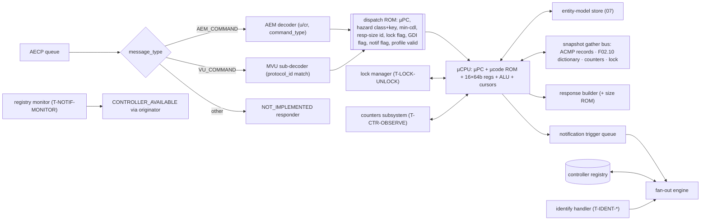
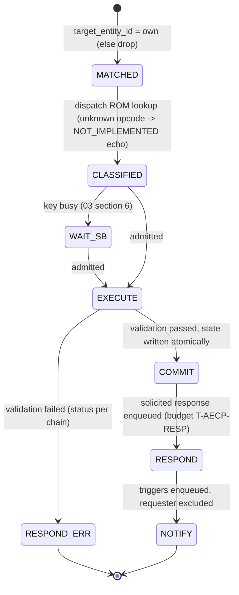
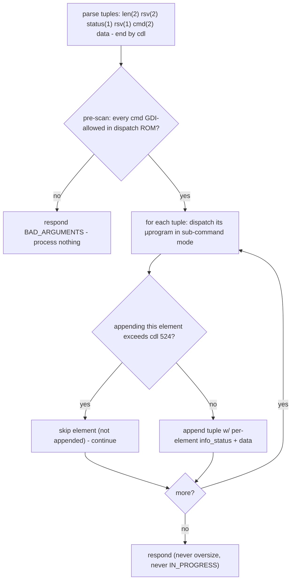
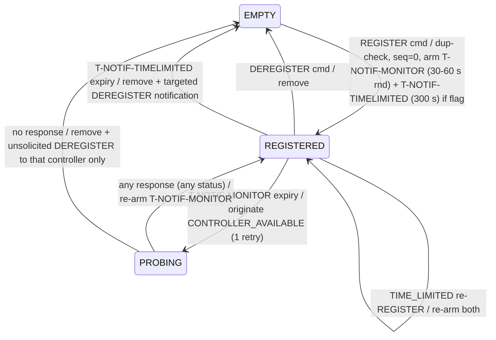
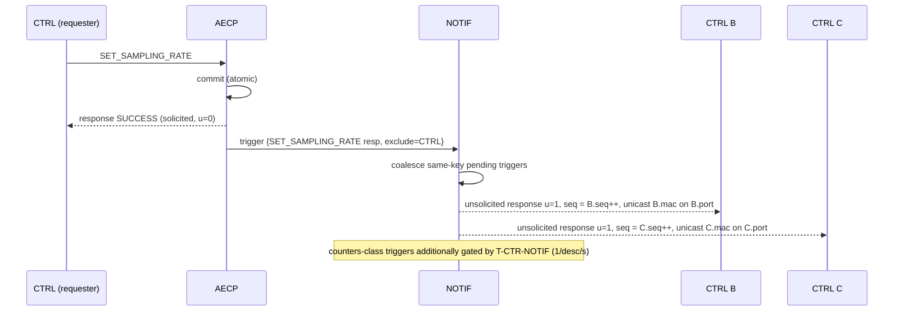
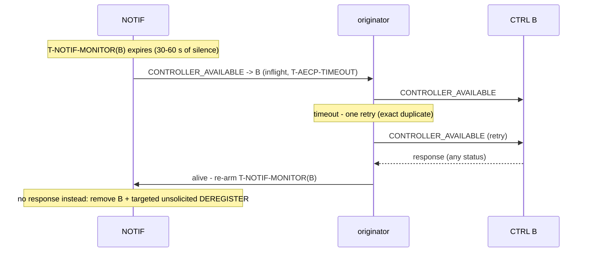
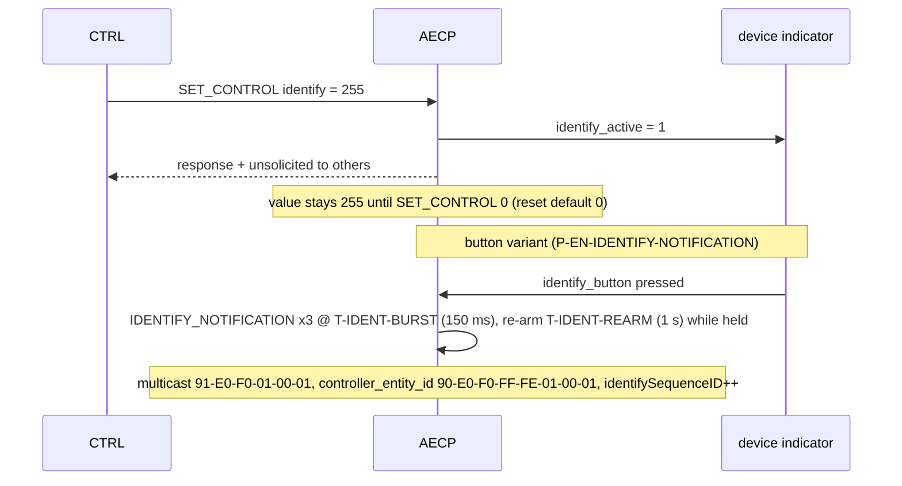

<!-- SPDX-License-Identifier: CERN-OHL-W-2.0 -->
# 06 — AECP Engine (AEM + Milan Vendor Unique)

## 1. Role and scope

Executes every AEM and MVU command, owns the controller registry + unsolicited
notification machinery, the lock manager, the counters service and the identify
handler. This is the microcoded part of the processor: ~24 mandatory commands with
per-command validation chains and variable-size responses justify a µsequencer over
per-command FSMs ([review §4](../00_MILAN_COMPLIANCE_REVIEW.md)).

## 2. External contract

Consumes: AECP queue (AEM_COMMAND, VENDOR_UNIQUE_COMMAND); MGMT-origin transactions
(front-panel-equivalent changes); timer expiries (`T-NOTIF-MONITOR`, `T-LOCK-UNLOCK`,
`T-NOTIF-TIMELIMITED`, `T-CTR-OBSERVE`, `T-IDENT-*`); events routed for notification
triggers; snapshot reads of ACMP sink records ([05 §5](05_acmp_engine.md)) and the
class-D dictionary ([F02.10](02_interfaces.md#fig-02-statusdict)). Produces: solicited
responses; unsolicited responses + CONTROLLER_AVAILABLE + IDENTIFY_NOTIFICATION via
the originator; entity-model overlay writes + NVM marks; `avtp`/`mclk`/`srp` class-B
ops for applied settings.

## 3. PDU handling

<a id="fig-06-aecpdu"></a>**F06.10 — AECPDU + AEM header (wire order, `@n` = byte offset)**

```wavedrom
{"reg": [
  {"bits": 8,  "name": "subtype @0 = 0xFB"},
  {"bits": 1,  "name": "h=0"},
  {"bits": 3,  "name": "ver=0"},
  {"bits": 4,  "name": "message_type @1 (0 AEM_CMD, 1 AEM_RESP, 6 VU_CMD, 7 VU_RESP)"},
  {"bits": 5,  "name": "status @2"},
  {"bits": 11, "name": "control_data_length"},
  {"bits": 64, "name": "target_entity_id @4"},
  {"bits": 64, "name": "controller_entity_id @12"},
  {"bits": 16, "name": "sequence_id @20"},
  {"bits": 1,  "name": "u @22 (0x80)"},
  {"bits": 1,  "name": "cr (0x40)"},
  {"bits": 14, "name": "command_type @22[5:0],@23"}
], "config": {"bits": 192, "lanes": 6, "hspace": 950},
 "head": {"text": "u=1 only on unsolicited responses; cr=1 implies u=1 (entity requests controller, unused here)"}}
```

<a id="fig-06-mvu"></a>**F06.11 — MVU header + GET_MILAN_INFO response (wire order)**

```wavedrom
{"reg": [
  {"bits": 96, "name": "common AECP header @0..@11 (message_type 6/7)"},
  {"bits": 64, "name": "controller_entity_id @12 + sequence_id @20 (as F06.10)", "type": 2},
  {"bits": 48, "name": "protocol_id @22 = 00-1B-C5-0A-C1-00"},
  {"bits": 1,  "name": "r=0"},
  {"bits": 15, "name": "mvu_command_type @28[6:0],@29"},
  {"bits": 16, "name": "reserved @30"},
  {"bits": 32, "name": "protocol_version @32 = 1"},
  {"bits": 32, "name": "features_flags @36 (REDUNDANCY 0x1 = 0, TALKER_DYN_MAPPINGS 0x2)"},
  {"bits": 32, "name": "certification_version @40 (0 if uncertified)"}
], "config": {"bits": 336, "lanes": 7, "hspace": 950},
 "head": {"text": "MVU commands 0x0000 GET_MILAN_INFO, 0x0001/2 SET/GET_SYSTEM_UNIQUE_ID, 0x0003/4 SET/GET_MEDIA_CLOCK_REFERENCE_INFO; padding never counted in cdl"}}
```

Oversize rule (Δ8): responses of READ_DESCRIPTOR, GET_AVB_INFO, GET_AS_PATH,
GET_AUDIO_MAP, ADD/REMOVE_AUDIO_MAPPINGS may exceed cdl 524 up to a full frame —
these serialize into the oversize TX slot ([03 §7](03_packet_engine.md)). Everything
else, including GET_DYNAMIC_INFO, is capped at cdl 524.

## 4. Internal blocks

<a id="fig-06-blocks"></a>**F06.1 — AECP engine internals**



## 5. Command lifecycle

<a id="fig-06-lifecycle"></a>**F06.2 — Lifecycle with scoreboard**



Policies:

- **Never `IN_PROGRESS`** — every command completes within `T-AECP-RESP` (240 ms); this
  is mandatory for GET_DYNAMIC_INFO coexistence (IEEE §7.4.76.2) and deletes the
  120 ms re-send machinery ([review §8](../00_MILAN_COMPLIANCE_REVIEW.md) item 7).
- Duplicate `sequence_id` from the same controller: commands are idempotently
  re-executed (safe: reads) or answered from the last-response cache for state-changing
  classes — one cached response per controller suffices with single-issue execution.
- Scoreboard classes/keys are assigned by the dispatch ROM; the table lives in
  [03 §6](03_packet_engine.md) (single source).

## 6. Command set

<a id="fig-06-cmdtable"></a>**F06.14 — Command master table** (Milan mandate; hazard
class per [03 §6](03_packet_engine.md); GDI = allowed inside GET_DYNAMIC_INFO;
n/i = not implemented → echo command, status `NOT_IMPLEMENTED` — the response-size
rule that satisfies IEEE §9.3.5.3.3 for **every** opcode 0x0000–0x0068).

| Opcode | Command | Mandate | Scope rule | Class | Lock-prot. | GDI | Oversize | Notif | Resp. size |
|---|---|---|---|---|---|---|---|---|---|
| 0x0000 | ACQUIRE_ENTITY | shall, **never succeeds** (Δ7) | any | — | — | — | — | — | 40 B echo, `NOT_SUPPORTED` |
| 0x0001 | LOCK_ENTITY | shall | ENTITY only (Δ10) | LOCK_OP | n/a | — | — | on lock/unlock/auto | 40 B |
| 0x0002 | ENTITY_AVAILABLE | shall | — | RO | — | — | — | — | 44 B (2021 form w/ flags + acquired/locked IDs) |
| 0x0003 | CONTROLLER_AVAILABLE | responder: n/i (not a controller); **originator**: §7 | — | — | — | — | — | — | 24 B echo |
| 0x0004 | READ_DESCRIPTOR | shall | allowed while locked | RO | no | — | **yes** | — | 28 + descriptor (4-B stub on failure) |
| 0x0006 | SET_CONFIGURATION | shall | STREAM_IS_RUNNING guard §6.4 | CFG_BARRIER | yes | — | — | yes | 28 B |
| 0x0007 | GET_CONFIGURATION | shall | — | RO | — | yes | — | — | 28 B |
| 0x0008 | SET_STREAM_FORMAT | shall | §6.4 chain | STREAM_CFG | yes | — | — | yes | 40 B |
| 0x0009 | GET_STREAM_FORMAT | shall | — | RO | — | yes | — | — | 40 B |
| 0x000E | SET_STREAM_INFO | shall | **output only** (Δ11); §6.3 | STREAM_CFG | yes | — | — | yes | 80 B |
| 0x000F | GET_STREAM_INFO | shall | Milan 80-B form §6.2 | RO | — | yes | — | async triggers | 80 B |
| 0x0010 | SET_NAME | shall | all names | NAME_WR | yes | — | — | yes | 48 B |
| 0x0011 | GET_NAME | shall | — | RO | — | yes | — | — | 48 B |
| 0x0014 | SET_SAMPLING_RATE | shall | per AUDIO_UNIT; §6.4 | CLOCK_CFG | yes | — | — | yes | 36 B |
| 0x0015 | GET_SAMPLING_RATE | shall | — | RO | — | yes | — | — | 36 B |
| 0x0016 | SET_CLOCK_SOURCE | shall | per CLOCK_DOMAIN | CLOCK_CFG | yes | — | — | yes | 36 B |
| 0x0017 | GET_CLOCK_SOURCE | shall | — | RO | — | yes | — | — | 36 B |
| 0x0018 | SET_CONTROL | shall (identify) | value 0/255 | IDENTIFY | yes | — | — | yes | 28 + values |
| 0x0019 | GET_CONTROL | shall (identify) | — | RO | — | **no** (variable) | — | — | 28 + values |
| 0x0022 | START_STREAMING | shall | **input only** (Δ11) | STREAM_CFG | yes | — | — | yes | 28 B |
| 0x0023 | STOP_STREAMING | shall | **input only** (Δ11) | STREAM_CFG | yes | — | — | yes | 28 B |
| 0x0024 | REGISTER_UNSOLICITED_NOTIFICATION | shall | §7; accepts 2013 no-flags form | REGISTRY_OP | no | — | — | — | 28 B (w/ flags) |
| 0x0025 | DEREGISTER_UNSOLICITED_NOTIFICATION | shall | §7 | REGISTRY_OP | no | — | — | auto-deregister → targeted | 24 B |
| 0x0026 | IDENTIFY_NOTIFICATION | unsolicited-only | as command → `BAD_ARGUMENTS` | — | — | — | — | is one | 28 B |
| 0x0027 | GET_AVB_INFO | shall | gather §6.2 | RO | — | **no** | **yes** | async triggers | 44 + msrp mappings |
| 0x0028 | GET_AS_PATH | shall | gather §6.2 | RO | — | **no** | **yes** | async trigger | 28 + 8·count |
| 0x0029 | GET_COUNTERS | shall | §6.6 | RO | — | yes | — | async ≤1/desc/s | 160 B |
| 0x002B | GET_AUDIO_MAP | shall (dynamic ports) | §6.5 | RO | — | **no** | **yes** | — | 32 + 8·N |
| 0x002C | ADD_AUDIO_MAPPINGS | shall (dynamic ports) | §6.5 | MAP_CFG | yes | — | **yes** | yes | 28 + 8·N |
| 0x002D | REMOVE_AUDIO_MAPPINGS | shall (dynamic ports) | §6.5 | MAP_CFG | yes | — | **yes** | yes | 28 + 8·N |
| 0x004B | GET_DYNAMIC_INFO | shall | iterator §6.7 | RO (per element) | — | n/a | **no** | — | ≤ 536 B |
| MVU 0x0000 | GET_MILAN_INFO | shall | §6.9 | RO | — | — | — | — | 44 B |
| MVU 0x0001/0x0002 | SET/GET_SYSTEM_UNIQUE_ID | recommended (`P-EN-MVU-SUID`) | §6.9 | CLOCK_CFG-like (global key) | yes/— | — | — | yes/— | 40 B |
| MVU 0x0003/0x0004 | SET/GET_MEDIA_CLOCK_REFERENCE_INFO | recommended (`P-EN-MVU-MCR`) | §6.9 | CLOCK_CFG | yes/— | — | — | yes/— | 104 B |
| all others 0x0005–0x0068, 0x3FFF | — | n/i | — | — | — | — | — | — | echo, `NOT_IMPLEMENTED` |

### 6.1 READ_DESCRIPTOR

Command: `configuration_index @24`, `descriptor_type @28`, `descriptor_index @30`.
Assembly from image + overlay by the model store ([07 §3](07_memory_maps.md)) — the
µprogram resolves the address via `DESC_ADDR`, streams via `COPY_BUFFER`. Failure →
status (`NO_SUCH_DESCRIPTOR` / `BAD_ARGUMENTS` for a bad config index) with the 4-byte
{type, index} stub (IEEE §7.4.5). Permitted while locked or acquired.

### 6.2 GET_STREAM_INFO — the Milan 80-byte response and its data lineage

<a id="fig-06-streaminfo"></a>**F06.12 — Response payload @24..@79 (Milan Fig 5.1; renames Δ6)**

```wavedrom
{"reg": [
  {"bits": 16, "name": "descriptor_type @24"},
  {"bits": 16, "name": "descriptor_index @26"},
  {"bits": 32, "name": "flags @28 (masks below)"},
  {"bits": 64, "name": "stream_format @32"},
  {"bits": 64, "name": "stream_id @40"},
  {"bits": 32, "name": "msrp_accumulated_latency @48"},
  {"bits": 48, "name": "stream_dest_mac @52"},
  {"bits": 8,  "name": "msrp_failure_code @58"},
  {"bits": 8,  "name": "reserved @59"},
  {"bits": 64, "name": "msrp_failure_bridge_id @60"},
  {"bits": 16, "name": "stream_vlan_id @68"},
  {"bits": 16, "name": "reserved @70"},
  {"bits": 32, "name": "flags_ex @72 (REGISTERING 0x00000001)"},
  {"bits": 3,  "name": "pbsta @76[7:5]"},
  {"bits": 5,  "name": "acmpsta @76[4:0]"},
  {"bits": 24, "name": "reserved @77"}
], "config": {"bits": 448, "lanes": 14, "hspace": 950},
 "head": {"text": "legacy controllers ignore @72+; Milan controllers detect the extension via control_data_length"}}
```

> ⚠ Bit tables in Milan and IEEE 1722.1 are **MSB-first** (bit 31 ⇔ mask `0x00000001`).
> The **hex mask column is authoritative**; never derive shifts from bit-number columns.

`flags` masks and validity — **Stream Input**: STREAM_FORMAT_VALID `0x80000000`
always · STREAM_ID_VALID `0x40000000`, STREAM_DEST_MAC_VALID `0x10000000`,
STREAM_VLAN_ID_VALID `0x02000000` **iff settled** · MSRP_ACC_LAT_VALID `0x20000000`
iff registering a matching talker attribute (= `flags_ex.REGISTERING`) ·
MSRP_FAILURE_VALID `0x08000000` = REGISTERING_FAILED `0x00000040` (registering
matching Talker **Failed**) · BOUND `0x04000000` · FAST_CONNECT `0x00000002` **= 1 iff
bound** (Milan-required legacy signal) · SAVED_STATE `0x00000004` recommended = bound ·
STREAMING_WAIT `0x00000008` = bound ∧ stopped. **Stream Output**: FAST_CONNECT /
SAVED_STATE / STREAMING_WAIT / BOUND always 0 · MSRP_ACC_LAT_VALID always 1
(field = presentation-time offset) · REGISTERING_FAILED = declaring ∧ registering
Listener **Asking Failed** · {REGISTERING=1 ∧ REGISTERING_FAILED=0 ∧
MSRP_FAILURE_VALID=0} ⇔ **streaming**.

<a id="fig-06-lineage"></a>**F06.13 — Field lineage (input rows; output analogous)**

| Field / flag | Owner record | Signal ([F02.10](02_interfaces.md#fig-02-statusdict)) | Update event | Async notif (Table 5.22) |
|---|---|---|---|---|
| stream_format | overlay: current input format | — | SET_STREAM_FORMAT | via command trigger |
| BOUND, pbsta, acmpsta, STREAMING_WAIT | ACMP sink record | — | listener-SM commits | yes (input) |
| stream_id / DA / VLAN + *_VALID | sink record (settled) | — | A15 / A8 | yes |
| msrp_accumulated_latency | srp | `acc_latency[sink]` + `P-INTERNAL-INGRESS-DELAY-NS` | talker-attr change | yes (input) |
| REGISTERING (flags_ex), REGISTERING_FAILED | srp | `tk_reg_state[sink]` | TK_ATTR events | yes |
| msrp_failure_code / bridge | srp | `msrp_fail_*` | TK_ATTR(Failed) | yes |

Atomicity: the µprogram issues one `GATHER_EXT` that snapshots sink record + dictionary
under the sink's STREAM_CFG key (scoreboard blocks writers during the latch) — a
response is never a torn mix of two states.

### 6.3 Direction asymmetries (Δ11)

| Command | Stream Input | Stream Output |
|---|---|---|
| SET_STREAM_INFO | `NOT_SUPPORTED` (params come from PROBE_TX_RESPONSE) | per IEEE §7.4.15 subset: **MSRP_ACC_LAT_VALID must be supported** → writes presentation-time offset (0..0x7FFFFFFF ns, else `BAD_ARGUMENTS`); **any unsupported sub-flag ⇒ whole command `NOT_SUPPORTED`**; `STREAM_IS_RUNNING` while streaming; success echoes the flag + value |
| START/STOP_STREAMING | bound ∧ stopped → started (and inverse); no effect otherwise; persisted | `NOT_SUPPORTED` (a talker streams whenever reserved — Δ14) |

### 6.4 Validation chains (order matters; first failure responds)

| Command | Chain |
|---|---|
| SET_CONFIGURATION | lock → any input bound ∨ any output streaming ⇒ `STREAM_IS_RUNNING` → index valid ⇒ commit (CFG_BARRIER drained) → NVM mark (review §8 item 1) |
| SET_STREAM_FORMAT | lock → sink bound ∨ source streaming ⇒ `STREAM_IS_RUNNING` → format ∈ descriptor list → every existing static+dynamic mapping still references an existing channel, else `BAD_ARGUMENTS` → commit + `avtp.SET_*_FORMAT` + NVM |
| SET_SAMPLING_RATE | lock → rate ∈ AUDIO_UNIT list → mappings whose stream rate ≠ new rate while port has neither SRC bit ⇒ may `NOT_SUPPORTED` (Milan §5.4.2.13 — "UNSUPPORTED" typo, review §8 item 3) → commit + NVM |
| SET_CLOCK_SOURCE | lock → source ∈ CLOCK_DOMAIN list → `mclk.SET_CLOCK_SOURCE` → commit + NVM |
| SET_NAME | lock → descriptor named → commit + NVM |

### 6.5 Audio-map operations (Milan §5.4.2.26–.28)

- Channel space of each stream port is **partitioned at model-build time** into fixed
  subsets ≤ `P-MAP-SUBSET-CH-MAX` (176); `number_of_maps` always reports the partition
  count N regardless of dynamic content; `GET_AUDIO_MAP(map_index = P)` returns all and
  only the dynamic mappings of subset P.
- `ADD_AUDIO_MAPPINGS`: **all-or-nothing** — any invalid mapping ⇒ `BAD_ARGUMENTS`,
  nothing added (`MAP_VALIDATE` primitive). Invalid = references a channel absent from
  the current format; or (without `P-EN-TALKER-DYN-MAPPINGS-RUNNING`) references a
  streaming output; input-port conflict rule: same cluster channel from two different
  stream channels in one command ⇒ `BAD_ARGUMENTS`; conflict with an *existing* mapping
  may be rejected the same way or accepted with an automatic REMOVE notification sent
  **before** the ADD response.
- `REMOVE_AUDIO_MAPPINGS`: ignores duplicates; streaming-output restriction as above.
- Input maps are changeable **any time, even while bound** (Milan §5.3.10.1).

### 6.6 GET_COUNTERS and the counters subsystem

Response: `descriptor_type @24`, `descriptor_index @26`, `counters_valid @28`,
32 × u32 block @32 (cdl 148). `counters_valid` bit N (MSB-first) ⇔ block offset 4·N.
Counters are 32-bit wrapping; interval-latched events sample at `T-CTR-OBSERVE`
(≤ 1 s); adapters accumulate ticks so nothing is lost between observations.

<a id="fig-06-counters"></a>**F06.15 — Mandatory counter banks**

> ⚠ Masks authoritative (MSB-first tables). **Δ9**: the STREAM_OUTPUT masks below are
> Milan Table 5.17 and *differ from IEEE Tables 7-158/159* — the plain-IEEE profile
> swaps this one bank's mask ROM.

| Bank | Counter | Mask | Semantics / reset rule |
|---|---|---|---|
| AVB_INTERFACE | LINK_UP | 0x00000001 | link down→up; invariant UP = DOWN or DOWN+1 |
| | LINK_DOWN | 0x00000002 | |
| | GPTP_GM_CHANGED | 0x00000020 | GM changes since boot |
| | FRAMES_TX / FRAMES_RX / RX_CRC_ERROR | 0x04/0x08/0x10 | optional |
| CLOCK_DOMAIN | LOCKED / UNLOCKED | 0x01 / 0x02 | invariant LOCKED = UNLOCKED or +1 |
| STREAM_INPUT | MEDIA_LOCKED / MEDIA_UNLOCKED | 0x01 / 0x02 | invariant; **whole bank resets on not-bound→bound**, never on unbind |
| | STREAM_INTERRUPTED | 0x04 | any interruption except a controller unbind |
| | SEQ_NUM_MISMATCH / MEDIA_RESET / TIMESTAMP_UNCERTAIN | 0x08 / 0x10 / 0x20 | per observation interval |
| | UNSUPPORTED_FORMAT / LATE_TIMESTAMP / EARLY_TIMESTAMP / FRAMES_RX | 0x100 / 0x200 / 0x400 / 0x800 | per observation interval |
| STREAM_OUTPUT | STREAM_START / STREAM_STOP | 0x01 / 0x02 | invariant START = STOP or +1 |
| | MEDIA_RESET | **0x04** (Δ9) | resets on stream start |
| | TIMESTAMP_UNCERTAIN | **0x08** (Δ9) | resets on stream start |
| | FRAMES_TX | **0x10** (Δ9) | resets on stream start |

Any counter update arms the per-descriptor GET_COUNTERS notification, rate-limited to
one per descriptor per second (`T-CTR-NOTIF`).

### 6.7 GET_DYNAMIC_INFO iterator

<a id="fig-06-gdi"></a>**F06.7 — Two-pass execution (IEEE §7.4.76)**



GDI-allowed set is a dispatch-ROM flag (fixed-size GETs only: GET_CONFIGURATION,
GET_STREAM_FORMAT, GET_STREAM_INFO, GET_NAME, GET_SAMPLING_RATE, GET_CLOCK_SOURCE,
GET_COUNTERS, …); GET_CONTROL, GET_AVB_INFO, GET_AS_PATH, GET_AUDIO_MAP are
variable-size ⇒ excluded.

### 6.8 ACQUIRE / LOCK

- **ACQUIRE_ENTITY (Δ7)**: a 3-µop constant program — echo fields, `owner_id` = 0,
  status `NOT_SUPPORTED`. No acquire state, no CONTROLLER_AVAILABLE contention flow,
  no PERSISTENT handling. (`CONTROLLER_AVAILABLE` origination exists solely for the
  registry, §7.)
- **LOCK_ENTITY**:

```mermaid
stateDiagram-v2
    UNLOCKED --> LOCKED: LOCK(flags=0) desc=ENTITY / locked_id = controller, arm T-LOCK-UNLOCK (60 s)
    LOCKED --> LOCKED: LOCK by owner / re-arm (keep-alive); respond locked_id
    LOCKED --> UNLOCKED: LOCK(UNLOCK 0x1) by owner / respond
    LOCKED --> LOCKED: LOCK by other / respond ENTITY_LOCKED + locked_id
    LOCKED --> UNLOCKED: T-LOCK-UNLOCK expiry / unsolicited LOCK_ENTITY notification (Table 5.22)
    UNLOCKED --> UNLOCKED: LOCK(UNLOCK) / respond (lock-state query idiom)
    LOCKED --> LOCKED: LOCK desc != ENTITY / NOT_SUPPORTED (Δ10)
```

<a id="fig-06-lock"></a>**F06.8 — Lock lifecycle**



<a id="fig-06-lockset"></a>**F06.9 — Lock-protected set** (checked via `CHECK_LOCK`; a
different controller receives `ENTITY_LOCKED` — Milan leaves the code unspecified,
review §8 item 2; ACMP uses `CONTROLLER_NOT_AUTHORIZED`): SET_CONFIGURATION,
SET_STREAM_FORMAT, SET_STREAM_INFO, SET_NAME, SET_SAMPLING_RATE, SET_CLOCK_SOURCE,
SET_CONTROL, START/STOP_STREAMING, ADD/REMOVE_AUDIO_MAPPINGS, MVU SETs, ACMP
BIND_RX/UNBIND_RX, and **MGMT-origin state changes** (front-panel equivalence,
Milan §5.4.2.x "in any other way").

### 6.9 MVU commands

| Command | Behavior |
|---|---|
| GET_MILAN_INFO (0x0000, shall) | respond F06.11: protocol_version 1; features = (`P-EN-TALKER-DYN-MAPPINGS-RUNNING` ? 0x2 : 0) — REDUNDANCY stays 0; certification_version register (0 = uncertified). Per-config compliance flag in model metadata implements the "no reply if active configuration non-compliant" recommendation |
| SET/GET_SYSTEM_UNIQUE_ID (0x0001/2, rec) | u64 @32; default 0; SET value must be ≠ 0 else `BAD_ARGUMENTS`; persisted (design decision, review §8 item 4) |
| SET/GET_MEDIA_CLOCK_REFERENCE_INFO (0x0003/4, rec) | `clock_domain_index @28`; `flags` (PRIO_VALID 0x1, NAME_VALID 0x2 — response reports the *supported* set); `default_mcr_prio` read-only from `mclk.GET_MCR_DEFAULTS`; `user_mcr_prio` default = default prio; 64-B UTF-8 domain name, default `"DEFAULT"`; persisted (design decision) |
| any other MVU type | VU response, MVU status 1 `NOT_IMPLEMENTED` |
| wrong `protocol_id` | VU response echoing the protocol_id, status `NOT_IMPLEMENTED` |

## 7. Registry, notifications, liveness, identify

Registry entry ([F07.7](07_memory_maps.md#fig-07-regrec)): {controller EID, MAC, port,
next unsolicited `sequence_id` (init 0), TIME_LIMITED deadline, monitor deadline,
probe state}. **No duplicate {EID, MAC, port} tuples; ≥ 16 entries per AVB interface;
volatile** (cleared by power cycle) — Δ12.

<a id="fig-06-regsm"></a>**F06.5 — Registry-entry lifecycle**



Registration overflow (Milan §5.4.2.21): full table ⇒ probe **all** registered
controllers (pool `P-CA-POOL`); deregister non-responders (targeted DEREGISTER
notifications); still full ⇒ `NO_RESOURCES`. A responding controller is never evicted.

<a id="fig-06-fanout"></a>**F06.4 — Unsolicited fan-out**



Trigger classes: (1) every successful state-changing command (regenerated as the
corresponding response, requester excluded); (2) MGMT/front-panel-equivalent changes
while unlocked — read-only objects use the GET_ form (IEEE §7.5.2); (3) async
Table 5.22 set: GET_STREAM_INFO field changes (input/output splits per F06.13),
GET_AVB_INFO (GM, prop delay, domain, asCapable, class-A prio/VID), GET_AS_PATH,
GET_COUNTERS (rate-limited), LOCK_ENTITY auto-unlock, targeted DEREGISTER.
Coalescing merges same-key pending triggers (safe: notifications carry current full
state); LOCK/DEREGISTER events are never coalesced. Ordering: notification after
commit and after the solicited response ([03 §6](03_packet_engine.md) rule a).

<a id="fig-06-liveness"></a>**F06.6 — Liveness probe**



<a id="fig-06-identify"></a>**F06.16 — Identify flows**



## 8. µcode architecture

Dispatch ROM entry (per opcode): {µPC entry, hazard class + key extractor, min-cdl,
response-size id, lock flag, GDI flag, notif flag, per-profile valid}. µCPU: µPC,
µcode ROM (`P-UCODE-ROM-DEPTH`), 16 × 64-bit operand registers, response/iteration
cursors, 32-bit ALU / 64-bit moves, status register.

**µISA (~24 operations)** — revised from the original document
([review §4](../00_MILAN_COMPLIANCE_REVIEW.md); dropped ops targeted objects that do
not exist in a Milan PAAD):

| Group | Ops | Notes |
|---|---|---|
| Flow | `NOP`, `BRANCH`, `BRANCH_IF_STATUS`, `END` | |
| Data | `MOVE`, `COMPARE`, `SET_MASKED` | flag-word assembly |
| Model | `DESC_ADDR`, `READ_STATE`, `WRITE_STATE`, `NAME_RD`, `NAME_WR`, `COPY_BUFFER` | image+overlay via [07 §3](07_memory_maps.md) |
| Checks | `CHECK_LOCK`, `CHECK_ARG`, `MAP_VALIDATE` | first failure sets status + branches |
| Gather | `GATHER_EXT`, `READ_COUNTERS` | atomic snapshots (§6.2, §6.6) |
| Iterate | `ITER_OPEN`, `ITER_NEXT`, `APPEND_RESP` | GDI + list responses; APPEND has skip-on-overflow semantics |
| Effects | `COMMIT`, `NVM_MARK`, `NOTIFY_ENQ` | commit is the atomicity point |
| Respond | `SET_STATUS`, `SET_LENGTH`, `BUILD_HEADER`, `BUILD_FIELD`, `SEND_RESPONSE` | |

Dropped from the original sketch: `ALLOCATE/RELEASE_CONNECTION`,
`UPDATE_ENTITY_TABLE`, `WRITE_DESCRIPTOR`, `CHECK_ACQUIRE` (no such objects/flows in
Milan). Exemplar µprograms:

```text
GET_SAMPLING_RATE:                    SET_SAMPLING_RATE:
  DESC_ADDR  AUDIO_UNIT[idx]            CHECK_LOCK
  BRANCH_IF_STATUS fail                 DESC_ADDR  AUDIO_UNIT[idx]
  READ_STATE r1 <- current_rate         CHECK_ARG  rate in sampling_rates[]
  SET_STATUS SUCCESS                    CHECK_ARG  SRC rule (may NOT_SUPPORTED)
  BUILD_HEADER; BUILD_FIELD r1          WRITE_STATE current_rate <- arg
  SEND_RESPONSE; END                    COMMIT; NVM_MARK sampling_rate
                                        SET_STATUS SUCCESS
ACQUIRE_ENTITY:                         BUILD_HEADER; BUILD_FIELD
  SET_STATUS NOT_SUPPORTED              SEND_RESPONSE
  BUILD_HEADER (echo, owner_id=0)       NOTIFY_ENQ  {resp, excl=requester}
  SEND_RESPONSE; END                    END

GET_DYNAMIC_INFO:
  ITER_OPEN tuples            ; pre-scan pass: GDI flags, else BAD_ARGUMENTS-all
  loop: ITER_NEXT -> sub      ; dispatch sub-µprogram in sub-command mode
  APPEND_RESP (skip if > 524) ; per-element info_status written
  BRANCH loop until end
  SEND_RESPONSE; END
```

Sizing: ~35 programs × ~25 µops ⇒ `P-UCODE-ROM-DEPTH` = 2048 with ~2× margin.
The dispatch ROM + response-size ROM + µcode are the artifacts generated from the
single-source command model ([09 §1](09_verification.md)).

## 9. Timing

Owns `T-AECP-RESP` (240 ms respond budget — hard, no IN_PROGRESS), `T-NOTIF-MONITOR`,
`T-NOTIF-TIMELIMITED`, `T-LOCK-UNLOCK`, `T-CTR-OBSERVE`, `T-CTR-NOTIF`,
`T-IDENT-BURST`, `T-IDENT-REARM`; the originator applies `T-AECP-TIMEOUT` to
CONTROLLER_AVAILABLE inflight. Values: [F08.1](08_timing.md#fig-08-constants);
budgets: [08 §4](08_timing.md).

## 10. Milan deltas

Δ6 (GET_STREAM_INFO), Δ7 (ACQUIRE), Δ8 (oversize), Δ9 (output counter masks),
Δ10 (lock scope), Δ11 (direction rules), Δ12 (registry tuple + per-controller seq) —
master table [F01.4](01_overview.md#fig-01-deltas).

## 11. Parameterization

`P-N-CONTROLLERS`, `P-CA-POOL`, `P-NOTIF-QUEUE-DEPTH`, `P-UCODE-ROM-DEPTH`,
`P-EN-MVU-SUID`, `P-EN-MVU-MCR`, `P-EN-TALKER-DYN-MAPPINGS-RUNNING`,
`P-EN-IDENTIFY-NOTIFICATION`, `P-MAP-SUBSET-CH-MAX`, `P-INTERNAL-INGRESS-DELAY-NS`.

## 12. Cross-references

Covers REQ-AEM-001…026, REQ-MVU-001…005, REQ-NOT-001…005 and the counter rows of
REQ-NET-004. Storage: [07 §3–§4](07_memory_maps.md); ACMP state consumed via
[05 §5](05_acmp_engine.md); verification categories DIR/RND/STORM/TOL
([09 §3](09_verification.md)).
