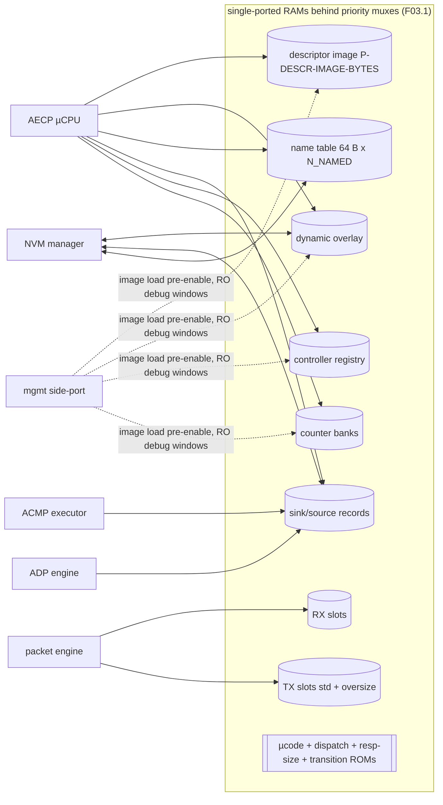
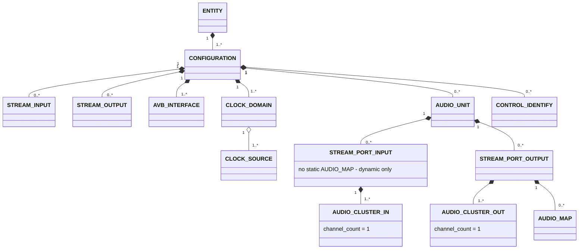
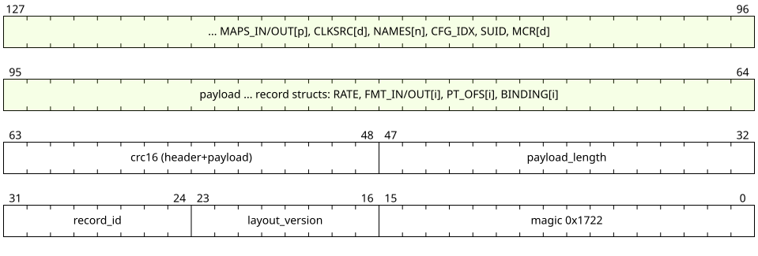

<!-- SPDX-License-Identifier: CERN-OHL-W-2.0 -->
# 07 — Memory Maps, Records, Persistence

## 1. Role

All storage: the entity model (static image + dynamic overlay + names), per-sink and
registry records, counter banks, buffers, the NVM layout and its commit/restore flows,
and the management side-port map. Other documents link here for every layout.

## 2. Memory system overview

<a id="fig-07-regions"></a>**F07.1 — Regions and port owners**



Access-rights rule: exactly one writer class per region at runtime (µCPU for
overlay/names, ACMP executor for sink records, counters subsystem for banks); the
side-port is read-only everywhere after `entity_enable` except the control window.

## 3. Entity model

### 3.1 Descriptor tree

<a id="fig-07-tree"></a>**F07.2 — Milan descriptor tree (multiplicities per Milan §5.3.2/§5.3.3)**



Structural rules enforced by the **model lint** (build-time, part of the single-source
toolchain — [09 §1](09_verification.md)):

| # | Rule | Clause |
|---|---|---|
| L1 | Every descriptor except ENTITY/CONFIGURATION has exactly one parent; no cross-subtree sharing | Milan §5.3.2 |
| L2 | Indices dense, restart at 0 per configuration, IEEE ordering for multi-level types | IEEE §7.2 |
| L3 | ≥1 STREAM_INPUT or STREAM_OUTPUT per configuration; each with a Base format (talker §6.3 / listener §6.4 incl. rate-completeness + configuration-uniformity) | Milan §5.3.3.4, §6.3/§6.4 |
| L4 | STREAM_INPUT `buffer_length` ≥ 2 126 000 ns; CLASS_A flag set; CRF and AAF never mixed in one format list; `current_format` ∈ list; N formats ≤ 47 | Milan §5.3.3.4, Annex C |
| L5 | Same AVB_INTERFACE index for the same physical port in every configuration | Milan §5.3.3.5 |
| L6 | CLOCK_SOURCE construction: one INPUT_STREAM per CRF-capable input (or the single AAF input when no CRF input exists); ≥1 INTERNAL if any output; ≥1 CLOCK_SOURCE per CLOCK_DOMAIN; gPTP-as-media-clock chain only in non-redundant single-interface models | Milan §5.3.3.6, §7.5 |
| L7 | STREAM_PORT_INPUT owns no AUDIO_MAP; ≤1 static mapping per output stream channel; AUDIO_CLUSTER `channel_count` = 1 | Milan §5.3.3.7–.9 |
| L8 | Primary IDENTIFY CONTROL present in all configurations at the same index | Milan §5.3.3.10 |
| L9 | `entity_model_id` ≠ 0 / ≠ all-1s; changes whenever the static model changes | Milan §5.3.1 |

### 3.2 Descriptor sizing

<a id="fig-07-sizing"></a>**F07.3 — Fixed sizes + variable parts (IEEE §7.2; Milan Annex C for streams)**

| Descriptor | Type | Fixed B | Variable part |
|---|---|---|---|
| ENTITY | 0x0000 | 312 | — |
| CONFIGURATION | 0x0001 | 74 | + 4·descriptor_counts |
| AUDIO_UNIT | 0x0002 | 144 | + 4·sampling_rates |
| STREAM_INPUT / OUTPUT | 0x0005/6 | 136 | + 8·F formats (F ≤ 47, `formats_offset` = 136) + redundancy tail `redundant_offset` = 136+8F, **R = 0 emitted** (Annex C layout for all entities) |
| AVB_INTERFACE | 0x0009 | 102 | — |
| CLOCK_SOURCE | 0x000A | 86 | — |
| STREAM_PORT_IN/OUT | 0x000E/F | 20 | — (no name field) |
| AUDIO_CLUSTER | 0x0014 | 90 | — |
| AUDIO_MAP | 0x0017 | 8 | + 8·mappings {stream_index, stream_channel, cluster_offset, cluster_channel} |
| CONTROL (identify) | 0x001A | 104 | + values (LINEAR_UINT8: 1×{min,max,step,default,current…}) |
| CLOCK_DOMAIN | 0x0024 | 76 | + 2·clock_sources |

> Δ note: IEEE-2021 defines `timing @136` in stream descriptors; Milan Annex C places
> `formats` at 136 — **Annex C takes precedence** for Milan builds (profile ROM swaps
> the assembly template if a plain-IEEE build ever needs `timing`).

### 3.3 Static image

Read-only at runtime; loaded via side-port window `0x00000` before `entity_enable`
(or synthesized as ROM). Layout = concatenated descriptors in (configuration, type,
index) order + an **index map** per configuration (type → base pointer + count) used by
`DESC_ADDR`. READ_DESCRIPTOR assembles: image bytes, then overlay patches
(current values, names), then the Annex C tail with R = 0.

### 3.4 Dynamic overlay

| Overlaid field | Width | NVM? |
|---|---|---|
| current configuration index | 16 | design decision — **yes** (review §8 item 1) |
| per AUDIO_UNIT `current_sampling_rate` | 32 | yes (§5.3.5.1) |
| per CLOCK_DOMAIN `clock_source_index` | 16 | yes (§5.3.11.1) |
| per stream `current_format` | 64 | yes (§5.3.7.1/§5.3.8.1) |
| per STREAM_OUTPUT presentation-time offset | 32 | yes (§5.3.7.6) |
| per port dynamic mapping tables | 64·M | yes (§5.3.9.1/§5.3.10.1) |
| name table: `entity_name`, `group_name`, `object_name` of every named descriptor | 64 B each | yes (§5.3.13) |
| identify value | 8 | no — reset to 0 |
| `system_unique_id` | 64 | design decision — yes |
| per CLOCK_DOMAIN `user_mcr_prio` + media-clock-domain name | 8 + 64 B | design decision — yes |

## 4. Dynamic state records

<a id="fig-07-sinkrec"></a>**F07.6 — ACMP sink record** (48 B core; fields defined in
[05 §5](05_acmp_engine.md); lanes bottom→top = record order)


<details>
<summary>WaveDrom source (editable)</summary>

```wavedrom
{"reg": [
  {"bits": 3,  "name": "sm_state"},
  {"bits": 3,  "name": "pbsta"},
  {"bits": 5,  "name": "acmpsta"},
  {"bits": 8,  "name": "flags: bound,started,sw,retried,srp_decl[1:0],tk_reg,tk_disc"},
  {"bits": 13, "name": "reserved"},
  {"bits": 64, "name": "talker_entity_id"},
  {"bits": 16, "name": "talker_unique_id"},
  {"bits": 16, "name": "probe_seq"},
  {"bits": 64, "name": "bind_controller_eid"},
  {"bits": 64, "name": "settled stream_id"},
  {"bits": 48, "name": "settled stream_dest_mac"},
  {"bits": 12, "name": "settled vlan_id"},
  {"bits": 4,  "name": "rsv"},
  {"bits": 32, "name": "last_available_index"},
  {"bits": 8,  "name": "saved interface_index"},
  {"bits": 8,  "name": "sm timer handle"},
  {"bits": 8,  "name": "noadp timer handle"},
  {"bits": 8,  "name": "rsv"}
], "config": {"bits": 384, "lanes": 12, "hspace": 950}}
```

</details>

Plus per sink: SRP failure registers {code 8, bridge_id 64} held in the `srp` adapter;
NVM shadow ≈ 20 B ({valid, talker EID, unique_id, controller EID, started}).

<a id="fig-07-regrec"></a>**F07.7 — Controller-registry entry** (28 B; Δ12 tuple; lanes
bottom→top = record order)


<details>
<summary>WaveDrom source (editable)</summary>

```wavedrom
{"reg": [
  {"bits": 64, "name": "controller_entity_id"},
  {"bits": 48, "name": "mac_address"},
  {"bits": 8,  "name": "port (AVB interface)"},
  {"bits": 8,  "name": "flags: valid, time_limited, probing"},
  {"bits": 16, "name": "next unsolicited sequence_id (init 0)"},
  {"bits": 16, "name": "reserved"},
  {"bits": 32, "name": "monitor deadline (T-NOTIF-MONITOR)"},
  {"bits": 32, "name": "time-limited deadline (T-NOTIF-TIMELIMITED)"}
], "config": {"bits": 224, "lanes": 7, "hspace": 950}}
```

</details>

<a id="fig-07-ctrmap"></a>**F07.10 — Counter banks** (full-bank form; compressed
option = only-implemented-offsets with an index ROM):

| Bank | Instances | Size | Reset domain |
|---|---|---|---|
| AVB_INTERFACE | P-N-AVB-INTERFACES | 4 (valid mask ROM) + 128 B | boot only |
| CLOCK_DOMAIN | P-N-CLOCK-DOMAINS | 128 B | boot only |
| STREAM_INPUT | P-N-STREAM-IN | 128 B | boot + **not-bound→bound** clear |
| STREAM_OUTPUT | P-N-STREAM-OUT | 128 B | boot; MEDIA_RESET/TS_UNCERTAIN/FRAMES_TX clear on stream start |

Event→address mapping and masks: [F06.15](06_aecp_engine.md#fig-06-counters).

## 5. Persistence

### 5.1 Persisted vs volatile (normative set — REQ-PER-001/002)

| Persisted (Milan clause) | Volatile (clause) |
|---|---|
| sampling rate (§5.3.5.1) · stream formats in/out (§5.3.7.1/§5.3.8.1) · presentation offset (§5.3.7.6) · bound state + binding params (§5.3.8.2/.3) · started/stopped (§5.3.8.7) · output + input mappings (§5.3.9.1/§5.3.10.1) · clock source (§5.3.11.1) · all user names (§5.3.13) | lock state (§5.3.4.1) · controller registry (§5.3.4.2) · identify value = 0 after reset (§5.3.12) |
| design decisions (review §8): current configuration index · system_unique_id · user_mcr_prio + MC domain name | |

### 5.2 NVM record layout

<a id="fig-07-nvmrec"></a>**F07.8 — Record framing** (device-agnostic; one record per
item group and index — a partial update never rewrites unrelated records; lanes
bottom→top = record order)



<details>
<summary>WaveDrom source (editable)</summary>

```wavedrom
{"reg": [
  {"bits": 16, "name": "magic 0x1722"},
  {"bits": 8,  "name": "layout_version"},
  {"bits": 8,  "name": "record_id"},
  {"bits": 16, "name": "payload_length"},
  {"bits": 16, "name": "crc16 (header+payload)"},
  {"bits": 32, "name": "payload ... record structs: RATE, FMT_IN/OUT[i], PT_OFS[i], BINDING[i]", "type": 3},
  {"bits": 32, "name": "... MAPS_IN/OUT[p], CLKSRC[d], NAMES[n], CFG_IDX, SUID, MCR[d]", "type": 3}
], "config": {"bits": 128, "lanes": 4, "hspace": 950}}
```

</details>

### 5.3 Commit / restore flows

```mermaid
flowchart TB
  subgraph runtime ["runtime commit"]
    chg["committed state change (COMMIT + NVM_MARK)"] --> dirty["set record dirty bit"]
    dirty --> deb["debounce T-NVM-DEBOUNCE (coalesce bursts)"]
    deb --> ser["serialize record + crc16"] --> port["class-F port write (F02.8)"]
    port --> ok{"done?"}
    ok -- err --> retry["bounded retry, then side-port alarm - responses were never blocked"]
    ok -- done --> clr["clear dirty"]
  end
  subgraph boot ["boot restore (before entity_enable)"]
    rd["read all records"] --> crc{"magic+version+crc ok?"}
    crc -- no --> defs["vendor defaults for that record"]
    crc -- yes --> apply["apply to overlay / sink shadows"]
    defs --> apply
    apply --> preload["saved binding present? preload listener SM to PRB_W_AVAIL (05)"]
    preload --> en["release entity_enable (ADP may start - Milan 5.6.1)"]
  end
```

<a id="fig-07-nvmflow"></a>**F07.9 — Runtime commit and boot restore**



### 5.4 Open decisions

Recorded in [review §8](../00_MILAN_COMPLIANCE_REVIEW.md): configuration-index,
system_unique_id and MCR persistence are design-affirmative (Milan silent); wear
management (write coalescing beyond `T-NVM-DEBOUNCE`) is device-dependent and out of
contract.

### 5.5 Side-port address map (detail of [02 §7](02_interfaces.md))

| Window (word addr) | Access | Contents |
|---|---|---|
| 0x00000–0x0FFFF | W pre-enable | descriptor image, index maps, identity registers (entity_id, model_id, MACs, capabilities), profile select |
| 0x10000–0x1FFFF | RO | overlay + name table debug view |
| 0x20000–0x2FFFF | RO | registry entries, counter banks, sink records (snapshot) |
| 0x30000–0x300FF | RW | control/status: entity_enable, shutdown_req, boot state, NVM alarm, version/build id |
| 0x40000–0x4FFFF | RO | trace ring (class-A framing) |
| 0x50000–0x5FFFF | RW | firmware mailbox (`P-EN-FIRMWARE-ASSIST` only) |

## 6. Sizing roll-up (worked example)

Baseline: 1 configuration, 1 AVB interface, 2 in + 2 out streams, F = 6 formats each,
1 audio unit, 2 + 2 stream ports, 2 clusters/port, 1 output AUDIO_MAP (8 entries),
2 clock sources, 1 clock domain, identify control.

| Region | Formula | Bytes |
|---|---|---|
| Static image | 312 + (74+4·10) + (144+4·3) + 4·(136+48) + 102 + 2·86 + 4·20 + 8·90 + (8+64) + (104+9) + (76+4) + index maps ≈ | **≈ 2.9 K** — comfortably inside the `P-DESCR-IMAGE-BYTES` default |
| Overlay + names | ≈ 20 named × 64 + currents + maps | ≈ 1.6 K |
| Sink/source records | 2×48 + 2×16 (source DA gates) | 128 |
| Registry | 16 × 28 | 448 |
| Counters | (1+1+2+2) × 132 | 792 |
| RX + TX slots | 4×576 + 4×576 + 1600 | 6.2 K |
| NVM image | Σ records ≈ | ≈ 2.5 K |

Total block RAM well under 32 KB for the baseline — the architecture scales linearly
via the [F01.5](01_overview.md#fig-01-params) parameters.

## 7. Cross-references

Covers REQ-MDL-001…011, REQ-PER-001…003 and storage referenced by
[04](04_adp_engine.md)/[05](05_acmp_engine.md)/[06](06_aecp_engine.md). NVM handshake:
[F02.8](02_interfaces.md#fig-02-nvmwave). Power-cut verification: NVM category
([09 §3](09_verification.md)).
