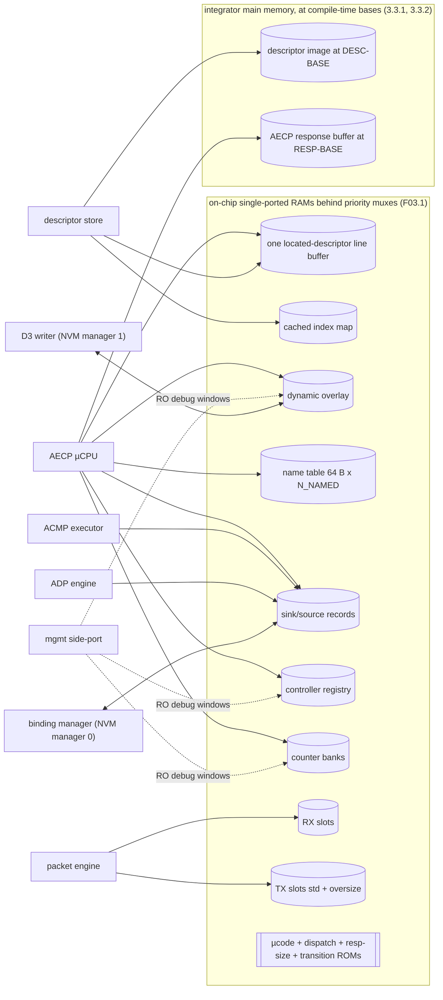
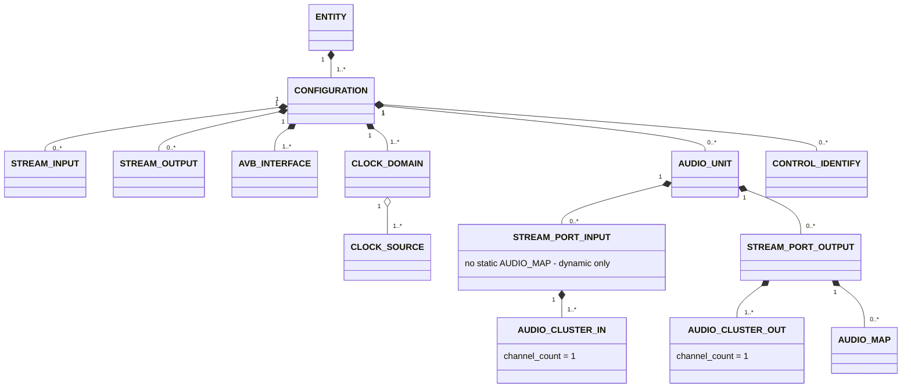
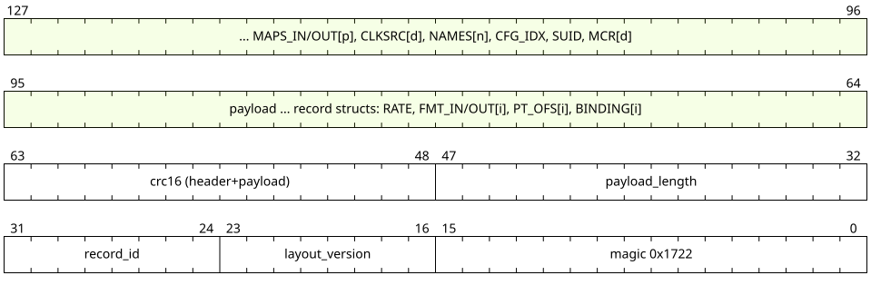

<!-- SPDX-License-Identifier: CERN-OHL-W-2.0 -->
# 07 — Memory Maps, Records, Persistence

## 1. Role

All storage: the entity model (static image + dynamic overlay + names), per-sink and
registry records, counter banks, buffers, the NVM layout and its commit/restore flows,
and the management side-port map. Other documents link here for every layout.

## 2. Memory system overview

<a id="fig-07-regions"></a>**F07.1 — Regions and port owners**


```mermaid
flowchart LR
  subgraph mainmem ["integrator main memory, at compile-time bases (3.3.1, 3.3.2)"]
    img[("descriptor image at DESC-BASE")]
    rsp[("AECP response buffer at RESP-BASE")]
  end
  subgraph rams ["on-chip single-ported RAMs behind priority muxes (F03.1)"]
    line[("one located-descriptor line buffer")]
    idx[("cached index map")]
    ovl[("dynamic overlay")]
    names[("name table 64 B x N_NAMED")]
    dyn[("sink/source records")]
    reg[("controller registry")]
    ctr[("counter banks")]
    rxs[("RX slots")]
    txs[("TX slots std + oversize")]
    ucr[["µcode + dispatch + resp-size + transition ROMs"]]
  end
  aecp["AECP µCPU"] --> line & ovl & names & dyn & reg & ctr
  aecp --> rsp
  store["descriptor store"] --> img
  store --> line & idx
  acmp["ACMP executor"] --> dyn
  adp["ADP engine"] --> dyn
  pkt["packet engine"] --> rxs & txs
  side["mgmt side-port"] -. "RO debug windows" .-> ovl & reg & ctr
  d3w["D3 writer (NVM manager 1)"] <--> ovl
  bindm["binding manager (NVM manager 0)"] <--> dyn
```

The names' NVM manager is the name stage's, accepted and not implemented yet (§5.3).

The two regions in main memory are reached over separate vendor-neutral masters and are
the integrator's to reserve — see the
[integrator guide](../guides/integrator.md#5-what-you-must-reserve-in-your-memory-map)
and [diagram 22](../diagrams/22-aecp-descriptor-fetch.svg).

Access-rights rule: exactly one writer class per region at runtime (µCPU for
overlay/names, ACMP executor for sink records, counters subsystem for banks); the
side-port is read-only everywhere after `entity_enable` except the control window.
The D3 writer writes the overlay only during its boot restore, and the binding manager
reaches the sink records only through the listener's boot preload (§5.3); in service
both only read.

## 3. Entity model

### 3.1 Descriptor tree

<a id="fig-07-tree"></a>**F07.2 — Milan descriptor tree (multiplicities per Milan §5.3.2/§5.3.3)**


```mermaid
classDiagram
    ENTITY "1" *-- "1..*" CONFIGURATION
    CONFIGURATION "1" *-- "0..*" STREAM_INPUT
    CONFIGURATION "1" *-- "0..*" STREAM_OUTPUT
    CONFIGURATION "1" *-- "1..*" AVB_INTERFACE
    CONFIGURATION "1" *-- "1..*" CLOCK_DOMAIN
    CONFIGURATION "1" *-- "0..*" AUDIO_UNIT
    CONFIGURATION "1" *-- "0..*" CONTROL_IDENTIFY
    CLOCK_DOMAIN "1" o-- "1..*" CLOCK_SOURCE
    AUDIO_UNIT "1" *-- "0..*" STREAM_PORT_INPUT
    AUDIO_UNIT "1" *-- "0..*" STREAM_PORT_OUTPUT
    STREAM_PORT_INPUT "1" *-- "1..*" AUDIO_CLUSTER_IN
    STREAM_PORT_OUTPUT "1" *-- "1..*" AUDIO_CLUSTER_OUT
    STREAM_PORT_OUTPUT "1" *-- "0..*" AUDIO_MAP
    class STREAM_PORT_INPUT { no static AUDIO_MAP - dynamic only }
    class AUDIO_CLUSTER_IN { channel_count = 1 }
    class AUDIO_CLUSTER_OUT { channel_count = 1 }
```

The `1..*` cluster minimum on both Stream Port directions follows Milan §5.3.3.8
(printed p. 27). IEEE 1722.1-2021 §7.2.13, Table 7-23 (pp. 81–82), defines
`number_of_clusters` separately from `number_of_maps`; dynamic mapping sets
`number_of_maps` to zero; it does not relax the cluster count. The parent's D8
zero-cluster 8×8 input pools conflict with that Milan requirement. The [#122 clause disposition](https://github.com/Mister-M-alt/protocol-processor-control-plane-avb-milan/issues/122#issuecomment-5853884588)
retains F07.2's minimum; the parent owns the D8 product correction under
[milan-fpga#584](https://github.com/kebag-logic/milan-fpga/issues/584).
The processor lint below refuses those pools (L1 `port-cluster-minimum`). The parent's
8×8 model packs only with a waiver that names #584, which its layout report lists and
which is refused as stale once the pools carry clusters.

The consuming product owns its shipping-model semantics. For the parent end-station,
the allocation and measured enforcement are recorded in
[`docs/reference/PP_DESCRIPTOR_OWNERSHIP.md`](https://github.com/kebag-logic/milan-fpga/blob/e0920d77/docs/reference/PP_DESCRIPTOR_OWNERSHIP.md).
That contract distinguishes construction from discriminating refusal. The processor
owns generic packed-image structure and validation: image extents, directory
well-formedness, dense indices, name binding, line-buffer bounds and descriptor
type/index consistency. An ownership assignment is not evidence that every check
is implemented. The [packer](../../hdl/aecp/desc/gen_desc_image.py) rejects
configuration and per-type index gaps, duplicate keys, invalid name bindings and
descriptors exceeding the configured line-buffer bound. It also rejects disagreement
between the descriptor body's type/index and its directory key, including both
`fields` and `bytes` inputs. Each of these refusals has a negative case in
`tb/desc_store` ([09 §8.4](09_verification.md#84-the-descriptor-model-lint-issues-38-39-60-89)).

Parent shipping checks are authoritative for all generated model content,
including every L1–L10 model obligation below: L1 partition and cardinalities
(including F07.2's minima), L2 multi-level ordering, L3, L4, L5, L6 clock-source
construction and list shape, L7, L8, L9 model identity and evolution, and L10
AUDIO_UNIT rate-list offset, count and length, plus ADP stream-count maxima
across supported configurations. All processor semantic checks, including those
retained or added under #60, provide defence in depth. Generic packer checks
remain authoritative for packed-image acceptance, including L2's index density.
Neither construction nor byte-exact serving substitutes for a negative validation
case.

<a id="model-lint"></a>**The processor model lint** is that defence in depth, placed on
the packing path so that one check guards every consumer of the packer (issue #89):

- **Where it runs.** [`model_lint.py`](../../hdl/aecp/desc/model_lint.py), with its rules in
  [`model_rules.py`](../../hdl/aecp/desc/model_rules.py), which
  `gen_desc_image.build()` calls by default after the layout checks above and before it
  renders the image. It judges the bytes that are packed, at the IEEE 1722.1-2021 §7.2
  wire offsets, and reads every variable part through the descriptor's own offset field.
  The opt-out is explicit, `build(..., lint=False)` or `--no-lint`. It exists for layout
  vectors and for deliberate negative cases that another checker must name. The layout
  report then says `semantic lint: off`.
- **How a consumer sees a refusal.** `ImageError`, one line per finding, each naming the
  rule, one check, the descriptor and the clause, for example
  `L10 rate-offset: cfg 0 AUDIO_UNIT 0: sampling_rates_offset 143; SET_SAMPLING_RATE reads the list at 144 (...)`.
  The command line prints it, exits 1 and writes no file.
- **Waivers.** A waiver excuses one check on a named descriptor scope, never a whole
  rule. It travels in the document the packer consumes (`lint_waivers`) and carries a
  reason that names its tracking issue. The report lists every applied waiver. A waiver
  is refused when it is malformed, and when it is stale: when any descriptor in its scope
  does not exist, or passes its check.
- **What it reports and checks.** The values the integrator drives on
  `entity_model_id_i`, `talker_sources_i`, `listener_sinks_i` and `identify_index_i`,
  and the model digest. These stay integrator inputs, and no generated constant replaces
  one. `build(adp=...)` (`--adp-*`) refuses a driven value that disagrees with the model,
  and `build(model_ids=...)` (`--model-ids`) refuses a recorded entity_model_id whose
  digest moved.
  - The digest is SHA-256 over every descriptor, with exactly the IEEE 1722.1-2021
    §6.2.2.8 exclusions zeroed: `object_name` in the types that carry one; the fields
    the clause lists for ENTITY, AUDIO_UNIT, STREAM_INPUT/OUTPUT, CLOCK_SOURCE,
    CLOCK_DOMAIN, AVB_INTERFACE, SIGNAL_SELECTOR, VIDEO_CLUSTER, SENSOR_CLUSTER and
    MEMORY_OBJECT; and in CONTROL, MIXER, MATRIX and SIGNAL_TRANSCODER `value_details`
    only the current subfields of the value families it names for each (the whole
    `value_details` only for a CONTROL's UTF-8, SMPTE time, sample rate, gPTP time or
    vendor value). A selector's options, a linear value's range and every other
    structural field stay in the digest.
  - The clause names each family's range from its UINT8 type, so an INT8 type's
    current value stays in the digest. That can only demand a new `entity_model_id`,
    never accept a changed structure.
  - Beyond the clause, `entity_id` (the unit's own identity) and `entity_model_id`
    (the key the digest is recorded under) are zeroed too.
  - This repository records its own models in
    [`model_ids.json`](../../hdl/aecp/desc/model_ids.json). A consumer records nothing.
- **Its models.** [`milan_min.json`](../../hdl/aecp/desc/milan_min.json) is a minimal
  Milan model and the lint's positive case. The gate derives every negative case from it
  by one named mutation ([09 §8.4](09_verification.md#84-the-descriptor-model-lint-issues-38-39-60-89)).
  [`example_milan_8.json`](../../hdl/aecp/desc/example_milan_8.json) stays a layout
  vector (the §3.2 Δ note) and packs with the lint off. The `tb/pp_top` fixture image is
  built in C++, never through `build()`, and is not a Milan model either.

The rules, each with the checks that implement it (`CHECKS` in `model_rules.py`; each
check has a negative case in the gate):

| # | Rule | Clause | Checks |
|---|---|---|---|
| L1 | Every descriptor except ENTITY/CONFIGURATION has exactly one parent; no cross-subtree sharing. F07.2's cardinalities: exactly one ENTITY, one CONFIGURATION per configuration with matching `descriptor_counts`; per configuration at least one AVB_INTERFACE, CLOCK_DOMAIN and CLOCK_SOURCE, an AUDIO_UNIT and a Stream Port of the stream's direction where a stream carries AAF, and at least one AUDIO_CLUSTER per Stream Port. Ownership is read through every IEEE §7.2 count/base pair: a Unit's Ports, CONTROLs and other multi-level children, a Port's CONTROLs, clusters and maps, and the CONTROLs of a JACK, AVB_INTERFACE, CONTROL_BLOCK or PTP_INSTANCE. An owned descriptor is not top-level, so `descriptor_counts` counts only the configuration's own | Milan §5.3.2, §5.3.3.1, §5.3.3.3, §5.3.3.5–.8, §5.3.3.11; IEEE §7.2.1 to §7.2.5, §7.2.7, §7.2.8, §7.2.13 to §7.2.15, §7.2.33, §7.2.35 | `entity-count`, `configurations-count`, `current-configuration`, `configuration-descriptors`, `descriptor-counts`, `required-type`, `audio-unit-for-aaf`, `stream-port-for-aaf`, `port-cluster-minimum`, `child-exists`, `single-parent`, `has-parent` |
| L2 | Indices dense, restart at 0 per configuration (the packer's own refusal). CONTROL, the multi-level type IEEE §7.2 names, is numbered in §7.2's walk: the configuration's own CONTROLs first, then for each Unit (AUDIO, VIDEO, SENSOR, each by index) its CONTROLs and those of its Stream, External and Internal Ports. The CONTROLs of a JACK, AVB_INTERFACE, CONTROL_BLOCK or PTP_INSTANCE are outside that walk. Single-level types (Stream Ports, clusters, maps) keep no order: §7.2 gives none, and neither the store nor the microcode reads a child range (the store takes every length from the index map, §3.3; GET_AUDIO_MAP takes `number_of_maps` from the integrator's amap face, `gen_ucode.py` NMAPS) | IEEE §7.2 | `parent-order` |
| L3 | ≥1 STREAM_INPUT or STREAM_OUTPUT per configuration. A Talker has a Stream Output, and a Listener a Stream Input, advertising a Base format (§6.3, §6.4), with rate-completeness (every Base channel count at each Base rate an input advertises) and configuration-uniformity (one set of Base rates per configuration). Every CRF format a stream lists is the Milan word 0x041060010000BB80 (so, with L4's `current-format`, a CRF stream runs at it) | Milan §5.3.3.4, §6.3/§6.4, §7.3.2, §7.3.4 Table 7.1 | `stream-presence`, `talker-base-format`, `listener-base-format`, `base-channel-completeness`, `base-rate-uniformity`, `crf-format` |
| L4 | STREAM_INPUT `buffer_length` ≥ 2 126 000 ns; CLASS_A flag set; CRF and AAF never mixed in one format list; `current_format` ∈ list (an `ut` entry covers the counts up to its own); N formats ≤ 46; the Table 7-8 layout with no redundancy tail (REQ-MDL-003) | Milan §5.3.3.4; IEEE 1722.1-2021 §7.2, Table 7-8 (the N cap: 508-octet descriptor, formats at 138) | `buffer-length`, `class-a`, `format-family`, `current-format`, `format-count`, `stream-layout` |
| L5 | A physical port (`port_number`) keeps the same AVB_INTERFACE index in every configuration that holds it. A configuration without the port is not a finding, so an interface may be absent from some configurations (a second, redundant interface stays possible) | Milan §5.3.3.5 | `interface-index` |
| L6 | CLOCK_SOURCE construction: one INPUT_STREAM per CRF-capable input (or the single AAF input when no CRF input exists); ≥1 INTERNAL if any output; ≥1 CLOCK_SOURCE per CLOCK_DOMAIN; each CLOCK_DOMAIN's `clock_sources` list sits at 76, is `76 + 2 × count` long and is the identity permutation 0..count-1 (dense, zero-based, in order): the processor's SET_CLOCK_SOURCE range check tests `clock_source_index` < `clock_sources_count` and relies on this list shape to be the IEEE §7.4.23.1 membership test ([06 §6.4](06_aecp_engine.md#64-validation-chains-order-matters-first-failure-responds)); gPTP-as-media-clock chain only in non-redundant single-interface models | Milan §5.3.3.6, §7.5; IEEE §7.2.32, §7.4.23.1 | `domain-source-offset`, `domain-source-count`, `domain-source-length`, `domain-source-identity`, `domain-source-exists`, `crf-input-source`, `aaf-input-source`, `internal-source`, `gptp-source-interfaces` |
| L7 | STREAM_PORT_INPUT owns no AUDIO_MAP; ≤1 static mapping per output stream channel; AUDIO_CLUSTER `channel_count` = 1 | Milan §5.3.3.7–.9 | `input-port-maps`, `unique-mapping`, `cluster-channels` |
| L8 | Primary IDENTIFY CONTROL present in all configurations at the same index, and `identify_index_i` names it. The ADPDU always sets AEM_IDENTIFY_CONTROL_INDEX_VALID (Milan §5.6.2, [F04.6](04_adp_engine.md#fig-04-caps)), so a model without one is refused | Milan §5.3.3.10, §5.6.2 | `identify-index`, `identify-driven` |
| L9 | `entity_model_id` ≠ 0 / ≠ all-1s; equal to `entity_model_id_i`; changes whenever the static model changes (the recorded digest) | Milan v1.2 §5.3.1, §5.3.3.1, §5.6.2; IEEE §6.2.2.8, §7.2.1 | `model-id-valid`, `model-id-driven`, `model-id-recorded`, `model-digest` |
| L10 | AUDIO_UNIT `sampling_rates_offset` = 144 and `sampling_rates_count` ≤ 8, each entry the full sampling-rate word (pull field included): the processor's SET_SAMPLING_RATE reads the list at 144 and consults at most its first 8 entries ([06 §6.4](06_aecp_engine.md#64-validation-chains-order-matters-first-failure-responds)). Another offset refuses every rate, and a rate listed past the eighth entry is refused; neither can accept an unlisted rate. The list is not empty, the descriptor is `144 + 4 × count` long, and `current_sampling_rate` is one of its words | IEEE §7.2.3, §7.4.21.1; Milan §5.3.3.3 | `rate-offset`, `rate-count`, `rate-empty`, `rate-length`, `current-rate` |
| L11 | ENTITY `talker_stream_sources` and `listener_stream_sinks` are the most STREAM_OUTPUTs and STREAM_INPUTs of any configuration, and equal `talker_sources_i` and `listener_sinks_i` | Milan §5.3.3.1, §5.6.2 | `talker-sources`, `listener-sinks`, `talker-sources-driven`, `listener-sinks-driven` |

Not linted, and left to the consumer's shipping checks: the formats a statically mapped
Stream Output may list, `interface_flags` and `entity_capabilities` bit values, the CRF
Media Clock Input and Output obligations of Milan §7.2.2 and §7.2.3, and whether a
sampling-rate list matches what the Audio Unit does (Milan §5.3.3.3, §5.3.3.4,
§5.3.3.5).

The AUDIO_UNIT descriptor extent must equal `144 + 4 × sampling_rates_count`
bytes, excluding packed-image stride padding. The parent currently emits one
configuration per image, with one or three rate words. Its loader permits at most
eight distinct entries, but its image conversion currently supports only 48000,
96000 and 192000 Hz. These are separate limits, as the parent ownership matrix
records. The processor lint enforces L10's offset, count, extent and current-rate
checks and L6's identity clock-source list (#89).

### 3.2 Descriptor sizing

<a id="fig-07-sizing"></a>**F07.3 — Fixed sizes + variable parts (IEEE Std 1722.1-2021 §7.2)**

| Descriptor | Type | Fixed B | Variable part |
|---|---|---|---|
| ENTITY | 0x0000 | 312 | — |
| CONFIGURATION | 0x0001 | 74 | + 4·descriptor_counts |
| AUDIO_UNIT | 0x0002 | 144 | + 4·sampling_rates |
| STREAM_INPUT / OUTPUT | 0x0005/6 | 138 | + 8·F formats (F ≤ 46, the 508-octet descriptor maximum of IEEE §7.2; `formats_offset` = 138) + redundancy tail `redundant_offset` = 138+8F, **R = 0 emitted** (Table 7-8; see the Δ note) |
| AVB_INTERFACE | 0x0009 | 102 | — |
| CLOCK_SOURCE | 0x000A | 86 | — |
| STREAM_PORT_IN/OUT | 0x000E/F | 20 | — (no name field) |
| AUDIO_CLUSTER | 0x0014 | 90 | — |
| AUDIO_MAP | 0x0017 | 8 | + 8·mappings {stream_index, stream_channel, cluster_offset, cluster_channel} |
| CONTROL (identify) | 0x001A | 104 | + values (LINEAR_UINT8: 1×{min,max,step,default,current…}) |
| CLOCK_DOMAIN | 0x0024 | 76 | + 2·clock_sources |

> Δ note — two stream layouts exist; **IEEE Std 1722.1-2021 Table 7-8 is the one this
> design's images carry**. The consumer's generator builds it, whole, under the §3.1
> ownership (the parent's L4 row emits Table 7-8, formats at 138, R = 0); the processor
> assembles no stream descriptor and adds no redundancy tail. It serves the image's bytes
> and reads only `current_format` (@74, the same offset in both layouts) and the lane
> after it (§3.3). Table 7-8 (§7.2.6) places `redundant_offset` at 132,
> `number_of_redundant_streams` at 134, `timing` at 136 and `formats` at 138, for
> 138+8F+2R octets. Milan v1.2 §5.3.3.4 binds the descriptor to it: these descriptors
> "shall have the format specified in [ATDECC, Clause 7.2.6]". Milan v1.2 clause 2
> (References) defines [ATDECC] as IEEE Std 1722.1-2021.
>
> Milan v1.2 Annex C Table C.1 is a second normative layout: `formats` at 136, no
> `timing` field, 136+8F+2R octets. It is **optional here**. §5.3.3.4 says "A PAAD-AE
> may use the extension ... for any of its Streams and shall use it for the Streams
> that are part of the redundant pair". This design declares no redundant pair (R = 0),
> so the *shall* never fires and Table 7-8 governs unmodified. A previous revision of
> this note claimed Annex C "takes precedence for Milan builds". That read the **may**
> as a **shall**, and no shipping descriptor was ever assembled that way.
>
> One artifact still carries Annex C deliberately: the test vector
> [`hdl/aecp/desc/example_milan_8.json`](../../hdl/aecp/desc/example_milan_8.json),
> labelled as such in its own header. It disagrees with the shipping packer on purpose,
> because §3.3 below takes each descriptor's length from the index map and never reads a
> descriptor's interior. It is not a compliance reference and must not be copied into an
> entity model.

### 3.3 Static image

Read-only at runtime. Layout = concatenated descriptors in (configuration, type,
index) order + an **index map** per configuration (type → base pointer + count) used by
`DESC_ADDR`. Each descriptor sits in the image whole, as the consumer built it; the
index map's length is the length served. READ_DESCRIPTOR answers the located
descriptor's image bytes with the name table's current names, and, for configuration 0
(the configuration the GET/SET family locates in), with the §3.4 overlay's current value
in place of the image's once a SET or the restore has written the row (issue #82):
ENTITY `current_configuration` (@310), AUDIO_UNIT `current_sampling_rate` (@136),
CLOCK_DOMAIN `clock_source_index` (@70) and STREAM_INPUT/OUTPUT `current_format` (@74),
the values the GETs then read ([06 §6.1](06_aecp_engine.md)). Nothing is appended:
there is no redundancy-tail assembly, since the image already carries the Table 7-8
tail (§3.2 Δ note).

The response ceiling of the Δ8 command set is the response buffer (§3.3.2), not the
full frame Milan §5.4.1 permits: `16 + LINE_BYTES_P` bytes, cdl 592 and a 618-byte frame
through the oversize TX slot at the default 576-byte line. READ_DESCRIPTOR reaches it
with a 576-byte descriptor and GET_AUDIO_MAP with a 71-record page (`P-MAP-SUBSET-CH-MAX`);
GET_AVB_INFO and GET_AS_PATH stay below cdl 524, and ADD/REMOVE_AUDIO_MAPPINGS mirror a
command capped there ([06 §3](06_aecp_engine.md#3-pdu-handling),
[03 §7](03_packet_engine.md)).

Software loads it into the integrator's main memory at `DESC_BASE_P`, and checks it,
before it starts the restore (`restore_go_i`, which judges saved values against it; §5.3)
and so before `entity_enable` — **not** through the side-port window, and not as a
synthesized ROM.
Both alternatives were priced and rejected in §3.3.1 below, and neither is what the RTL
does.

<a id="sec-desc-memory"></a>
#### 3.3.1 Realization — the image lives in MAIN MEMORY, not on chip

`hdl/aecp/KL_aecp_desc_store.sv`. A ROM was priced and rejected: the reference
consumer's generated model is 22,561 B at the 8×8 shape (~5 RAMB36) *before* the
§3.4 overlay and the 64-B-per-descriptor name table, it grows with every stream,
descriptor and localized string, and the reference part (xc7a100t, 135 block-RAM
tiles) measured 131 tiles used. So the image sits in the integrator's main memory —
DDR3 on the reference board — behind a **vendor-neutral read-only master** on
`protocol_processor_top` (`desc_mem_*`: byte address + 64-bit beat count out, an
in-order response stream back). This repository does not know what that memory is.

The master passes through `KL_aecp_desc_mem_guard` before reaching that face.
An accepted burst remains owed until its terminal response (`last` or `err`)
is consumed. The guard holds subsequent requests while owed and passes every
response through unchanged; a store that abandoned the burst discards its late
beats. A permanently unterminated burst therefore holds memory requests, while
the store watchdog still bounds every locate with an error. The watchdog itself
is unchanged, including the immediate error on the next locate after a fetch
response timeout.

The guard is reset by the hard reset alone. Its module port `debt_o` is a `clk_i`
level set on request acceptance and cleared on a consumed `last` or `err`, or hard
reset only. The top routes it, inside the processor, to the D3 writer in the AECP
engine; it is not a `protocol_processor_top` port. The D3 restore's **roll-back**
(§5.3) resets this store and the dynamic-state store together (`rb_rst`) for at
least two clocks and while the debt is set, and ends CLOSED if its deadline expires
first. The guard never takes that local reset, so a burst the store abandoned stays
owed across it. The store's local reset returns its fetch watchdog to zero and makes
it walk the image again, so the recovery LOCATE of ENTITY 0 that follows proves the
image anew. The memory ordering, terminal-error and reset obligations are in the
[integrator guide §4.1](../guides/integrator.md#sec-desc-memory).

The store's validated-image level (`dbg_img_valid_o` on the engine) is the D3
restore's image proof: the restore reads it, and makes the store walk the image with
a LOCATE of ENTITY 0 if it is not yet set. An image that cannot be proven ends the
restore CLOSED (§5.3), since no restored value could be judged against it.

Every address is an **elaboration parameter** (`DESC_BASE_P`), never a register and
never a CSR: the memory map is fixed when the bitstream is built, so a runtime base
would only buy a port and the flops behind it. The failure it removes ("base points
at nothing") is replaced by a likelier one — *software has not loaded the image yet*,
or loaded a truncated one — and uninitialised DRAM is not a recognisable zero. The
image therefore opens with a **magic + layout-version + checksum header** and nothing
is served until all three agree. While the image is invalid, an RGN_NCFG read reports
zero configurations, so `READ_DESCRIPTOR` returns `BAD_ARGUMENTS` before it locates.
A command that starts with a direct locate instead receives `st_err` and returns
`NO_SUCH_DESCRIPTOR`. Neither path can put descriptor bytes on the wire. A locate or
an RGN_NCFG read arriving while invalid TRIGGERS the header probe and stalls through
it, answering from the walk's
outcome (heal BEFORE answer, the r49a/w3a silicon round: the old
answer-then-re-arm order sacrificed the first wire command after every late
image load). A late load therefore heals with no reset and no lost command;
an absent bridge still degrades inside the memory watchdog.

Latency is the design problem (the reference SoC measures ~1424 ns on a miss to main
memory), so: the **index map is walked once into an on-chip table** — it is consulted
on every locate, and at 16 B per (configuration, type) caching it is cheap exactly
where caching the image is not — and a located descriptor is fetched **once, as a
single burst**, into a `LINE_BYTES_P` line buffer that every subsequent `READ_STATE` /
`COPY_BUFFER` beat reads on chip. One command pays one memory latency, not one per
byte. `LINE_BYTES_P` defaults to 576 = the largest descriptor §3.2 can produce, rounded
to the [03 §2](03_packet_engine.md) slot size. IEEE §7.2 caps any descriptor at 508
octets, which a Table 7-8 STREAM_INPUT/OUTPUT reaches at F = 46 formats with R = 0
(506 B). Even the field limits alone, F ≤ 47 formats and R ≤ 8 redundant streams, give
138 + 8·47 + 2·8 = 530 B, and the Annex C layout of the Δ note is 2 B shorter at the
same caps (528 B), so 576 covers a model assembled either way. The legal line is
`P-DESC-LINE-BYTES` ([F01.5](../architecture/01_overview.md#fig-01-params)): a multiple
of 8 from 576 to 1008, and `KL_aecp_engine` refuses any other at elaboration with a
message naming the top's `DESC_LINE_BYTES_P`. Below 576 the response reservation
(§3.3.2) cannot hold a whole GET_AUDIO_MAP page; above 1008 it passes the 1024 bytes the
response cursor addresses. A descriptor longer than the line is refused at load time
(header `desc_max_len`) and at locate time, never truncated.

The writable name table is loaded into its own on-chip overlay during the same
validation walk. A request can carry at most 511 beats, so the loader uses
504-beat chunks, the largest whole-name multiple that fits, until every 64-byte
entry is present. `NAME_ENTRIES_P` is the elaborated capacity and an image that
exceeds it is refused. The reference root derives that capacity from the same
generated entity shape that produces the image, including models whose table is
larger than one request.

<a id="sec-resp-memory"></a>
#### 3.3.2 The other main-memory region — the AECP response buffer

The image is read-only and the store never writes it, but it is not the only region
this processor addresses. The AECP **response buffer** ([03 §7.1](03_packet_engine.md))
lives in main memory too, at its own compile-time `RESP_BASE_P`, behind a second
vendor-neutral master (`resp_mem_*`) that is READ **and** WRITE. The integrator
reserves `16 + LINE_BYTES_P` bytes there; unlike the image it is written by the
processor, so an overlap with `DESC_BASE_P` is silent corruption of the entity model
and neither base may be a register. The response buffer is exactly that reservation:
no response byte is written past it (`tb/pp_top` AX RB grades it at the default line
and at a non-default one).

<a id="fig-07-image"></a>**F07.4 — flat image layout** (generator:
`hdl/aecp/desc/gen_desc_image.py`; all fields big-endian)

| Region | Field | Notes |
|---|---|---|
| header @0x00 (32 B) | `magic` u32 = `"AEMI"` · `layout_version` u16 = 1 · `n_config` u16 | |
| | `n_entries` u16 · `n_names` u16 · `index_off` u32 | |
| | `names_off` u32 · `image_bytes` u32 | |
| | `desc_max_len` u16 · reserved u16 · `checksum` u32 | the eight u32 words sum to `0xFFFFFFFF` |
| index map @`index_off` | `n_entries` × 16 B, sorted by (configuration, type): `config_index` u16 · `descriptor_type` u16 · `count` u16 · `elem_len` u16 · `elem_off` u32 · `name_base` u16 · `elem_stride` u16 | locate = `elem_off + index·elem_stride`, length `elem_len` |
| descriptors | concatenated in (configuration, type, index) order at `elem_stride` spacing | |
| name table @`names_off` | `n_names` × 64 B — the §3.4 overlay's initial content | |

Layout-version-1 constraints, enforced by the generator (it refuses an input that
violates them) and re-checked by the store at locate time: each index row is one
maximal run of equal `elem_len`, and `elem_stride` is `elem_len` rounded up to 8 so
index > 0 never starts mid-beat. Rows for one descriptor type remain contiguous.
The store accumulates the counts of earlier rows of that type before calculating
the run-relative index. This permits an AAF and CRF Stream Input to have the
different lengths their format lists require without adding a second indirection.
Bytes 0–3 of every packed descriptor equal its index-map key (type, index),
and the generator refuses a disagreement.

The µCPU's `st_*` face reaches all of this through a region nibble on `st_addr[19:16]`:
0x0 descriptor data, 0xB semantic `name_index` to writable-table byte address,
0xC the located descriptor's `name_base`, 0xD
`configurations_count` (so a µprogram can answer `BAD_ARGUMENTS` for a bad
configuration index per [06 §6.1](06_aecp_engine.md), not `NO_SUCH_DESCRIPTOR`), 0xE
its length, 0xF LOCATE with the 48-bit key on `st_wdata` — because a 20-bit address
cannot carry {configuration, type, index} and [06 §8](06_aecp_engine.md) leaves the
encoding open.

After every descriptor fetch, the store copies its named fields from the writable
table into the line buffer: ENTITY offsets 48 and 180, and offset 4 for every
other named descriptor. A name write to the currently located descriptor patches
the same line before accepting another state operation. Thus the table is the
single writable source while descriptor reads remain coherent with it.

The names initialise from the verified image at every image walk, a roll-back's
included. Persisting them is the name stage of the saved-state contract: its
restore writes names only after the image walk, and its trigger is the accepted
name-table lane write on the command side. That stage is accepted and **not
implemented** in this release.

### 3.4 Dynamic overlay

| Overlaid field | Width | NVM? |
|---|---|---|
| current configuration index | 16 | design decision — **yes** (review §8 item 1) |
| per AUDIO_UNIT `current_sampling_rate` | 32 | yes (§5.3.5.1) |
| per CLOCK_DOMAIN `clock_source_index` | 16 | yes (§5.3.11.1) |
| per stream `current_format` (READ_DESCRIPTOR serves the row once set, §3.3; GET_STREAM_FORMAT reads the integrator's face, which serves the published row) | 64 | yes (§5.3.7.1/§5.3.8.1) |
| per STREAM_OUTPUT presentation-time offset | 32 | yes (§5.3.7.6) |
| per port dynamic mapping tables | 64·M | yes (§5.3.9.1/§5.3.10.1) |
| name table: `entity_name`, `group_name`, `object_name` of every named descriptor | 64 B each | yes (§5.3.13) |
| identify value | 8 | no — reset to 0 |
| `system_unique_id` (deferred design; no storage) | 64 | not implemented under the October MVU waiver ([06 §6.9](06_aecp_engine.md#69-mvu-commands)) |
| per CLOCK_DOMAIN `user_mcr_prio` + media-clock-domain name (deferred design; no storage) | 8 + 64 B | not implemented under the same waiver |

"yes" names the saved set, not the writer. The scalar rows (configuration, sampling
rate, clock source, both formats, presentation offset) are written by the D3 writer
from the store's accepted changing write (§5.3); their records are §5.2's. The maps and
names are accepted in the same contract and implemented by later stages. The store's
sticky `dirty_o` (`aecp_dyn_dirty_o` at the top) is a diagnostic, not the trigger.

## 4. Dynamic state records

Ownership of the overlay rows of §3.4: from reset until the D3 restore's terminal the
D3 writer owns the engine's state bus (AECP dispatch is held), restores the rows it
accepts, and, on a pass-1 abort, returns the dynamic-state store and the descriptor
store to their reset state together (§5.3). In service the µCPU owns the bus, except for
the writer's one-row latch while dispatch is held. The ACMP records below are the
listener's and never take that roll-back.

<a id="fig-07-sinkrec"></a>**F07.6 — ACMP sink record** (48 B core; fields defined in
[05 §5](05_acmp_engine.md); lanes bottom→top = record order)


<details>
<summary>WaveDrom source (editable)</summary>

```wavedrom
{"reg": [
  {"bits": 3,  "name": "sm_state"},
  {"bits": 3,  "name": "pbsta"},
  {"bits": 5,  "name": "acmpsta"},
  {"bits": 8,  "name": "flags: bound,started,sw,retried,srp_decl[1:0],tk_reg,tk_disc"},
  {"bits": 13, "name": "reserved"},
  {"bits": 64, "name": "talker_entity_id"},
  {"bits": 16, "name": "talker_unique_id"},
  {"bits": 16, "name": "probe_seq"},
  {"bits": 64, "name": "bind_controller_eid"},
  {"bits": 64, "name": "settled stream_id"},
  {"bits": 48, "name": "settled stream_dest_mac"},
  {"bits": 12, "name": "settled vlan_id"},
  {"bits": 4,  "name": "rsv"},
  {"bits": 32, "name": "last_available_index"},
  {"bits": 8,  "name": "saved interface_index"},
  {"bits": 8,  "name": "sm timer handle"},
  {"bits": 8,  "name": "noadp timer handle"},
  {"bits": 8,  "name": "rsv"}
], "config": {"bits": 384, "lanes": 12, "hspace": 950}}
```

</details>

Plus per sink: SRP failure registers {code 8, bridge_id 64} held in the `srp` adapter;
NVM shadow ≈ 20 B ({valid, talker EID, unique_id, controller EID, started}).

<a id="fig-07-regrec"></a>**F07.7 — Controller-registry entry** (28 B; Δ12 tuple; lanes
bottom→top = record order)


<details>
<summary>WaveDrom source (editable)</summary>

```wavedrom
{"reg": [
  {"bits": 64, "name": "controller_entity_id"},
  {"bits": 48, "name": "mac_address"},
  {"bits": 8,  "name": "port (AVB interface)"},
  {"bits": 8,  "name": "flags: valid, time_limited, probing"},
  {"bits": 16, "name": "next unsolicited sequence_id (init 0)"},
  {"bits": 16, "name": "reserved"},
  {"bits": 32, "name": "monitor deadline (T-NOTIF-MONITOR)"},
  {"bits": 32, "name": "time-limited deadline (T-NOTIF-TIMELIMITED)"}
], "config": {"bits": 224, "lanes": 7, "hspace": 950}}
```

</details>

<a id="fig-07-ctrmap"></a>**F07.10 — Counter banks** (full-bank form; compressed
option = only-implemented-offsets with an index ROM):

| Bank | Instances | Size | Reset domain |
|---|---|---|---|
| AVB_INTERFACE | P-N-AVB-INTERFACES | 4 (valid mask ROM) + 128 B | boot only |
| CLOCK_DOMAIN | P-N-CLOCK-DOMAINS | 128 B | boot only |
| STREAM_INPUT | P-N-STREAM-IN | 128 B | boot + **not-bound→bound** clear |
| STREAM_OUTPUT | P-N-STREAM-OUT | 128 B | boot; MEDIA_RESET/TS_UNCERTAIN/FRAMES_TX clear on stream start |

Event→address mapping and masks: [F06.15](06_aecp_engine.md#fig-06-counters).

## 5. Persistence

### 5.1 Persisted vs volatile (normative set — REQ-PER-001/002)

| Persisted (Milan clause) | Volatile (clause) |
|---|---|
| sampling rate (§5.3.5.1) · stream formats in/out (§5.3.7.1/§5.3.8.1) · presentation offset (§5.3.7.6) · bound state + binding params (§5.3.8.2/.3) · started/stopped (§5.3.8.7) · output + input mappings (§5.3.9.1/§5.3.10.1) · clock source (§5.3.11.1) · all user names (§5.3.13) | lock state (§5.3.4.1) · controller registry (§5.3.4.2) · identify value = 0 after reset (§5.3.12) |
| design decision (review §8): current configuration index | |

The earlier design intention to persist `system_unique_id`, `user_mcr_prio`
and the media-clock-domain name is deferred with their commands under the
[October MVU waiver](06_aecp_engine.md#69-mvu-commands). These fields are neither
stored nor persisted by the processor in this release.

The volatile column is enforced at the trigger, not by the absence of a completion
mark: the D3 writer's change snoop covers dynamic-state selectors 0 to 5 only, so
IDENTIFY (selector 7) never becomes pending, and lock and registry state has no
record ([parent D3 contract](https://github.com/kebag-logic/milan-fpga/blob/7a7582f0/docs/design/SAVED_STATE_MATERIALIZATION.md) §9). The CONTROL descriptor's **name** is a user
name like any other and is persisted with the name group. Which record carries each
persisted item, and which stage writes it, is §5.2's inventory.

### 5.2 NVM record layout

<a id="fig-07-nvmrec"></a>**F07.8 — Record framing** (device-agnostic; one record per
item group and index — a partial update never rewrites unrelated records; lanes
bottom→top = record order)

The SUID and MCR[d] labels in F07.8 are reserved design groups, not implemented
records in the October release ([06 §6.9](06_aecp_engine.md#69-mvu-commands)).

**The record inventory.** The allocation authority is the parent saved-state page's
[§4.2](https://github.com/kebag-logic/milan-fpga/blob/7a7582f0/docs/design/SAVED_STATE_FASTCONNECT.md#42-the-allocation----decided-the-donors-f078-rule-unchanged); this table
restates it with the processor's writer for each block. A record sits at
`base + index`; one record per group and index, user names included (one 64-byte record
per writable-name ordinal, the AEM string verbatim, no name banks).

| ids | group | index | payload | writer in this release |
|---|---|---|---|---|
| `0x00` | configuration index | - | u16 | D3 writer (scalar stage) |
| `0x01` | system unique id | - | reserved | none: kept erased (MVU waiver) |
| `0x02` .. `0x09` | sampling rate | AUDIO_UNIT | u32 | D3 writer (scalar stage) |
| `0x0A` .. `0x11` | clock source index | CLOCK_DOMAIN | u16 | D3 writer (scalar stage) |
| `0x12` .. `0x19` | media clock reference | CLOCK_DOMAIN | reserved | none: kept erased (MVU waiver) |
| `0x20` .. `0x2F` | binding | sink | 20 B | binding manager (`REC_ID_BASE_P`) |
| `0x30` .. `0x3F` | stream format in | STREAM_INPUT | u64 | D3 writer (scalar stage) |
| `0x40` .. `0x4F` | stream format out | STREAM_OUTPUT | u64 | D3 writer (scalar stage) |
| `0x50` .. `0x5F` | presentation time offset | STREAM_OUTPUT | u32 | D3 writer (scalar stage) |
| `0x60` .. `0x6F` | channel map in | STREAM_PORT_INPUT | clusters × 8 B | accepted, not implemented (map stage) |
| `0x70` .. `0x7F` | channel map out | STREAM_PORT_OUTPUT | max(clusters, STREAM_OUTPUT × 8) × 8 B for a dynamic port (#501), clusters × 8 B for a static one | accepted, not implemented (map stage) |
| `0x80` .. `0xFF` | user name | writable-name ordinal | 64 B | accepted, not implemented (name stage) |

Every multi-byte field is big-endian. An unused map entry is eight `0xFF` bytes.



<details>
<summary>WaveDrom source (editable)</summary>

```wavedrom
{"reg": [
  {"bits": 16, "name": "magic 0x1722"},
  {"bits": 8,  "name": "layout_version"},
  {"bits": 8,  "name": "record_id"},
  {"bits": 16, "name": "payload_length"},
  {"bits": 16, "name": "crc16 (header+payload)"},
  {"bits": 32, "name": "payload ... record structs: RATE, FMT_IN/OUT[i], PT_OFS[i], BINDING[i]", "type": 3},
  {"bits": 32, "name": "... MAPS_IN/OUT[p], CLKSRC[d], NAMES[n], CFG_IDX, SUID, MCR[d]", "type": 3}
], "config": {"bits": 128, "lanes": 4, "hspace": 950}}
```

</details>

### 5.3 Commit / restore flows

<a id="fig-07-nvmflow"></a>**F07.9 — Runtime commit and boot restore**


```mermaid
flowchart TB
  subgraph runtime ["runtime commit (one record producer; the binding manager's is the same loop)"]
    chg["accepted live write that changes a record's projection {value, valid}:<br/>selectors 0-5 on the µCPU's side of the state bus (D3 §3.1);<br/>never a completion mark, never a restore write, never IDENTIFY"] --> dirty["set dirty[group, index]"]
    dirty --> deb["first-dirty window of 500 ticks (T-NVM-DEBOUNCE) arms one burst"]
    deb --> acq["ACQUIRE: hold dispatch; wait for no program in flight"]
    acq --> latch["LATCH the row over the state bus, taint 0; release"]
    latch --> ser["frame F07.8 + crc16"] --> port["class-F WRITE through manager 1 (F02.8); attempt + 1"]
    port --> ok{"port"}
    ok -- "done, not tainted" --> clr["clear dirty[group, index] - the backend owns it now"]
    ok -- "done, tainted: a change after the latch" --> keep["dirty kept; a change on the done edge wins"]
    ok -- "err, attempt 1 or 2" --> bo["BACKOFF RETRY_BACKOFF_CYC_P (500 ms), then a fresh latch"]
    bo --> acq
    ok -- "err, attempt 3" --> alarm["drop the record: clear dirty, nvm_alarm_o set until reset"]
  end
  subgraph boot ["boot restore: two walks, three releases"]
    aem["AEM loaded and CRC-checked by the platform; restore_go_i"] --> bw["binding walk (manager 0): read, validate, preload the listener"]
    bw --> drained["drained binding terminal: the admission gate's release (S4)<br/>= live ACMP listener work"]
    drained --> img{"descriptor image proven?<br/>(valid, or a LOCATE of ENTITY 0 walks it)"}
    img -- no --> closed["CLOSED: fail, never done; AECP and ADP held until reset"]
    img -- yes --> p0["pass 0: every D3 record read whole or blank"]
    p0 -- abort --> defs0["DEFAULTS: done + fail, nothing applied"]
    p0 --> p1["pass 1: read again; passes agree; frame; value rule;<br/>apply value with its valid bit"]
    p1 -- abort --> rb["ROLL-BACK both stores (rb_rst, held while desc debt)"]
    rb --> reloc{"re-LOCATE proves the image?"}
    reloc -- yes --> defs1["DEFAULTS: done + fail + rolled back"]
    reloc -- no --> closed
    p1 --> comp["COMPLETE: done"]
    comp --> aecp["AECP dispatch released (the held commands first)"]
    defs0 --> aecp
    defs1 --> aecp
    aecp --> en["restore_done_o = both walks: entity_enable_i reaches ADP (Milan 5.6.1)"]
  end
```

**Runtime: who writes which record.** Two record producers share the one port behind
`KL_pp_nvm_mgr_arb` ([02 §8.2](02_interfaces.md#82-two-record-managers-one-port)): the
binding manager `KL_acmp_nvm_shadow` (manager 0, region 0x20, from the listener's record
write-back) and the D3 writer `KL_aecp_nvm_writer` inside the AECP engine (manager 1, the
scalar records of §3.4's rows). The D3 writer's trigger is the dynamic-state store's
**accepted write that changes the row's `{value, valid}` projection**, selectors 0 to 5,
tapped on the µCPU's side of the engine's state-bus selection
([parent D3 contract](https://github.com/kebag-logic/milan-fpga/blob/7a7582f0/docs/design/SAVED_STATE_MATERIALIZATION.md) §3.1, DR2b). A restore write is therefore never a change, IDENTIFY (selector 7) sets nothing,
and a row becoming valid at its reset value is a change. The µprogram's `NVM_MARK`
instructions keep their completion effects (`aecp_nvm_stb_o` / `aecp_nvm_mark_o`,
[02 §8](02_interfaces.md#fig-02-nvmwave)); they select no record. The user-name and
channel-map groups are accepted in the same contract (§3.1: the name-table lane write and
the phase-5 map commit beat) and are **not implemented yet**: they have no writer until
their stages land, and their records are neither written nor restored by this release.

The service loop, both producers alike: the first dirty record opens a
`T-NVM-DEBOUNCE` window (500 ticks of `tick_ms`: `DEB_TICKS_P`, `DEB_MS_P`); its close arms one burst that drains every
dirty record in round-robin order. For each, the D3 writer holds AECP dispatch (ACQUIRE),
waits until no program is in flight, then takes the state bus for one read of the row
(LATCH) and releases both, so a latched value is always one a completed command left.
The record is framed (F07.8) and written; an attempt starts at the arbiter's grant. A
change to the record after its latch **taints** the write, whose `done` then clears
nothing; a change on the `done` edge wins; set and clear name the record by group **and**
index. An untainted `done` clears the record: from that `done` the integrator's backend
owns it (parent D3 §7.1), and nothing a flash slot does later reaches back to the
producer. A failed attempt waits `RETRY_BACKOFF_CYC_P` clocks (`NVM_RETRY_BACKOFF_CYC_P`
at the top, 500 ms, [F08.1](08_timing.md) `T-NVM-RETRY-BACKOFF`) holding neither the
state bus nor the port, then relatches afresh; relatching never replenishes the count.
The third failed attempt (`1 + RETRY_MAX_P`, `RETRY_MAX_P = 2` additional retries) drops
the record with `nvm_alarm_o`, which only reset clears (parent DR2c). The binding manager
follows the same rules on its own sink records. Pending is exported per producer:
`nvm_unflushed_o` (binding sinks) and `d3_unflushed_o` (any D3 record dirty); the
integrator's pending is their OR ([02 §8.1](02_interfaces.md#81-what-the-integrator-reads-while-a-commit-is-outstanding)).
`aecp_dyn_dirty_o` is a sticky diagnostic of the store, not persistence work.

**Boot: the order.** The platform loads and CRC-checks the AEM image in main memory
before it starts the restore (`restore_go_i`), because the D3 walk judges values against
that image. From reset, the listener's work faces are owned by the admission gate and
AECP dispatch by the D3 writer. Three releases follow, each its own
([05 §5.1](05_acmp_engine.md#sec-05-boot-admission), parent D3 §8.1):

| Point | Releases | What runs from it |
|---|---|---|
| the binding walk's **drained** terminal: the admission gate's release | the listener's four work faces | live ACMP listener work, on the restored bindings or the defaults |
| the D3 terminal COMPLETE or DEFAULTS | AECP dispatch and the state bus | AECP programs, those held since reset first; CLOSED never releases |
| `restore_done_o` = both walks | the ADP engine's enable, `entity_enable_i && restore_done_o` | ADP advertising (Milan 5.6.1); the side port's image-window lock keeps the requested `entity_enable_i` |

A read-only command that arrives during either walk is answered after its release, from
the restored state or the defaults, and it changes nothing here either way.

**How a binding walk ends** (`KL_acmp_nvm_shadow`, processor issue #93). A walk is a
transaction: a transport failure anywhere ends it with **every** sink not captured live at
its vendor default, the binding manager's raw fail and no preload, never with part of the
image. It rejects the image, not the media: every saved record stays in the device as it
was. The raw verdicts below are the binding manager's; the top's
`restore_done_o` / `restore_fail_o` / `restore_blank_o` combine them with the D3 walk's
(below), and `restore_cause_o` stays the binding walk's cause.

| The record read… | Result | `restore_cause_o` |
|---|---|---|
| delivers a whole record that passes crc, layout_version, record_id and length | that sink's saved binding is stored and later preloaded | 0 |
| delivers a whole record that fails one of those | **that record's** vendor default; the walk continues | 0 |
| ends with nothing forwarded because the device answered with something that is not a record: a clean `done`, or an `err` the port names UNFRAMED ([02 §8](02_interfaces.md#fig-02-nvmwave)) | **that record's** vendor default; the walk continues | 0 |
| ends after at least one forwarded byte and short of the record (torn) | the **whole walk** fails | 1 |
| ends with nothing forwarded on an `err` the port names DEVICE (a device error, or a header read the device ended short) | the **whole walk** fails: a failing device is not an empty record | 2 |
| waits `P-NVM-RS-TMO-CYC` consecutive clocks without progress (`T-NVM-RS-DEADLINE`): for the port idle before a read, or for a byte, `done` or `err` during it | the **whole walk** fails, and a read already issued is abandoned to the arbiter, which drains it ([02 §8.2](02_interfaces.md#82-two-record-managers-one-port)) | 3 |
| is still reading when the restore's aggregate deadline fires (`T-NVM-RS-AGGREGATE`, below): at once before a read is issued, else in its first clock without a byte, `done` or `err`, which may be the clock its read strobe is issued | the same path: the **whole walk** fails and an issued read goes to the drain, also one abandoned in its issue clock (the arbiter arms the drain there, [02 §8.2](02_interfaces.md#82-two-record-managers-one-port)) | 3 |

Progress is the awaited event itself, so a device that is slow but moving never trips the
deadline, and the deadline bounds only the read phase: the preload phase is bounded by
the listener's admission ([05 §5.1](05_acmp_engine.md#sec-05-boot-admission)). A failed
walk still reaches its terminal, the listener is released and answers on the defaults,
and the D3 walk starts. The binding manager's raw blank reads 1 for a walk that validated
no record, a failed one included; the top's combined `restore_blank_o` never does (below).
What the deadline does **not** do: it gives the port no deadline of its own and releases
nothing on time. A device that ends the abandoned read late ends the drain and the port
serves the next operation; a device that never ends it leaves the port quarantined until
reset.

**A failed walk keeps the saved records** (processor issue #92). After the atomic reject
the listener runs on its defaults, and it writes its record back for every command it
serves, a read-only `GET_RX_STATE` included. The shadow commits only a record that differs
from what it holds, and **two unbound records never differ**, whatever their other fields:
an unbound record carries no binding (Milan v1.2 5.3.8.3 clears the binding parameters on
unbind), and no walk preloads one. So a command that leaves a sink unbound writes nothing
after a failed walk, whether it is a `GET_RX_STATE` held from the boot window, a later
poll, or an `UNBIND` of a sink the failed walk left unbound, and the next walk on a
healthy device restores every saved binding. A `BIND` does bind the sink: it replaces
that sink's record, as it would after any walk. Graded for all three causes in
[`tb/acmp_nvm`](../../tb/acmp_nvm/README.md) (N8) and at the top in
[`tb/pp_top`](../../tb/pp_top/README.md) (BW3).

**How the D3 walk ends** (`KL_aecp_nvm_writer`, processor issue #131; parent D3 §6.2,
§8.6). It starts at the admission gate's release and is a transaction too. It first
**proves the descriptor image**: the store's validated-image level, or a LOCATE of
ENTITY 0 that makes the store walk the image the platform loaded. **Pass 0** reads every
D3 record and only marks it whole or blank; **pass 1** reads each again, requires the
same verdict as pass 0, checks the F07.8 frame, judges the value by the rule of the SET
program that would set it (configuration below `configurations_count`; a rate on the
AUDIO_UNIT's list; a clock source below `clock_sources_count`; a format the integrator's
judge supports; a presentation offset with bit 31 clear) and writes an accepted value
with its valid flag. A framed record whose frame or value fails keeps its default and the
walk goes on. Every restore wait is watched by one count of stalled clocks, and the whole
restore by a second count: `P-NVM-RS-AGG-CYC` clocks (1,000 ms, `T-NVM-RS-AGGREGATE`)
from the accepted restore start (`restore_go_i`), the binding walk, both passes and the
roll-back included. At that bound the phase the restore is in takes the path a stalled
wait takes in it, once, in the first clock at or after the bound whose wait has no event
in hand; a device that answers every wait just inside its deadline therefore ends there,
within one per-wait deadline of it plus a few clocks, or within two plus a few clocks
when a roll-back follows it (its debt wait and its re-LOCATE are each bounded by one;
parent DR3a, ratified as an enforced bound). **An
aggregate expiry never closes a provable image** (the ratification's clarification,
processor issue #131): a binding walk still reading takes its own per-wait path (it fails
whole and releases the listener, table above), and the D3 walk then proves the image,
with no record read, and ends DEFAULTS.

| Event | Cause (`rs_cause_o`) | Terminal |
|---|---|---|
| the image cannot be proven (the LOCATE errs or finds no validated image) | 7 | **CLOSED**: fail, never done; AECP dispatch and ADP held until reset; the listener stays released and keeps its latency: at most one AECP command stays held in the ingress, and every further one is dropped at its slot gate and counted (snapshot word 37; [03 §6](03_packet_engine.md) rule (d)) |
| the aggregate bound before the image is proven: the binding walk still reading (it fails whole, table above), or the image proof under way | 3 | **DEFAULTS** once the image is proven, with no record read (done and fail; nothing was applied); **CLOSED** only if it cannot be proven (the row above, cause 7) |
| the image proof's own LOCATE stalls `P-NVM-RS-TMO-CYC` clocks (reachable only with `P-NVM-RS-TMO-CYC` below the store's image walk, which the integrator guide rules out) | 3 | **CLOSED**, no roll-back: nothing was read |
| in pass 0: a DEVICE err, a torn read, a stall of `P-NVM-RS-TMO-CYC` clocks or the aggregate bound (a granted read abandoned to the drain) | 2, 1, 3 | **DEFAULTS**: done and fail; nothing was applied |
| in pass 1: any of those, a record whole in one pass and not the other, or a descriptor read a value rule needs that errs (never a refusal) | 2, 1, 3, 5, 6 | **ROLL-BACK**, then DEFAULTS or CLOSED |
| during the roll-back: its debt wait or re-LOCATE stalls `P-NVM-RS-TMO-CYC` clocks, or the aggregate bound falls in either (the roll-back could not prove the image again by the deadline) | the pass-1 abort's (the first abort names the restore) | **CLOSED** |
| an UNFRAMED err with nothing forwarded | - | that record is blank; the walk continues |
| pass 1 ends | - | **COMPLETE**: done |

The **roll-back** undoes pass 1 by reset: `rb_rst` resets the dynamic-state store and the
descriptor store together for at least two clocks and while the descriptor-memory guard
owes a burst its terminal beat (`debt_o`, §3.3.1). The guard takes the hard reset only, so
its debt survives the local reset. The store's reset returns its fetch watchdog to zero
and makes it walk the image again; the re-LOCATE of ENTITY 0 that follows proves the
image anew: a hit ends DEFAULTS with `restore_rb_o`, a miss or error, or an abort during
the roll-back, ends CLOSED. The roll-back owns neither the binding manager, the listener
nor its admission gate: **bindings the binding walk restored stay restored**. Maps join
the roll-back with their stage (parent D3 §8.6); they are not restored in this release.

**Combined verdicts at the top** (parent D3 §8.7):

| Output | Meaning |
|---|---|
| `restore_done_o` | the drained binding terminal AND the D3 walk's done (COMPLETE or DEFAULTS); never in CLOSED |
| `restore_busy_o` | from the binding walk's start to that combined terminal; 0 in CLOSED |
| `restore_fail_o` | either walk failed |
| `restore_blank_o` | done, **not failed**, and neither walk validated a record: a failed product restore is never blank |
| `restore_closed_o`, `rs_cause_o[2:0]`, `restore_rb_o` | the D3 walk's CLOSED terminal, its cause, and its roll-back |
| `restore_cause_o[1:0]` | the binding walk's cause, unchanged |
| `nvm_alarm_o` | either producer exhausted a record's three write attempts; reset-sticky |

Graded at the top in [`tb/pp_top`](../../tb/pp_top/README.md) (D3O, D3S, D3R).

### 5.4 Open decisions

Recorded in [review §8](../00_MILAN_COMPLIANCE_REVIEW.md): configuration-index
persistence is a design decision (Milan silent), retained by the parent D3 contract
(§16, "design-affirmative"). The earlier system_unique_id and MCR persistence plans are
deferred under [06 §6.9](06_aecp_engine.md#69-mvu-commands); their record spans stay
deliberately erased.

Decided by the parent manager rulings ([D3 contract](https://github.com/kebag-logic/milan-fpga/blob/7a7582f0/docs/design/SAVED_STATE_MATERIALIZATION.md) §15.1):

- **Migration (DR5).** The inventory above and its flat ids are retained. An image whose
  identity, shape or layout is incompatible is refused under the integrator's image
  rules and never erased merely on refusal; any added source, name growth or layout
  change needs a public migration decision and new goldens first.
- **Wear (DR2a, DR2b).** A producer writes once per first-dirty window
  (`T-NVM-DEBOUNCE`, 500 ms), draining one burst; only a proven unchanged
  `{value, valid}` projection is suppressed, so every real change is written and an
  identical rewrite is not. Coalescing beyond that is the integrator's (its firmware
  window, 1,000 ms) and device-dependent.
- **Retries (DR2c).** At most three write attempts per record, 500 ms apart, then the
  reset-sticky alarm (§5.3).

### 5.5 Side-port address map (detail of [02 §7](02_interfaces.md))

| Window (word addr) | Access | Contents | State in the landed top |
|---|---|---|---|
| 0x00000–0x0FFFF | W pre-enable | descriptor image, index maps, identity registers (entity_id, model_id, MACs, capabilities), profile select | reserved seam — reads 0; the image is loaded into main memory at `DESC_BASE_P` instead (§3.3.1 above) |
| 0x10000–0x1FFFF | RO | overlay + name table debug view | reserved seam — reads 0 |
| 0x20000–0x2FFFF | RO | registry entries, counter banks, sink records (snapshot) | **implemented** — the F02.10 class-D dictionary plus front-end counters |
| 0x30000–0x300FF | RW | control/status: entity_enable, boot state, NVM alarm, version/build id | word 0 scratch, word 1 boot state |
| 0x40000–0x4FFFF | RO | trace ring (class-A framing) | **implemented** |
| 0x50000–0x5FFFF | RW | firmware mailbox (`P-EN-FIRMWARE-ASSIST` only) | disabled — every access refused |

The **snapshot window at `0x20000`** is the observability surface. Its words 32–37 publish
the AECP engine, the descriptor store and the response buffer: command, response, drop and
locate-miss counters, the last response's status and length, the image-valid flag and its
fault code, and — words 35 and 36 — the count of responses voided by the response memory,
the lanes written to it and the last fault code on that master; word 37 counts the AECP
frames dropped at the slot gate while the D3 writer held AECP with one AECP record resident
(the AECP hold admission, [03 §6](03_packet_engine.md) rule (d)). The wire only ever shows
`ENTITY_MISBEHAVING` when that bridge fails; this window is where an integrator sees which
channel failed and how often.

The word-by-word map, with bit positions, is in the
[operator guide](../guides/operator.md#5-the-snapshot-window-word-by-word). Refused
accesses — a write to a read-only window, an image write after `entity_enable`, or any
unmapped address — answer with the error flag one cycle later and are never forwarded;
the enforcement lives in
[`KL_pp_side_port`](../../hdl/packet_engine/KL_pp_side_port.sv), not with the host.

## 6. Sizing roll-up (worked example)

Baseline: 1 configuration, 1 AVB interface, 2 in + 2 out streams, F = 6 formats each,
1 audio unit, 2 + 2 stream ports, 2 clusters/port, 1 output AUDIO_MAP (8 entries),
2 clock sources, 1 clock domain, identify control.

| Region | Formula | Bytes |
|---|---|---|
| Static image (**main memory**, not block RAM) | 312 + (74+4·10) + (144+4·3) + 4·(138+48) + 102 + 2·86 + 4·20 + 8·90 + (8+64) + (104+9) + (76+4) + index maps ≈ | **≈ 2.9 K** at this small baseline; the reference consumer's model at its shipping shape is an order of magnitude larger, which is why §3.3.1 moved it off chip |
| Overlay + names | ≈ 20 named × 64 + currents + maps | ≈ 1.6 K |
| Sink/source records | 2×48 + 2×16 (source DA gates) | 128 |
| Registry | 16 × 28 | 448 |
| Counters | (1+1+2+2) × 132 | 792 |
| RX + TX slots | 4×576 + 4×576 + 1600 | 6.2 K |
| NVM image | Σ records ≈ | ≈ 2.5 K |

Total block RAM well under 32 KB for the baseline — the architecture scales linearly
via the [F01.5](01_overview.md#fig-01-params) parameters. Note that the first and largest
row is **not** block RAM in the landed implementation: the static image and the AECP
response buffer both live in the integrator's main memory (§3.3.1, §3.3.2), which is what
makes the on-chip total fit at all on the reference part.

## 7. Cross-references

Covers REQ-MDL-001…011, REQ-PER-001…003 and storage referenced by
[04](04_adp_engine.md)/[05](05_acmp_engine.md)/[06](06_aecp_engine.md). NVM handshake:
[F02.8](02_interfaces.md#fig-02-nvmwave). Power-cut verification: NVM category
([09 §3](09_verification.md)).
