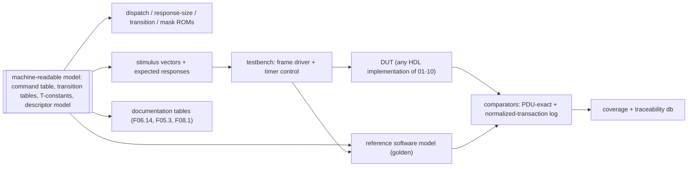
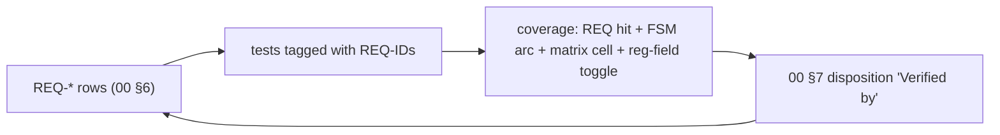

<!-- SPDX-License-Identifier: CERN-OHL-W-2.0 -->
# 09 — Verification & Compliance Strategy

## 1. Environment

**F09.1 — Single-source model drives everything**

The reference model and the DUT consume identical stimulus; comparison happens at two
levels: **wire-exact** response octets (parser/builder correctness) and the
**normalized-transaction log** (semantic state evolution: bindings, registry, lock,
counters). This realizes the original document's single-source vision
([review §4](../00_MILAN_COMPLIANCE_REVIEW.md)).

## 2. Traceability

**F09.2 — Requirement ↔ test loop**

Rule: every matrix row's **Ver** category expands to ≥ 1 tagged test; a release run
reports uncovered REQ-IDs as failures.

## 3. Test categories

**F09.3 — Categories (the Ver column vocabulary of 00 §6)**

| Cat | Method | Coverage goal |
|---|---|---|
| **DIR** | directed per-command tests from generated vectors (valid + each error status) | every F06.14 row, every status code reachable |
| **MTXW** | **matrix walker**: drive every cell of [F05.3](05_acmp_engine.md#fig-05-listener-matrix) (state × event, incl. `—`/`ign` cells proven inert), both ADP SMs, the SRP FSMs ([F10.2–F10.5](10_srp_engine.md), incl. the Δ13 registrar rule), and the MAAP Table B.7 matrix ([11 §6](11_maap_engine.md), incl. both compare_MAC tie-breaks and the `-x-` ignores) | 100 % cells + FSM arcs |
| **TOL** | malformed/tolerance suite ([F09.4](#fig-09-malformed)) | every V-rule of [F03.6](03_packet_engine.md#fig-03-valrules) |
| **TIM** | compressed-timer runs (prescaler factor) over every [F08.1](08_timing.md#fig-08-constants) row: advertise cadence, probe attempts + backoff, settle timeout, controller monitors, lock auto-unlock, TIME_LIMITED expiry, DA freshness; plus response-budget assertions (`T-BUDGET-*`) | every F08.1 row exercised + budget histograms |
| **RND** | randomized multi-controller sessions (16+ controllers: register/deregister churn, concurrent SETs, lock contention, GDI batches) against the reference model | scoreboard classes interleaved; no divergence |
| **STORM** | notification stress: counter churn at rate limit, fan-out to full registry, TX-arbiter starvation probes | pacing + ≤1/desc/s verified; no solicited deadline miss |
| **NVM** | power-cut/restore: cut at randomized commit points, verify CRC fallback + restored bindings enter `PRB_W_AVAIL`; persisted-set completeness per REQ-PER-001. For every persisted group: the stores read cleared (value and valid flag) before any restore applies; a real command saves and a real command reads back after reset; deleting the group's live trigger, or its replay, each fails a named check; a completion mark is never the oracle; volatile state (IDENTIFY, lock, registry) is populated before the cycle and absent after it; transport faults (DEVICE, torn, deadline) are kept distinct from value refusals; descriptor-memory debt and roll-back faults end DEFAULTS or CLOSED (§8.2) | every record type cut ≥ once; every group's trigger and replay mutation killed |

**F09.4 — Malformed/tolerance list (TOL)**

| Case | Expected |
|---|---|
| 96-B IEEE 1722.1-2021 ACMPDU (cdl 84) and 56-B Milan ACMPDU (cdl 44, the IEEE 1722.1-2013 length) | both accepted (V3) |
| REGISTER_UNSOLICITED without `flags` (cdl 12) | accepted as flags = 0 (V4) |
| padded minimum-size frames, cdl < frame length | parsed by cdl (V2) |
| cdl + 12 > frame length | dropped + counted (V1) |
| AECP command for a foreign target, including exact 38 through 45 B frames | silently dropped before short-command response dispatch (V6) |
| h ≠ 0 / version ≠ 0 / unknown subtype | dropped (V8) |
| unknown AEM opcode (each reserved range sampled) | echo + `NOT_IMPLEMENTED`, correctly sized |
| MVU wrong protocol_id / unknown MVU type | VU `NOT_IMPLEMENTED` echo |
| GET_DYNAMIC_INFO with a **non-§7.4.76.2** command inside (variable-size GET or non-GET) | `BAD_ARGUMENTS`, nothing processed |
| GET_DYNAMIC_INFO batching **all 13** §7.4.76.2 commands | accepted; unimplemented members answered per-element `NOT_SUPPORTED`, implemented ones with data |
| GET_DYNAMIC_INFO batch overflowing 524 cdl | overflowing elements skipped, rest answered |
| oversize READ_DESCRIPTOR response path | > 524-cdl frame emitted correctly (Δ8): byte-exact, through TX slot 4 above a 576-byte frame and freed after (tb/pp_top AX OV) |
| GET_AUDIO_MAP page above 62 records | served whole up to 71 (above cdl 524, the oversize slot from 66); above 71 `NO_RESOURCES`, `number_of_mappings` 0 (tb/pp_top AX PG) |
| ACMP responses with mismatched {controller, seq} | silently ignored |
| IDENTIFY_NOTIFICATION received as a command | `BAD_ARGUMENTS`, correctly sized (IEEE §7.4.39.2) |
| duplicate BIND_RX (same seq) replay | idempotent / cached response |
| MRPDU with a malformed vector attribute mid-PDU | prefix processed; rest of that list + subsequent messages discarded (V9, Milan §4.2.7.1.2) |
| deadline expiry mid-command (TIM, compressed timers) | forced FAIL_SAFE response emitted — never a silent retire (03 §6 rule (e)); `tb/pp_top` DL1 to DL6 ([§8.3](#83-the-aecp-deadline-and-the-hazard-classes-issues-81-57-84)) |

## 4. Reference-model contract

- Interfaces mirror [02](02_interfaces.md): frame in/out, class-B/C/D adapter stubs
  with scriptable state (SRP attribute injection, GM changes, media-lock events),
  virtual NVM, virtual time.
- Log format: one line per normalized transaction
  {origin, protocol, opcode, key, status, state-delta hash} — diffable against the DUT
  trace port ([02 §7](02_interfaces.md)).
- The model is the arbiter for RND; wire-exact comparison is authoritative for DIR/TOL.

## 5. Conformance alignment

Milan v1.2 has **no PICS annex**; certification runs against Avnu's separate test
plans. The 00 §6 matrix is this project's conformance statement; categories DIR/TIM/TOL
are designed so an Avnu-style external tester (e.g. probing advertise cadence, binding
recovery, GET_MILAN_INFO) passes as a byproduct. Interop smoke set: enumerate + bind
against at least two independent controller implementations.

## 6. Coverage targets

| Metric | Target |
|---|---|
| F05.3 matrix cells (incl. inert proofs) | 100 % |
| FSM states/arcs (F04.2, F04.3, F05.4/5, F06.5, F06.8, F03.3) | 100 % |
| F06.14 rows × {success, each error} | 100 % |
| PDU reg-figure field toggle (parser + builder) | 100 % of defined fields |
| REQ-ID tags | 100 % (release gate) |
| Budget histograms | max ≤ T-BUDGET-* under worst-case stimulus |

## 7. Documentation-sync regression

`make check` is the CI gate, and runs today:

| Target | Script | Asserts |
|---|---|---|
| `lint` | `scripts/lint-diagrams.sh` | every embedded mermaid block renders (`mmdc`); every wavedrom block is strict JSON |
| `links` | `scripts/check-links.py` | every relative link resolves; every `#anchor` exists in its target (code-block examples excluded) |
| `wavedrom-check` | `scripts/render-wavedrom.py --check` | every committed WaveDrom SVG matches the fenced source it was rendered from |
| `matrix` | `scripts/check-matrix.py` | REQ-IDs unique and fully populated; `Ver` values ∈ the §3 vocabulary; every GAP defined ↔ dispositioned |
| `modmatrix` | `scripts/gen_matrix.py --check` | `docs/traceability/MODULE_MATRIX.md` is not stale, and no module is without a suite (budget zero) |
| `params` | `scripts/check-integrator-params.py` | the guide section 2 table and diagram 21's `integration-parameters` group each equal the overridable parameter set of `protocol_processor_top`, with no missing, extra or duplicate names; empty or unparseable inputs fail |
| `stale` | `Makefile` | each committed `.svg` is newer than its `.drawio` source |

## 8. The suites that exist today

The single-source generated environment of [F09.1](#fig-09-env) is still the target
shape. What the tree actually carries is one hand-written, self-checking Verilator suite
per module under `tb/`, each with an **independent** C++ reference model built from the
document byte offsets — never from DUT logic.

| Command | Runs |
|---|---|
| `./scripts/run_suites.sh` | every suite under `tb/`, globbed rather than listed; exit code = number of failing suites, and exit 90 if a passing suite's tally line cannot be read |
| `cd tb/<suite> && make` | one suite; exit 0 = PASS |
| `./scripts/lint_hdl.sh` | Verilator `--lint-only` over every module elaborated as a top, zero warnings tolerated |

Do not quote a check total here — run `./scripts/run_suites.sh` and read the summary line.

Two suites are MTXW walks in the sense of [§3](#3-test-categories), each from an
independent transcription of the specification's table and ending in a cell count:
`tb/acmp_listener` walks F05.3, and `tb/adp_engine` walks F04.2 (Milan Table 5.51,
with the §5.6.1 boot gate and both hardware phases of DELAY) and F04.3 (Milan
Table 5.54 and its §5.6.4.5 guards). Their READMEs carry the tables.
Each `tb/<suite>/README.md` states what its suite proves, its recorded limits, and where
one exists a **mutation record**: deliberate breakages and how many checks each turned
red. That table is the evidence a suite has teeth.

Neither `run_suites.sh` nor `lint_hdl.sh` is wired into `make check`, which is the
documentation gate only; they are run separately before a submodule pin moves. See the
[HDL engineer guide](../guides/hdl-engineer.md#6-running-the-testbenches).

### 8.1 Dynamic-state overlay: the per-field A/B evidence map (issue #72)

Every controller-settable field is graded on both arms -- A: unwritten reads the
descriptor-image default; B: written reads the overlay -- plus row isolation and
fail-closed addressing. The checks live in `tb/pp_top/sim_main.cpp` (W-sections)
and `tb/dyn_state/sim_main.cpp` (lettered sections):

| Field | A: image fallback | B: written overlay | Isolation / fail-closed |
|---|---|---|---|
| current_configuration | W3c, W3d, W16a; AD1/AD1b (the ADPDU carries the image default while the row is unset); AD6 (a restore that applied the row and rolled back advertises the image default); AD7 (a reset after a SUCCESS SET_CONFIGURATION, with nothing to restore, advertises the image default) | W18/W18b/W18c/W18c3; W22a (SUCCESS-arm reachability after W21u's unbind) + W22d (residue displacement); AD2-AD4 (the next ADPDU carries the written overlay, only wire bytes 64..65 and available_index move); AD5 (a configuration the D3 writer saved and restored is advertised from the first ADPDU, and GET agrees) | mechanism-level: dyn_state C, D (row addressing shared across selectors) |
| sampling_rate | W5 (byte-exact image 96000); W9i (a rate the AUDIO_UNIT list does not hold is refused on the unset row carrying the image's 96000, GET still reads it) | W9/W9b/W9c (48000, GET and the GET_DYNAMIC_INFO member); the list check (issue #51) on a set row: W9j (refusal carries the stored rate), W9k (refusals of an unlisted, a pulled and a zero rate write, mark and notify nothing, graded at the effect strobes and a second registered controller; the accepted listed rate moves each once), W9l (count, entries and offset are the image's, patched in place), W9m (the lock outranks the list check) | mechanism-level: dyn_state C, D |
| clock_source | W6/W6b; W10i (a refusal on the unset row carries the image's index, GET still reads it) | W10/W10d; the accepted SET answers the index it stored, not the one it replaced, on the unset row (W10j7b, 0 to 1) and on a set row (W10b, 1 to 2); refusals write nothing: W10e-W10h; refusals mark and notify nothing, graded at the effect strobes and a second registered controller: W10j | mechanism-level: dyn_state C, D |
| stream formats (in/out) | W4 per type and index | W23a/W23a2 (SET, both the echo and the published row), W23b (GET_STREAM_FORMAT serves the setting through the fold), W23i (the output row); refusals write nothing: W23c-W23h, W25a | dyn_state C, D + the per-row face checks F |
| presentation offset | (no getter opcode; live face + GET_STREAM_INFO word 3) | W24a/W24a2 (SET + the published row), W24b (GET_STREAM_INFO serves it through the fold), W25d; refusals write nothing: W24c-W24h, W25b | dyn_state C + the per-row face checks F |
| Identify control | W12/W12b/W12c (pre-SET GET) | W12d-W12h (SET/GET cycles), W13-W13d (step legality); AX LK3b/LK3c (the out-of-range refusal carries the 255 in force, IEEE §7.4.25.1); volatility: dyn_state E | dyn_state E |
| started/stopped | NOT in this store: the ACMP binding record owns it and selector 6 is RETIRED (dyn_state F2) | listener suite + pp_top W21 | dyn_state F2 |

Reset and persistence semantics: dyn_state A (everything invalid out of reset),
E (the diagnostic dirty marks the persisted set, and only it) and H (the change
qualifier that triggers the D3 writer: an accepted write that changes the row's
`{value, valid}` projection, never IDENTIFY). The store is flops by design -- the
fields are read continuously by the fabric -- with the area taken in per-field
widths; the module banner carries the numbers.

### 8.2 Saved state: the scalar stage's evidence (issue #131)

The parent D3 contract's processor lane 1 graded at the top, on real AECP commands over
the device model (`tb/pp_top` section D3, focused with `--d3-only`), and on the binding
manager (`tb/acmp_nvm`):

| Property | Checks |
|---|---|
| cleared first: every scalar row at its reset value, valid clear, when the D3 walk starts | D3R1 |
| real-command save, power cycle and readback of every group, value and valid flag | D3S1 (first and last index of each group), D3R1 (GET of each) |
| six trigger and six replay deletions, one per scalar group (`TRG_*`, `RPL_*`) | each fails its own D3S1 or D3R1 check (driver `tb/pp_top/d3_mutants.py`, mutation record in `tb/pp_top/README.md`) |
| taint, change-wins-done, clear by group AND index, coalescing, DR2b unchanged projection | D3S3, D3S4, D3S5, D3S6, D3S8 |
| restore writes are no changes; IDENTIFY is no change | D3R1, D3S7 |
| volatile exclusions after the saved-set cycle (IDENTIFY, lock, registry) | D3R1 |
| value refusals (frame, rule) kept apart from transport faults (DEVICE, torn, deadline, unframed) | D3R2, D3R3 against D3R5, D3R6, D3R8 |
| the rate rule's walk past the list's first lane to its eight-entry bound | D3R3b |
| pass agreement in both directions, descriptor-read error never a refusal, roll-back of both stores for at least two cycles | D3R4, D3R4b, D3R7 |
| every watched wait: a pass-1 read abandoned to the drain, a silent format judge, the per-wait deadline to the cycle | D3R5b, D3R8b, D3R8 |
| the ratified 1,000 ms aggregate from `restore_go_i`, derived from `CLK_HZ_P`, against a device just inside every per-wait deadline | D3R13 |
| an aggregate expiry never closes a provable image: a binding walk slowed per byte past the bound fails whole at it, and the D3 walk proves the image and ends DEFAULTS (CLOSED only with an unprovable image) | D3R14 |
| the aggregate spans the roll-back: a bound inside its debt wait or its re-LOCATE ends it CLOSED on the bound's own clock | D3R15 |
| the aggregate is inert after COMPLETE, DEFAULTS and CLOSED, and never fires with an event in hand: a grant on the bound's own clock is drained, and a later SET persists | D3R16, D3R17 |
| an abort presented in the arbiter's issue cycle arms the drain, for either manager: the binding walk's READ strobe on the aggregate's first clock is drained, the port comes idle and a later SET persists | D3R18; `tb/acmp_nvm` N10 |
| the arbiter's own contract for inputs neither in-tree manager presents, manager 1's half of each rule: its WRITE presented with an abort is never drained and completes; its abort drains none of manager 0's READs, in their issue cycle or while manager 0 owns them; after its WRITE, its READ abandoned in the issue cycle is still drained. The manager-0 halves stay ungraded by construction (the real binding manager aborts only its own READ; the `tb/acmp_nvm` README lists the five and the out-of-tree probes) | `tb/acmp_nvm` N11a; N11b (issue cycle) and N11d (owned); N11c |
| the aggregate's pre-proof variants: an image loaded late and proven by the writer's LOCATE after the bound, a bound inside that LOCATE, a proof on the bound's own clock in `W_IMG` and in `W_IMGLOC`, all DEFAULTS with no record READ; a binding byte in hand on the expiry clock, and the walk fails whole at its next waiting clock | D3R19, D3R20, D3R21 |
| the AECP hold admission: one AECP record in the ingress while held, the rest dropped and counted, ACMP at its idle latency; a record the optional external drain returns frees the share | D3O5, D3O6, D3O7; `tb/rx_validator` F28 |
| guard debt held across the roll-back, watchdog recovery, CLOSED on an unprovable image | D3R10, D3R12, D3O2, D3O3, D3O4 |
| completed bindings kept on a D3 roll-back | D3R11 |
| AECP held from reset; ADP released only by both walks | D3O1, D3R1, D3R9, D3S9, D3S11 |
| DR2c on both producers: three attempts, the top's derived backoff, dispatch free while it runs, no forgiveness | D3S10; `tb/acmp_nvm` E8 to E11 |

Every negative control above runs from the tree: `tb/pp_top/d3_mutants.py` plants 83
of them, each in its own extract, and requires its named checks to fail (all 83 KILLED
at the lane head; mutation records in the `tb/pp_top`, `tb/acmp_nvm` and
`tb/rx_validator` READMEs). The name and map stages add their groups' controls when they land. The port suites'
open limitations stay theirs: issue #18 (no reset mid-commit), #19 (port mechanisms
without coverage) and #21 (no handshake-misbehaving port model) are not closed by this
evidence. The top-level device model does misbehave on the handshake for the walks
(late grant, silent header, late or erroring descriptor memory), which grades the
walks' deadlines, not the port's.

### 8.3 The AECP deadline and the hazard classes (issues #81, #57, #84)

The deadline engine of [03 §6](03_packet_engine.md) rule (e) and
[08 §4](08_timing.md#4-deadline-budgets), and its budgets, graded in the compressed timebase of
`tb/pp_top` section DL (`--deadline-only`, 1 ms = 100 clocks, so the armed
deadline is 10,000 clocks and `T-AECP-RESP` 24,000) and at the µCPU in
`tb/ucpu` P20. Every stall is an integrator face answering slowly but inside
its watchdog.

| Property | Checks |
|---|---|
| a command stalled past its budget is answered by a well-formed forced response (ENTITY_MISBEHAVING, header only, byte-exact) inside `T-AECP-RESP`, never a silent retire; the kill rises at the deadline; the program stops at an op boundary | DL1 |
| the key stays held from the expiry to the forced response's hand-off to its lane and is released in that clock, once | DL1 |
| a program past its first effect is not preempted: its own response, every effect once, the state reads back | DL2; `tb/ucpu` P20c |
| the deadline counts from reception, queue wait included; a Milan Vendor Unique command answers NOT_IMPLEMENTED with the command echoed | DL3 |
| a GET_DYNAMIC_INFO past its deadline runs no further record and is voided | DL4 |
| a frame owed no response retires through the normal release | DL5 |
| an edit riding the edit face is never preempted | DL6 |
| neither are the registry and lock commands, whose first op commits on the registry face: a REGISTER_UNSOLICITED_NOTIFICATION and a LOCK_ENTITY queued past their deadline answer their own SUCCESS, never redirected, and the registration and the lock take effect | DL10 |
| an honoured kill ends the AECP owner: the RX-slot return after it releases nothing, and across the section every normal release names a live hold | DL1, DL11 |
| nothing leaks: every RX slot free, the next command byte-exact | DL7 |
| every message type but AEM's, past its deadline: an ADDRESS_ACCESS, an AVC, an HDCP_APM and an EXTENDED command queued behind a stall answer NOT_IMPLEMENTED with the command echoed, as idle, never status 10 (IEEE Table 9-2) | DL9 |
| REQ-MVU-005 on the fault path: an MVU response whose memory fails (a read error, a write error, a tied-off master, and a command padded to 540 payload bytes, whose 578-byte echo needs the oversize slot) answers NOT_IMPLEMENTED with the command echoed, as the deadline's does, and is counted; an AEM one still answers ENTITY_MISBEHAVING | DL8 |
| the one command held through the boot restore is exempt (rule (d)) | D3O6 |
| the redirect: before the first op, never after an effect, never cutting a waiting op, once per dispatch, dropping a partly built body, keeping a batch's cursor, the best current status kept | `tb/ucpu` P20a to P20h |
| T-AECP-RESP for MVU (REQ-MVU-005): GET_MILAN_INFO and an unimplemented MVU command, byte-exact, at the suite's memory latency and at the reference 143 clocks, graded against their lines at `P-CLK-HZ` | TB1 |
| the 08 §4 worst-case stimuli: an oversize READ_DESCRIPTOR (byte-exact, the oversize TX slot) and a GET_DYNAMIC_INFO carrying all thirteen getters, at both latencies | TB2 |
| the engine busy: each of those behind a 15-frame notification fan-out, answered as idle, within one job plus its idle latency of the fan-out's last frame; GET_MILAN_INFO against a response memory stalled short of its watchdog | TB3, TB4 |
| `T-BUDGET-ACMP-RESP`: ACMP answers idle and beside that load, later than idle by at most one frame on the wire | TB5 |
| the deadline never fired while the budgets were measured | TB |
| every transaction presents its F03.7 class and key: 33 AECP rows (all nine classes, the GETs' descriptor keys, the no-descriptor key of READ_DESCRIPTOR, GET_DYNAMIC_INFO, MVU and of frames the engine drops) and 6 ACMP rows | HZ1 |
| CFG_BARRIER drains an in-flight ACMP step before executing and blocks a later ACMP head behind it | HZ2 |
| a pending barrier is never starved by the round-robin (the wedge the fix removes) | HZ3 |
| LOCK_OP waits for an ACMP stream step and runs beside an ACMP read | HZ4 |
| STREAM_CFG and RO_SNAPSHOT conflict per key; two reads run together; MAP_CFG waits for any stream step | HZ5 to HZ7 |
| CLOCK_CFG, NAME_WR, REGISTRY_OP, IDENTIFY and READ_DESCRIPTOR run beside an ACMP stream step; REGISTRY_OP, the one class with no reachable conflict, runs beside an ACMP read too | HZ8 |
| NAME_WR and an ACMP read of the stream it names exclude each other, either one held, on both engines' keys: a SET_NAME on STREAM_INPUT 1 waits for a GET_RX_STATE of sink 1, then answers SUCCESS and the name reads back; it runs beside a read of another sink and beside an UNBIND_RX of the same one; held, a SET_NAME on STREAM_OUTPUT 1 holds back a GET_TX_STATE of source 1 and not one of source 2 | HZ9 |
| STREAM_CFG against an ACMP read of its key; on the talker's keys, STREAM_CFG against a GET_TX_STATE and a DISCONNECT_TX per key, and RO_SNAPSHOT against a DISCONNECT_TX, not against a read | HZ10 |
| CFG_BARRIER, LOCK_OP and the MAP_CFG cross-lock against the talker: the barrier holds back a read, the lock and a mapping edit hold back a step and not a read | HZ11 |
| CLOCK_CFG, IDENTIFY and MAP_CFG commands naming a stream descriptor conflict with an ACMP read of it, either one held, and are then refused NOT_SUPPORTED | HZ12 |

Section TB runs in the suite's fourth build (`make budget`), whose timebase is the
nominal clock's own (1 ms = 1,000 clocks), so the deadline never cuts a measurement;
it prints the latency histogram ([08 §4](08_timing.md#4-deadline-budgets) records
it).

Section HZ (`--hazards-only`) holds an ACMP transaction in flight by stalling the
MAC until four answers fill the standard TX slots, so the next ACMP command is
admitted and keeps its key until the MAC restarts; it grades every admission at
the scoreboard's port. The same stall holds an AECP command, whose response
waits for a standard slot. The talker returns its RX slot once it has read a
frame, so a talker transaction keeps its key a few clocks only, and a
talker-side pair is graded with the AECP command held. A check that a head
waits requires the scoreboard to have been asked about it and to have refused
it, and a MAAP allocator answers, so the talker is free to take commands. The negative controls run from `tb/pp_top/aecp_mutants.py`
(`make -C tb/pp_top aecp-mutants`): each is a reviewed patch in `tb/pp_top/mutations/` applied to a
scratch copy, and each must fail its named check. The mutation record is in
the [`tb/pp_top` README](../../tb/pp_top/README.md).

### 8.4 The descriptor model lint (issues #38, #39, #60, #89)

The packer's self-test gate is `tb/desc_store/test_gen_desc_image.py`. `make` in
`tb/desc_store` runs it as `generator-check` before the RTL suite, so
`./scripts/run_suites.sh` and the `hdl` workflow gate it. It drives only `build()` and
the command line. The lint's negative cases are named mutations of the positive model
`milan_min.json`, in `tb/desc_store/lint_mutations.py`. The rules and their checks are
listed in [07 §3.1](07_memory_maps.md#model-lint).

| Property | Checks |
|---|---|
| the positive model packs with the lint on and reports `entity_model_id_i`, `talker_sources_i`, `listener_sinks_i`, `identify_index_i` and the recorded digest | `LintTest.test_milan_min_packs` |
| every check of `model_lint.CHECKS` has a mutation: one negative image per refusal | `LintTest.test_every_check_has_a_mutation` |
| each mutation is refused with its rule and check, and the same bytes pack with the lint off, so the refusal is the lint's and not a layout refusal (L1 to L11, 56 mutations; L9's 0 and all-ones, L8's index moving between two configurations, L11's two-configuration maximum among them) | `LintTest.test_mutations` |
| `example_milan_8.json` packs with the lint off, and is refused with it on (it is a layout vector, not a Milan model) | `LintTest.test_example_is_a_layout_vector`, `CommandLineTest.test_example_needs_no_lint` |
| each layout refusal the packer had before the lint has a negative case: an index gap, a duplicate key, a mixed named and unnamed run, an ENTITY at index 1, a configuration gap | `LayoutRefusalTest` |
| a waiver excuses one check on one scope and is listed in the report; removing it brings the L1 refusal back; on a fixed model, or past the descriptors, it is refused as stale; it excuses no other check and no other scope; each malformed waiver is refused | `WaiverTest` |
| driven ADP values that agree pass; a check asked for with the lint off is refused; the §6.2.2.8 exclusions and the unit identity leave the digest unchanged; `model_ids.json` is current | `IdentityTest` |
| the command line: the positive model with every check; a refusal exits 1 and writes nothing | `CommandLineTest` |

Mutation record, 2026-10-02: each of the 53 checks was suppressed in turn (its findings
dropped, nothing else changed). `test_mutations` failed for each one, so 53 of 53 were
killed. The record is in the [`tb/desc_store` README](../../tb/desc_store/README.md).

To add once the generated environment exists: REQ-ID ↔ test-tag coverage (§2), and a
single-source scan (no timing values outside F08.1, no parameter values outside F01.5)
per the scope rules in [docs/README §2](../README.md).
