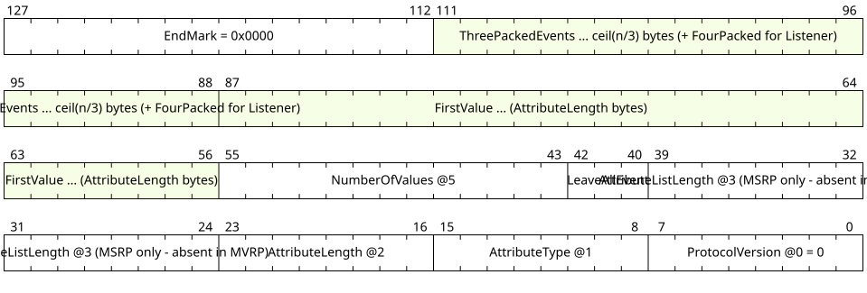
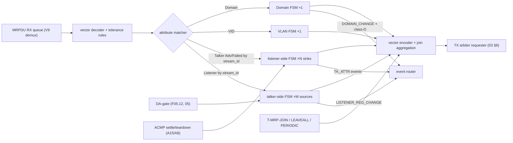
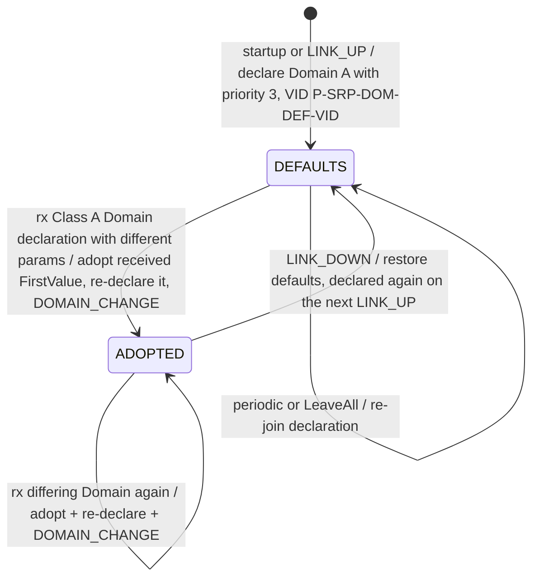
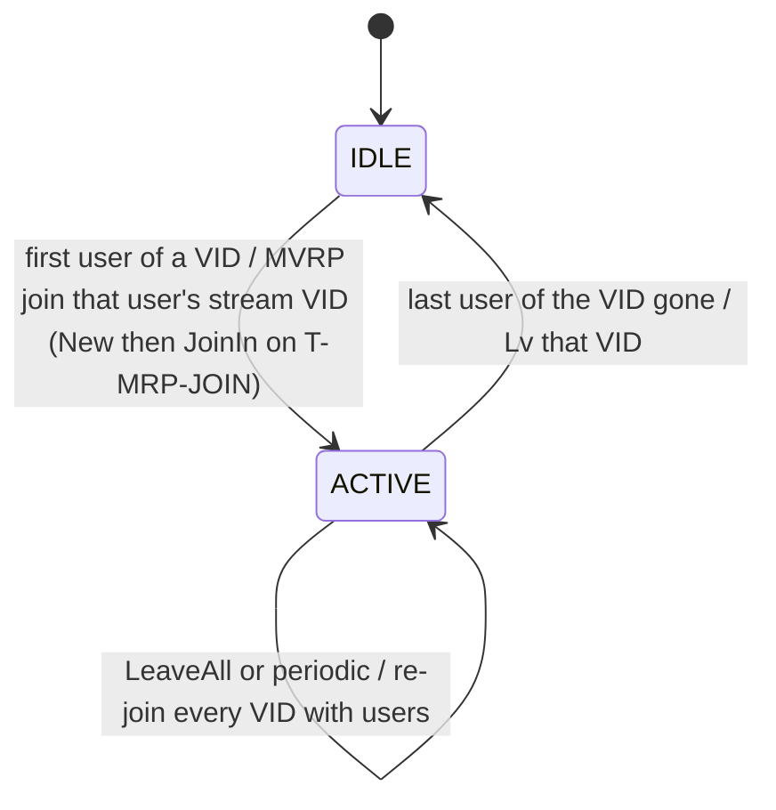
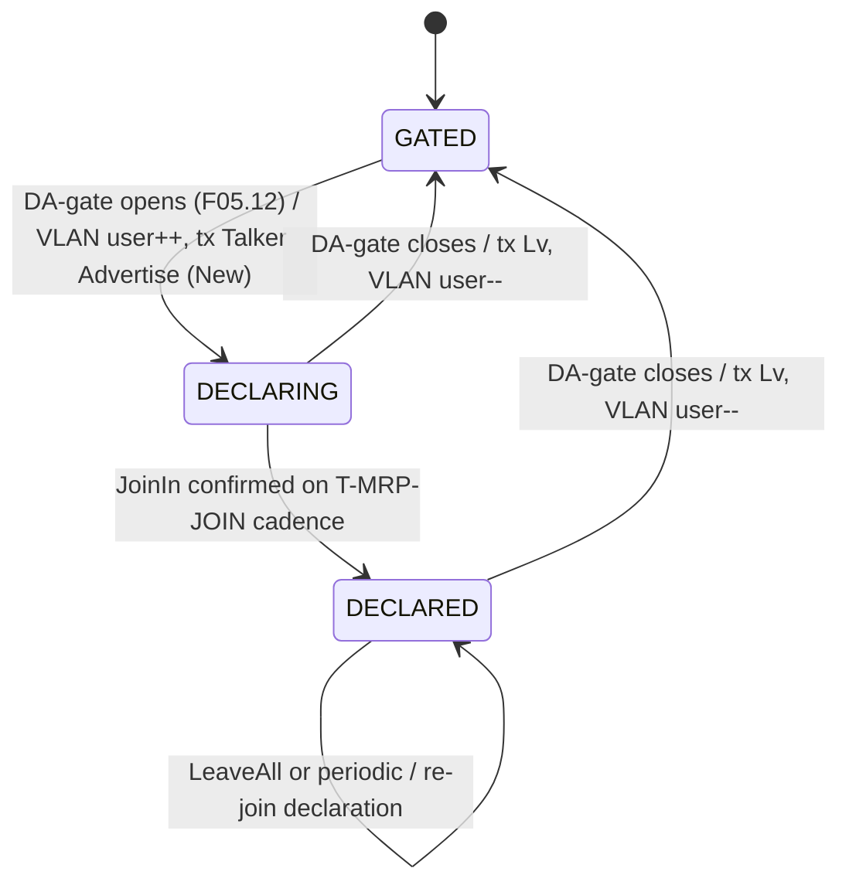
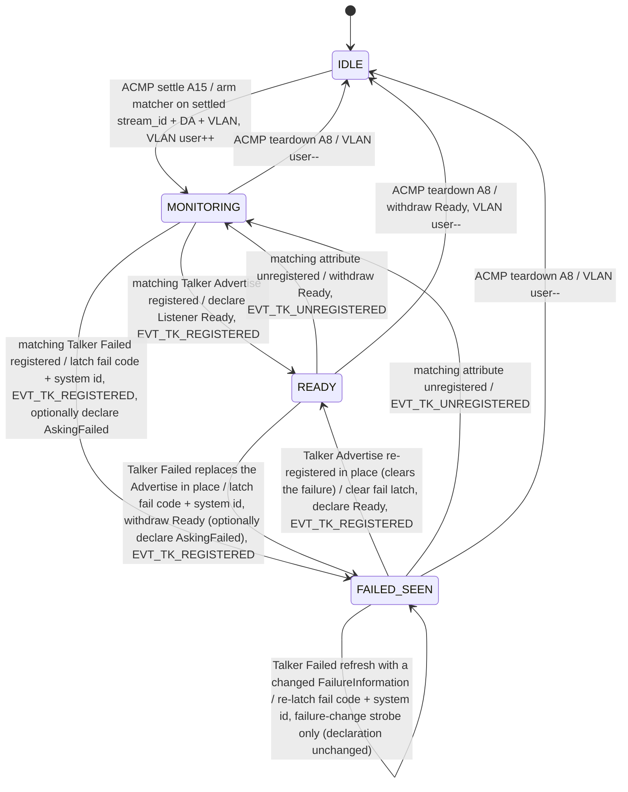
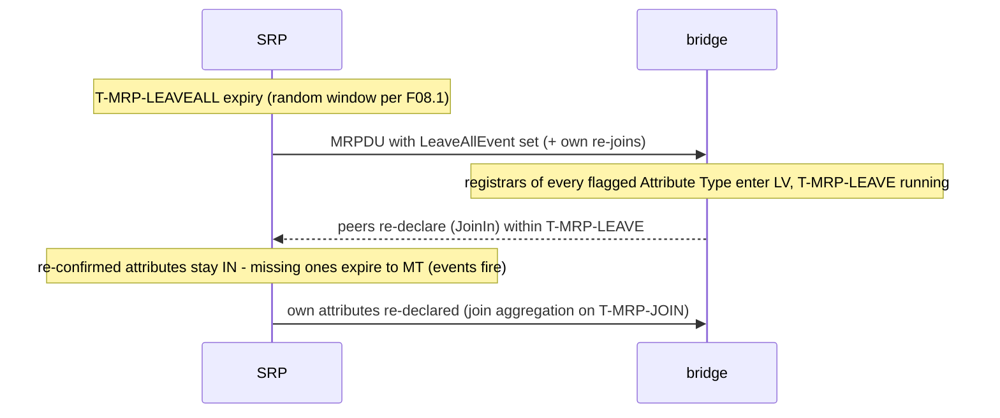

<!-- SPDX-License-Identifier: CERN-OHL-W-2.0 -->
# 10 — SRP Engine (MSRP/MVRP endpoint participant)

## 1. Role and scope

In-scope implementation of the stream reservation control plane: a Milan **endpoint**
MSRP + MVRP participant (802.1Q clauses 10/11/35, Milan §4.2.7/§4.3/§4.4). It serves
the exact `srp` contract of [02 §4.1](02_interfaces.md) — ACMP, AECP and the
notification engine cannot tell whether that contract is backed by this engine or by
an external stack (`P-EN-SRP-ENGINE` selects; the interface is identical either way).

The FSM inventory is deliberately minimal, per the Milan endpoint profile:

| FSM | Instances | Why it collapses to this |
|---|---|---|
| **Domain** | **1** | only SR **Class A** is supported (Class B undefined by Milan); one Domain attribute {class A, priority, VID} |
| **VLAN (MVRP)** | **1** | one FSM managing a per-VID refcounted membership set — steady state is one VID (the Domain's), briefly two across a Domain-VID change (§6.2) |
| **Stream, talker side** | **M = P-N-STREAM-OUT** | one Talker-Advertise declaration + Listener-registration tracker per Stream Output |
| **Stream, listener side** | **N = P-N-STREAM-IN** | one Listener declaration + Talker-registration matcher per Stream Input |

Total: **2 + N + M** FSMs. There is no N·M cross-product object anywhere in SRP —
streams never pair inputs with outputs inside the reservation protocol.

| Responsibilities | Non-goals |
|---|---|
| MRPDU encode/decode (MSRP + MVRP), vector packing; Σ-slope admission + granted-idleSlope publication ([F02.10](02_interfaces.md#fig-02-statusdict)) | bridge behavior: no attribute propagation, no registrar-per-port sets, no FQTSS/CBS shaping itself (stays in the AVTP/TSN engine) |
| Domain declare/adopt, single-VID membership | SR Class B (undefined by Milan) |
| Talker Advertise declarations gated by [F05.12](05_acmp_engine.md#fig-05-dagate) | MAAP (separate `maap` instance, external) |
| Listener Ready declarations + talker/listener registration tracking | multiple VLANs / multiple domains |

## 2. External contract

- **Frames**: MRPDUs tap the same MAC path as 1722.1 traffic. The RX filter demuxes
  two extra flows to this engine (rule V9, [F03.6](03_packet_engine.md#fig-03-valrules)):
  MSRP = DA `01-80-C2-00-00-0E`, EtherType `0x22EA`; MVRP = DA `01-80-C2-00-00-21`,
  EtherType `0x88F5`. TX joins the arbiter as one more requester
  ([03 §8](03_packet_engine.md)).
- **Serves** (class-B ops of [02 §4.1](02_interfaces.md)): `DECLARE_TALKER`,
  `WITHDRAW_TALKER`, `DECLARE_LISTENER`, `WITHDRAW_LISTENER`, `GET_DOMAIN`.
- **Emits** (class-C): `TK_ATTR_REGISTERED/UNREGISTERED{sink}` (exact match on the
  sink's settled {stream_id, DA, VLAN} — Milan §5.3.8.9),
  `LISTENER_REG_CHANGE{source}`, `DOMAIN_CHANGE{class}`.
- **Publishes** (class-D, [F02.10](02_interfaces.md#fig-02-statusdict)):
  `class_a_prio`, `class_a_vid`, `tk_decl_state[src]`, `lstn_reg_state[src]`,
  `tk_reg_state[sink]`, `msrp_fail_code/bridge[x]`, `acc_latency[sink]`,
  `granted_slope_bps[src]`, `sr_admitted[src]` (the shaper's per-stream
  idleSlope source — 802.1Q §34.6.1.1).
- **Consumes**: `LINK_UP/DOWN{if}` (Domain defaults reset, re-declarations), timer
  expiries `T-MRP-*`.

## 3. PDU handling

<a id="fig-10-mrpdu"></a>**F10.6 — MSRP MRPDU skeleton** (one message shown;
`FirstValue`/vectors are variable-length; lanes bottom→top = wire order)



<details>
<summary>WaveDrom source (editable)</summary>

```wavedrom
{"reg": [
  {"bits": 8,  "name": "ProtocolVersion @0 = 0"},
  {"bits": 8,  "name": "AttributeType @1"},
  {"bits": 8,  "name": "AttributeLength @2"},
  {"bits": 16, "name": "AttributeListLength @3 (MSRP only - absent in MVRP)"},
  {"bits": 3,  "name": "LeaveAllEvent"},
  {"bits": 13, "name": "NumberOfValues @5"},
  {"bits": 32, "name": "FirstValue ... (AttributeLength bytes)", "type": 3},
  {"bits": 24, "name": "ThreePackedEvents ... ceil(n/3) bytes (+ FourPacked for Listener)", "type": 3},
  {"bits": 16, "name": "EndMark (AttributeList) = 0x0000"},
  {"bits": 16, "name": "EndMark (MRPDU) = 0x0000"}
], "config": {"bits": 144, "lanes": 4, "hspace": 950}}
```

</details>

The EndMark closes **two** scopes (802.1Q §10.8.1.2 BNF: `AttributeList ::=
VectorAttribute {, VectorAttribute}, EndMark` and `MRPDU ::= ProtocolVersion,
Message {, Message}, EndMark`) — a minimal one-message MSRPDU therefore ends
`0x0000 0x0000`, and `AttributeListLength` counts the VectorAttributes **plus**
the AttributeList EndMark (802.1Q §35.2.2.6: "the number of octets contained
within the AttributeList").

<a id="fig-10-attrs"></a>**F10.8 — Attribute types and events used**

| Application | AttributeType | FirstValue | Used by |
|---|---|---|---|
| MSRP | 1 Talker Advertise | 25 B ([F10.7](#fig-10-talkerfv)) | talker declare (TX); sink matcher (RX) |
| MSRP | 2 Talker Failed | 34 B (= Advertise + FailureInformation: system_id 8 + failure_code 1; the system identifier may be a bridge id **or** an end-station MAC, 802.1Q §35.2.2.8.7) | sink matcher (RX); TX on local admission failure only (§6.3) |
| MSRP | 3 Listener | 8 B stream_id + FourPackedEvents {Ignore, AskingFailed, Ready, ReadyFailed} | listener declare (TX); source tracker (RX) |
| MSRP | 4 Domain | 4 B {SRclassID = 6 (A), SRclassPriority, SRclassVID} | Domain FSM |
| MVRP | 1 VID | 2 B | VLAN FSM |

Attribute events (three-packed `(((e1·6)+e2)·6)+e3`): 0 New · 1 JoinIn · 2 In ·
3 JoinMt · 4 Mt · 5 Lv. Tolerance rules (Milan §4.2.7.1.2/.1.3, tested by TOL):
a malformed Vector Attribute may be processed up to the bad field, then the **rest of
that attribute list and all subsequent messages in the PDU are discarded**; when an
"end of PDU" would be followed by padding, the EndMark is transmitted explicitly as
`0x0000`.

**Vector value k is FirstValue incremented k times** — matching on FirstValue alone
is a wire defect. Domain vectors increment SRclassID *and* SRclassPriority together,
VID unchanged (802.1Q §35.2.2.9, whose own worked example is the shape every
two-class bridge declares: `NumberOfValues = 2` from FirstValue `{5, 2, VID}`, so
**Class A arrives as value 1**). Surface Class A when
`SRclassID_first ≤ 6 < SRclassID_first + NumberOfValues` and take
`priority = prio_first + (6 − SRclassID_first)`. Talker and Listener vectors
increment `unique_id` and `destination_address` together (802.1Q §35.2.2.8), so the
sink matcher and source tracker **range-match** `{stream_id, DA}` and select the
k-th ThreePacked/FourPacked slot — never equality-match FirstValue.

<a id="fig-10-talkerfv"></a>**F10.7 — Talker Advertise FirstValue** (25 B; TSpec from
the stream's current format per Milan Table 4.4; lanes bottom→top = wire order)


<details>
<summary>WaveDrom source (editable)</summary>

```wavedrom
{"reg": [
  {"bits": 64, "name": "stream_id @0 (source MAC + unique_id)"},
  {"bits": 48, "name": "dest_mac @8 (from maap)"},
  {"bits": 16, "name": "vlan_id @14 (Domain VID)"},
  {"bits": 16, "name": "MaxFrameSize @16"},
  {"bits": 16, "name": "MaxIntervalFrames @18 = 1"},
  {"bits": 8,  "name": "priority(3) rank(1) rsv(4) @20"},
  {"bits": 32, "name": "accumulated_latency @21 (initial = portTcMaxLatency + registered amounts, 802.1Q §35.2.2.8.6)"}
], "config": {"bits": 200, "lanes": 5, "hspace": 950}}
```

</details>

TSpec source values (Milan Table 4.4; N = channel count): AAF PCM32 48 kHz →
MaxFrameSize 24·N+25; 96 kHz → 48·N+25; 192 kHz → 96·N+25; CRF → 29. All with
MaxIntervalFrames = 1.

`accumulated_latency` on the wire is 802.1Q's: the talker's initial value is
`portTcMaxLatency` plus registered amounts, grown by each bridge in transit
(§35.2.2.8.6). The presentation-time-offset equality belongs to the AECP *report*
([06](06_aecp_engine.md)): GET_STREAM_INFO on a Stream Output reports the
presentation time offset (Milan §5.4.2.10.2); on a Stream Input, the registered
value plus internal delay (§5.4.2.10.1) — neither is the wire field by definition.
A talker that wants the two to agree sets its initial declaration accordingly.

## 4. Internal blocks

<a id="fig-10-blocks"></a>**F10.1 — SRP engine internals**



The MRPDU RX queue is sized by `P-MRPDU-QUEUE-BYTES`
([F01.5](01_overview.md#7-parameter-master-table-f015)): an MRPDU carrying
aggregated vectors is frame-sized, so the queue holds one maximum frame plus
headroom, and V9's own tolerance rules apply on the way in.

Applicant/registrar note: each declared or tracked attribute carries a standard MRP
applicant + registrar pair (802.1Q §10.7 is normative for the event-by-event tables);
the FSM diagrams below are the **behavioral summaries** an implementer wires the
802.1Q tables into — with one Milan deviation, Δ13.

## 5. State

Per source (M): `tk_decl_state` {NONE, ADVERTISE} applicant ([F02.10](02_interfaces.md#fig-02-statusdict)
reserves a FAILED code for a self-declared Talker Failed — permitted, unused by
this profile, §6.3), listener-registration
set {Ignore/AskingFailed/Ready/ReadyFailed} → `lstn_reg_state[src]`. Per sink (N):
declared Listener state {NONE, READY, ASKING_FAILED}, matched talker registration
{NONE, ADVERTISE, FAILED} + `msrp_fail_code/bridge`, `acc_latency`. Singletons:
Domain {declared prio, VID, adopted?}, VLAN {refcount, joined VID}. All registrar
states carry the MRP {IN, MT, LV} encoding; LV is reachable **only** through the
LeaveAll cycle (Δ13 below).

## 6. Behavior

### 6.1 Domain FSM (×1)

<a id="fig-10-domsm"></a>**F10.2 — Class A Domain (Milan §4.2.7.2.1)**



Rules: Domain transmission is **independent of gPTP port state** (Milan §4.2.7.2.1);
a Domain change updates `class_a_prio`/`class_a_vid`, fires the GET_AVB_INFO
notification path, steers *future* MVRP joins to the new VID (already-declared VIDs
stay frozen, §6.2), and (on PCP change) triggers the talker withdraw →
`T-SRP-LEAVEALL2` → re-declare flow of [F05.12](05_acmp_engine.md#fig-05-dagate).

### 6.2 VLAN FSM (×1, MVRP)

<a id="fig-10-vlansm"></a>**F10.3 — Per-VID refcounted membership (one FSM, VID-keyed counters)**



Membership is refcounted **per VID, keyed by each user's own stream VID** — a talker
joins the VID it declares (and that VID is *frozen* for as long as the Talker
attribute is declared: a Domain Default-VID change does not move a declaring Stream
Output, Milan Table 5.3), and a settled sink joins the VID from its last
PROBE_TX_RESPONSE (Milan §5.3.8.9, §4.4.1). Leaving a VID that a still-declaring
talker streams on would violate the normative join-before-streaming rule (a talker
**shall** join the VLAN via MVRP prior to sending stream frames — Milan §4.3.2), so
a Domain VID change affects only *future* declarations; across the F05.12
withdraw → re-declare flow two VIDs are briefly live. Steady state is one VID,
because only Class A with the Domain's VID is supported.

### 6.3 Talker-side stream FSM (×M)

<a id="fig-10-talkersm"></a>**F10.4 — Per-source declaration + listener tracking**



In every state the FSM registers incoming **Listener** attributes for its stream_id
(four-packed Ready / ReadyFailed / AskingFailed) → `lstn_reg_state[src]` +
`LISTENER_REG_CHANGE`. The talker streams **iff** declaring Advertise ∧ registering
Ready or ReadyFailed (Milan §5.3.7.3, Δ14 — exported as a level to the AVTP engine);
`GET_TX_STATE`'s REGISTERING_FAILED reports the AskingFailed case
([F05.11](05_acmp_engine.md#fig-05-talker)). The streaming level additionally
requires admission: ACTIVE(src) = declaring Advertise ∧ registering
Ready/ReadyFailed ∧ `sr_admitted[src]` — the engine computes Σ-slope admission
against the port ceiling and publishes `granted_slope_bps[src]`
([F02.10](02_interfaces.md#fig-02-statusdict)); the shaper consumes it, never
computes it. **Local admission can fail**, and that failure is reported the
way the standards already provide: the source withdraws its Advertise and
declares **Talker Failed with failure code 1 (insufficient bandwidth)**, its
own MAC as the FailureInformation system identifier (802.1Q §35.1.2.1,
§35.2.2.8.7), and `msrp_fail_code/bridge[src]` is published for
GET_STREAM_INFO (Milan §5.4.2.10.2). Talker Failed is declared by this profile in exactly one case — local
Σ-slope admission failure (above); there is no other internal failure source.
802.1Q §35.1.2.1 and Milan §5.3.7.2/.4 permit it, §35.2.2.8.7 lets the
FailureInformation system identifier be an end-station MAC, and Milan
§5.4.2.10.2 requires GET_STREAM_INFO on a Stream Output to report the
self-declared failure — the class-D `msrp_fail_code/bridge[x]` publication
covers sources for that path.

### 6.4 Listener-side stream FSM (×N)

<a id="fig-10-listenersm"></a>**F10.5 — Per-sink matcher + Listener declaration (Milan §5.3.8.5)**



The match is **exact** on {stream_id, DA, VLAN}; a talker attribute with divergent
parameters is simply "no match" — which is precisely what sends the ACMP listener SM
back to probing (Milan §5.3.8.9, [F05.5](05_acmp_engine.md#fig-05-settled)).
`acc_latency[sink]` latches the registered attribute's accumulated_latency.

The **in-place Advertise ↔ Failed swap edges are the normal path**, not an edge
case: a talker may transition directly from Advertise to Failed (802.1Q §35.1.2.1,
normative), and the receiving participant treats a declaration whose type changed
as an implicit `rLv` of the old type followed by the new registration — no
unregistration event separates the two (§35.2.6, where the NOTE also gives Failed
precedence when both are somehow registered).

While Failed remains registered (IN or LV), a changed failure code or bridge ID
re-latches both and raises `evt_tk_fail_chg_o`, a strobe that feeds **only** the
GET_STREAM_INFO notification ([06 §7](06_aecp_engine.md#7-registry-notifications-liveness-identify),
[F06.13](06_aecp_engine.md#fig-06-lineage)). It is not a registration event and
not a declaration change: the Listener attribute (stream_id) and its AskingFailed
parameter are unchanged, so the applicant is not re-driven with New,
EVT_TK_REGISTERED stays silent and neither the event router nor the ACMP
listener sees it. An unchanged FailureInformation refresh emits nothing. The
change is detected with one comparator on the hit sink: every sink that can
take the strobe is registered Failed on the same {stream_id, DA, VLAN} and has
latched the same last FailureInformation. The failure code output is zero after
replacement by Advertise, withdrawal, teardown or reset; the bridge output is the
raw latch, valid only with `tk_reg_state` FAILED, and its one consumer gates it
after its index mux.

### 6.5 LeaveAll and the Δ13 registrar deviation

<a id="fig-10-leaveall"></a>**F10.9 — LeaveAll cycle (either side may start it)**



> **Δ13 — Milan overrides IEEE:** outside the LeaveAll cycle, a registrar receiving
> `rLv` transitions **IN → MT immediately** (no leavetimer) — Milan §4.2.7.2.2. This
> keeps `T-MRP-LEAVE` at its default without adding seconds of withdrawal-detection
> latency; `EVT_TK_UNREGISTERED` therefore fires on the *frame* that withdraws a
> talker attribute, not a timer later.

**The LeaveAll timer is per MRP application; the LeaveAll message is per
Attribute Type, on transmit and on receive.** 802.1Q-2014 §10.7.5.20 NOTE: "The
LeaveAll state machine operates on a per-application (not per-Attribute Type)
basis, but the LeaveAll message operates on a per-Attribute Type basis. Hence,
when the LeaveAll state machine issues a LeaveAll, it must generate a LeaveAll
Attribute for each Attribute Type supported by the application concerned."

*Timer.* MSRP and MVRP are separate participants with separate leavealltimers
("required on a per-Port, per-MRP Participant basis", §10.7.4.3; §10.7.9), exactly
as [F08.4](08_timing.md#fig-08-alloc) sizes them (× 2 participants). An MVRP
LeaveAll shall never age an MSRP registrar, and vice versa — a merged LeaveAll
pulse lets a bridge's MVRP maintenance cycle age a healthy Listener Ready and flap
the stream licence.

*Transmit.* The own LeaveAll MRPDU flags the first VectorAttribute of every
Attribute Type the application supports, the criterion of the §10.7.5.20 NOTE
above: MSRP Talker Advertise, Talker Failed, Listener and Domain, and MVRP VID.
That holds whatever this participant declares or registers; the Domain type, for
one, has no registrar here (table below). A supported type the cycle declares
nothing of rides a LeaveAll-only VectorAttribute in its own message:
NumberOfValues 0, a FirstValue that is present at its full AttributeLength but
ignored (sent as zero), and no packed events (§10.8.2.8 f and g, §10.8.2.10.1
NOTE). A bridge that scopes a received LeaveAll by type would otherwise
re-declare only the types we flagged, and let our other registrations, such as
its Listener Ready, age out after `T-MRP-LEAVE`.

*Receive.* A received LeaveAllEvent "is interpreted on receipt as a MAD Leave All
event to be applied to the state machines for all Attributes of the type defined
by the AttributeType field" (§10.8.2.6), and rLA! occurs for an Applicant or a
Registrar only when "the PDU contains a Message in which the Attribute Type is the
type associated with the state machine" (§10.7.5.20 b)2)). `KL_srp_decoder`
therefore strobes one lane per Attribute Type (`la_msrp_o[type − 1]`,
`la_mvrp_o`), and `KL_srp_top` routes each lane to the state machines of that
type only:

| Lane | Applicant: rLA! | Registrar: IN → LV |
|---|---|---|
| Talker Advertise | talker source declaring Advertise | listener sink holding an Advertise registration |
| Talker Failed | talker source declaring Failed | listener sink holding a Failed registration |
| Listener | listener sink declaring Listener | talker source's Listener registration |
| Domain | Domain participant re-declares ([F10.2](#fig-10-domsm)) | none: the Domain FSM keeps no registrar |
| MVRP VID | VLAN participant re-joins every held VID | none |

An own LeaveAll still ages every registrar of its participant: "Leave All messages
generated by this state machine also generate LeaveAll events against all the
Applicant and Registrar state machines associated with that Participant"
(§10.7.9).

*Order within an MRPDU.* A lane fires **once per MRPDU**, at the first VectorHeader
of its type that carries LeaveAllEvent; a later LeaveAllEvent of the same type in
the same MRPDU is not applied again. That VectorHeader precedes its FirstValue and
Vector (`VectorAttribute ::= VectorHeader, FirstValue {, Vector}`, §10.8.1.2), and
"a given MRP Participant shall process MRPDUs in the order in which they are
received, and shall process the MRP Messages in a PDU in the order in which they
were put into the Data Link Service Data Unit (DLSDU)" (§10.8). So a type's
LeaveAll is applied before the events of its own VectorAttribute and of every later
one. A conformant sender puts the LeaveAll first: "encoding a LeaveAll message (if
required) at the beginning of the MRPDU ... sequential processing of the encoded
messages by the recipient will ensure that the registration is uninterrupted"
(§10.6), and "any messages generated as a consequence of state machine responses
to an sLA action and its associated LeaveAll events will be put into the DLSDU
after the LeaveAll message(s)" (§10.8 NOTE 2). In such an MRPDU each type's
LeaveAll precedes all of that MRPDU's events of its type; events of other types
reach other state machines. The one layout where the two readings differ, a
VectorAttribute of a type without LeaveAllEvent ahead of the first one with it in
the same MRPDU, follows DLSDU order (§10.8): the LeaveAll then re-ages the
registration that the earlier vector made.

This is the case Run B hit. The bench switch's LeaveAll MRPDU is `[Listener LA
JoinMt/Ready] [Domain LA] [TalkerAdvertise LA n=0] [TalkerFailed LA n=0]`: the
Listener lane precedes the JoinMt that re-declares the stream, and no later lane of
that MRPDU reaches the Listener registrar. The decoder used to raise one
application-wide rLA! at every flagged VectorHeader, so the Domain message re-aged
the Listener registration and the stream stopped `T-MRP-LEAVE` later (issue #106).

*Timer on receipt: an open deviation.* The own leavealltimer re-arms only at its
own expiry, with a fresh 10–15 s draw ([F08.1](08_timing.md#fig-08-constants)); a
received LeaveAll does not restart it. 802.1Q-2014 does restart it: Table 10-5
(§10.7.9) maps rLA! to "Start leavealltimer" and Passive in both states, and §10.6
says "Reception of a LeaveAll message from another Participant causes the timer to
be restarted without generating a message, thus suppressing multiple LeaveAll
messages from Participants connected to the same LAN." Milan v1.2 Table 4.3 sets
only the timer's range (10–15 s, ± 0.5 s). Issue #106 leaves the behaviour
unchanged; the deviation is tracked in issue
[#108](https://github.com/Mister-M-alt/protocol-processor-control-plane-avb-milan/issues/108).
Without the restart, both ends send a LeaveAll each cycle instead of one between
them.

## 7. µcode / dispatch

n/a — FSM array + vector codec. The encoder aggregates all pending join/leave events
across attributes of the same type into packed vectors on the `T-MRP-JOIN` cadence
(one MRPDU carries many attributes; never one frame per event).

## 8. Canonical sequences

End-to-end reservation flows are owned by 05 and stay there:
[F05.7](05_acmp_engine.md#fig-05-seq-bind) (bind → settle → Ready → stream),
[F05.8](05_acmp_engine.md#fig-05-seq-srpfail) (Talker Failed surfacing) — this engine
is the `SRP` participant in those diagrams. [F10.9](#fig-10-leaveall) above covers the
maintenance cycle.

## 9. Timing

Owns `T-MRP-JOIN`, `T-MRP-LEAVE`, `T-MRP-LEAVEALL`, `T-MRP-PERIODIC` — values only in
[F08.1](08_timing.md#fig-08-constants); allocation in [08 §5](08_timing.md).
`T-SRP-DAFRESH` and `T-SRP-LEAVEALL2` remain owned by the DA-gate
([05 §6bis](05_acmp_engine.md)).

## 10. Milan deltas

Δ13 (registrar IN→MT on rLv, §6.5) — master table
[F01.4](01_overview.md#fig-01-deltas). Milan-profile scoping (not deltas, absences):
Class A only, single VID, endpoint-only participant.

## 11. Parameterization

`P-EN-SRP-ENGINE` (1 = this engine serves the `srp` contract; 0 = external stack).
`P-SRP-DOM-DEF-VID` is the Domain default VID of [F10.2](#fig-10-domsm): declared at
startup and on LINK_UP, restored on LINK_DOWN, and replaced at run time by an adopted
Domain (§6.1).
Instance counts: 2 + `P-N-STREAM-IN` + `P-N-STREAM-OUT` FSMs; registrar/leave timer
pool sized in [08 §5](08_timing.md). Per-interface keying (`P-N-AVB-INTERFACES`)
applies to the whole engine — one participant set per AVB interface.

## 12. Cross-references

Covers REQ-SRP-001…006 ([matrix §6.9](../00_MILAN_COMPLIANCE_REVIEW.md#fig-00-matrix));
serves REQ-NET-002/003 behind the unchanged `srp` contract. Clients:
[05](05_acmp_engine.md) (DA-gate, settle/teardown, TK_ATTR events),
[06](06_aecp_engine.md) (GET_STREAM_INFO lineage, GET_AVB_INFO, notifications).
Verification: MTXW walks F10.2–F10.5; TOL covers the malformed-MRPDU rules
([09 §3](09_verification.md)).
