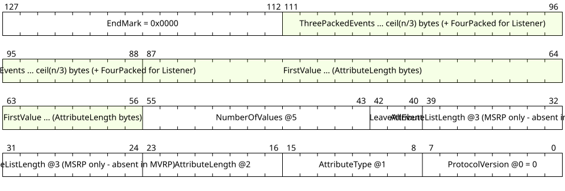
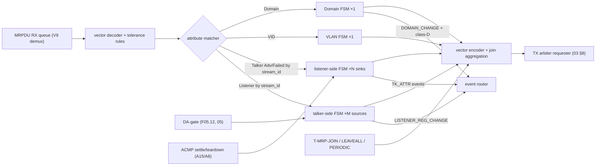
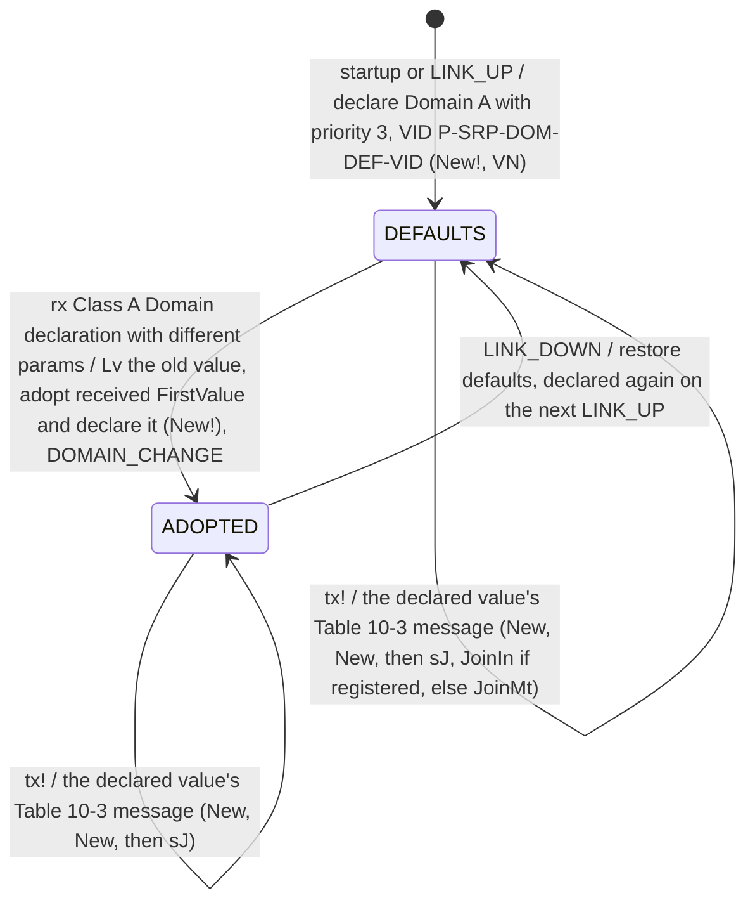
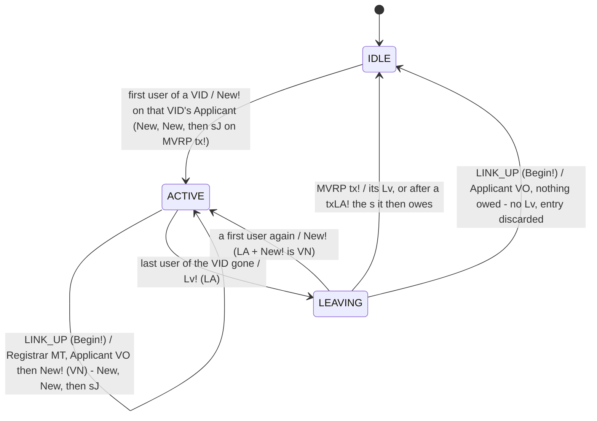
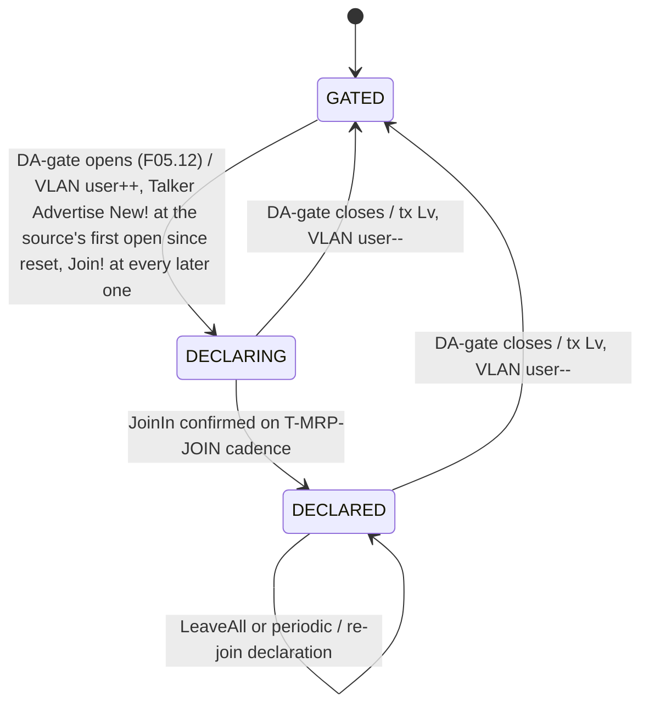
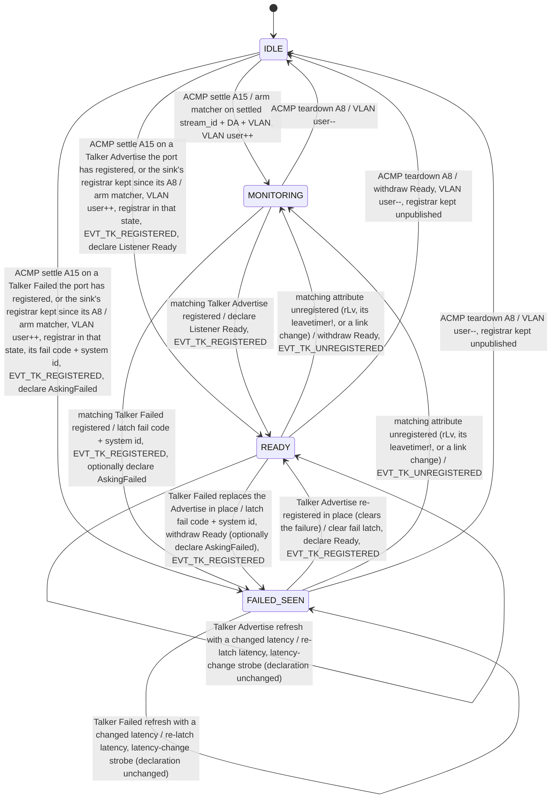
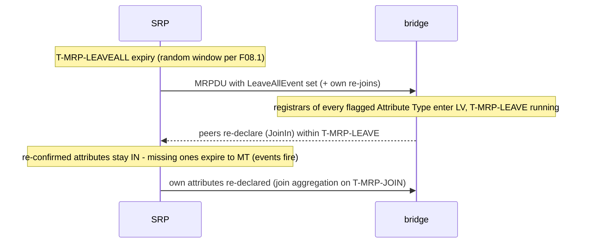

<!-- SPDX-License-Identifier: CERN-OHL-W-2.0 -->
# 10 — SRP Engine (MSRP/MVRP endpoint participant)

## 1. Role and scope

In-scope implementation of the stream reservation control plane: a Milan **endpoint**
MSRP + MVRP participant (802.1Q clauses 10/11/35, Milan §4.2.7/§4.3/§4.4). It serves
the exact `srp` contract of [02 §4.1](02_interfaces.md) — ACMP, AECP and the
notification engine cannot tell whether that contract is backed by this engine or by
an external stack (`P-EN-SRP-ENGINE` selects; the interface is identical either way).

The FSM inventory is deliberately minimal, per the Milan endpoint profile:

| FSM | Instances | Why it collapses to this |
|---|---|---|
| **Domain** | **1** | only SR **Class A** is supported (Class B undefined by Milan); one Domain attribute {class A, priority, VID} |
| **VLAN (MVRP)** | **1** | one FSM managing a per-VID refcounted membership set — steady state is one VID (the Domain's), briefly two across a Domain-VID change (§6.2) |
| **Stream, talker side** | **M = P-N-STREAM-OUT** | one Talker-Advertise declaration + Listener-registration tracker per Stream Output |
| **Stream, listener side** | **N = P-N-STREAM-IN** | one Listener declaration + Talker-registration matcher per Stream Input |

Total: **2 + N + M** FSMs. There is no N·M cross-product object anywhere in SRP —
streams never pair inputs with outputs inside the reservation protocol.

| Responsibilities | Non-goals |
|---|---|
| MRPDU encode/decode (MSRP + MVRP), vector packing; Σ-slope admission + granted-idleSlope publication ([F02.10](02_interfaces.md#fig-02-statusdict)) | bridge behavior: no attribute propagation, no registrar-per-port sets, no FQTSS/CBS shaping itself (stays in the AVTP/TSN engine) |
| Domain declare/adopt, single-VID membership | SR Class B (undefined by Milan) |
| Talker Advertise declarations gated by [F05.12](05_acmp_engine.md#fig-05-dagate) | MAAP (separate `maap` instance, external) |
| Listener Ready declarations + talker/listener registration tracking | multiple VLANs / multiple domains |

## 2. External contract

- **Frames**: MRPDUs tap the same MAC path as 1722.1 traffic. The RX filter demuxes
  two extra flows to this engine (rule V9, [F03.6](03_packet_engine.md#fig-03-valrules)):
  MSRP = DA `01-80-C2-00-00-0E`, EtherType `0x22EA`; MVRP = DA `01-80-C2-00-00-21`,
  EtherType `0x88F5`. TX joins the arbiter as one more requester
  ([03 §8](03_packet_engine.md)).
- **Serves** (class-B ops of [02 §4.1](02_interfaces.md)): `DECLARE_TALKER`,
  `WITHDRAW_TALKER`, `DECLARE_LISTENER`, `WITHDRAW_LISTENER`, `GET_DOMAIN`.
- **Emits** (class-C): `TK_ATTR_REGISTERED/UNREGISTERED{sink}` (exact match on the
  sink's settled {stream_id, DA, VLAN} — Milan §5.3.8.9; a registration the port held
  before the settle, or the sink kept from before its A8 on a re-bind to the same stream,
  strobes at the settle, [§6.4](#sec-10-pre-settle)),
  `LISTENER_REG_CHANGE{source}`, `DOMAIN_CHANGE{class}`.
- **Publishes** (class-D, [F02.10](02_interfaces.md#fig-02-statusdict)):
  `class_a_prio`, `class_a_vid`, `tk_decl_state[src]`, `lstn_reg_state[src]`,
  `tk_reg_state[sink]`, `msrp_fail_code/bridge[x]`, `acc_latency[sink]`,
  `granted_slope_bps[src]`, `sr_admitted[src]` (the shaper's per-stream
  idleSlope source — 802.1Q §34.6.1.1).
- **Consumes**: `LINK_UP/DOWN{if}` (Domain defaults reset, re-declarations; the
  listener's port Talker registrars and every sink registrar to MT, a settled sink's
  withdrawal published as at its leavetimer!, [§6.4](#sec-10-pre-settle)), timer
  expiries `T-MRP-*`.

## 3. PDU handling

<a id="fig-10-mrpdu"></a>**F10.6 — MSRP MRPDU skeleton** (one message shown;
`FirstValue`/vectors are variable-length; lanes bottom→top = wire order)



<details>
<summary>WaveDrom source (editable)</summary>

```wavedrom
{"reg": [
  {"bits": 8,  "name": "ProtocolVersion @0 = 0"},
  {"bits": 8,  "name": "AttributeType @1"},
  {"bits": 8,  "name": "AttributeLength @2"},
  {"bits": 16, "name": "AttributeListLength @3 (MSRP only - absent in MVRP)"},
  {"bits": 3,  "name": "LeaveAllEvent"},
  {"bits": 13, "name": "NumberOfValues @5"},
  {"bits": 32, "name": "FirstValue ... (AttributeLength bytes)", "type": 3},
  {"bits": 24, "name": "ThreePackedEvents ... ceil(n/3) bytes (+ FourPacked for Listener)", "type": 3},
  {"bits": 16, "name": "EndMark (AttributeList) = 0x0000"},
  {"bits": 16, "name": "EndMark (MRPDU) = 0x0000"}
], "config": {"bits": 144, "lanes": 4, "hspace": 950}}
```

</details>

The EndMark closes **two** scopes (802.1Q §10.8.1.2 BNF: `AttributeList ::=
VectorAttribute {, VectorAttribute}, EndMark` and `MRPDU ::= ProtocolVersion,
Message {, Message}, EndMark`) — a minimal one-message MSRPDU therefore ends
`0x0000 0x0000`, and `AttributeListLength` counts the VectorAttributes **plus**
the AttributeList EndMark (802.1Q §35.2.2.6: "the number of octets contained
within the AttributeList").

<a id="fig-10-attrs"></a>**F10.8 — Attribute types and events used**

| Application | AttributeType | FirstValue | Used by |
|---|---|---|---|
| MSRP | 1 Talker Advertise | 25 B ([F10.7](#fig-10-talkerfv)) | talker declare (TX); sink matcher (RX) |
| MSRP | 2 Talker Failed | 34 B (= Advertise + FailureInformation: system_id 8 + failure_code 1; the system identifier may be a bridge id **or** an end-station MAC, 802.1Q §35.2.2.8.7) | sink matcher (RX); TX on local admission failure only (§6.3) |
| MSRP | 3 Listener | 8 B stream_id + FourPackedEvents {Ignore, AskingFailed, Ready, ReadyFailed} | listener declare (TX); source tracker (RX) |
| MSRP | 4 Domain | 4 B {SRclassID = 6 (A), SRclassPriority, SRclassVID} | Domain FSM |
| MVRP | 1 VID | 2 B | VLAN FSM |

Attribute events (three-packed `(((e1·6)+e2)·6)+e3`): 0 New · 1 JoinIn · 2 In ·
3 JoinMt · 4 Mt · 5 Lv. Tolerance rules (Milan §4.2.7.1.2/.1.3, tested by TOL):
a malformed Vector Attribute may be processed up to the bad field, then the **rest of
that attribute list and all subsequent messages in the PDU are discarded**; when an
"end of PDU" would be followed by padding, the EndMark is transmitted explicitly as
`0x0000`.

**Vector value k is FirstValue incremented k times** — matching on FirstValue alone
is a wire defect. Domain vectors increment SRclassID *and* SRclassPriority together,
VID unchanged (802.1Q §35.2.2.9, whose own worked example is the shape every
two-class bridge declares: `NumberOfValues = 2` from FirstValue `{5, 2, VID}`, so
**Class A arrives as value 1**). Surface Class A when
`SRclassID_first ≤ 6 < SRclassID_first + NumberOfValues` and take
`priority = prio_first + (6 − SRclassID_first)`. Talker and Listener vectors
increment `unique_id` and `destination_address` together (802.1Q §35.2.2.8), so the
sink matcher and source tracker **range-match** `{stream_id, DA}` and select the
k-th ThreePacked/FourPacked slot — never equality-match FirstValue.

<a id="sec-10-one-vector"></a>**One VectorAttribute per value (issue
[#214](https://github.com/Mister-M-alt/protocol-processor-control-plane-avb-milan/issues/214)).**
IEEE 802.1Q-2022 §10.7.7 keeps one Applicant per attribute value. A VectorAttribute
carries an event for every value of its range (§10.7.5.13 c), §10.8.2.10.1), so a value
in two VectorAttributes of one MRPDU is two events for one state machine, and a peer's
Registrar sees both. Each producer hands a value over when its Applicant decides a message
at a tx! opportunity (Table 10-3; issue #216 for the Domain and the VIDs, §6.1 and §6.2),
and an adoption withdraws the old Domain value at once. A value is therefore handed over
again before its first message has left when:

- two tx! of the value's application pass before the first one's drain starts (that drain
  waits behind the other application's drain, or the TX arbiter holds the encoder): each
  tx! is a transmit action of its own;
- an adoption withdraws (Lv) a Domain value whose tx! message is still pending;
- several adoptions in one window withdraw values whose New is still pending.

Up to issue #214 the encoder appended every hand-over, and the MRPDU repeated the value.
Up to issue #216 the Domain and VLAN participants also handed every declared value over at
each `periodic!` and LeaveAll, beside their New, which made such windows common.

The pending tables now hold one entry per value. The identity is the application, the
AttributeType and the first eight octets of FirstValue: the StreamID of a Talker
Advertise, Talker Failed or Listener (§35.2.2.8.2; MSRP allows no FirstValue change for
an existing StreamID, §35.2.2.8), the Domain value (§35.2.2.9.1), and the MVRP VID
(§11.2.3.1.7). Each push is a message the value's Applicant has decided to send, so a
push for a value already pending is a second transmit action of that Applicant before
its first message left. It rewrites the entry in place, which keeps its place in the
table, so the push order and the run folding stand:

| Pending | Pushed | The entry carries | Why |
|---|---|---|---|
| any | New or Lv | the pushed one | a new declaration or a withdrawal (Table 10-3 New!, Lv!) |
| New | JoinIn or JoinMt | New | Join!, `periodic!` and rLA! leave VN in VN, and only New gives the peer's Registrar its new indication (§10.7.6.12) |
| JoinIn, JoinMt, In, Mt or Lv | JoinIn or JoinMt | the pushed one | sJ with the newer Registrar reading (§10.7.6.3); LA with Join! is AA |
| New, JoinIn, JoinMt or Lv | In or Mt | the pending one | an s carries only the Registrar state (§10.7.6.5) |
| In or Mt | In or Mt | the pushed one | the newer Registrar reading |

A Listener entry takes the pushed declaration type (§35.2.2.7.2), except under an In or
Mt that did not replace. An entry takes the pushed FirstValue, so two Talker values of one
StreamID carry the newer one, the value the talker now declares: MSRP does not support a
change of FirstValue for an existing StreamID (§35.2.2.8). A table that is full still holds every push until it drains, as
before. The encoder finds the value by searching the table through its own read port
before it accepts the push, one clock per pending entry. No RAM port and no copy of the
values are added, and every producer already holds its push until it is taken. The
search starts again whenever the offered event changes, because the intake of
`KL_srp_top` re-arbitrates while a push waits. A push that a drain start overtakes rides
the next MRPDU, as before. The search can hold a push for one clock per pending entry, and
no message of a tx! misses that tx!'s MRPDU for it: an MSRP round's drain waits for both
stream walks and for the Domain's tx! (`tx_done_o`, issue #216), an MVRP round's drain for
the VID walk, and each of them is done only once every push it made is accepted.
[`tb/srp_top`](../../tb/srp_top/README.md) AP7 places the Domain's New behind a search of
eleven pending entries.
[`tb/srp_encoder`](../../tb/srp_encoder/README.md) PV1 to PV20 grade the rule, and
[`tb/srp_top`](../../tb/srp_top/README.md) group `onevec`, OV0 to OV10, grades the wire.
Each rule has a planted control.

<a id="fig-10-talkerfv"></a>**F10.7 — Talker Advertise FirstValue** (25 B; TSpec from
the stream's current format per Milan Table 4.4; lanes bottom→top = wire order)


<details>
<summary>WaveDrom source (editable)</summary>

```wavedrom
{"reg": [
  {"bits": 64, "name": "stream_id @0 (source MAC + unique_id)"},
  {"bits": 48, "name": "dest_mac @8 (from maap)"},
  {"bits": 16, "name": "vlan_id @14 (Domain VID)"},
  {"bits": 16, "name": "MaxFrameSize @16"},
  {"bits": 16, "name": "MaxIntervalFrames @18 = 1"},
  {"bits": 8,  "name": "priority(3) rank(1) rsv(4) @20"},
  {"bits": 32, "name": "accumulated_latency @21 (initial = portTcMaxLatency + registered amounts, 802.1Q §35.2.2.8.6)"}
], "config": {"bits": 200, "lanes": 5, "hspace": 950}}
```

</details>

TSpec source values (Milan Table 4.4; N = channel count): AAF PCM32 48 kHz →
MaxFrameSize 24·N+25; 96 kHz → 48·N+25; 192 kHz → 96·N+25; CRF → 29. All with
MaxIntervalFrames = 1. Each source declares its own: the engine-driven declaration
of source *s* takes slot *s* of the top's `cfg_tspec_max_frame_i`
([02 §4.1](02_interfaces.md#sec-02-srp)).

`accumulated_latency` on the wire is 802.1Q's: the talker's initial value is
`portTcMaxLatency` plus registered amounts, grown by each bridge in transit
(§35.2.2.8.6). The presentation-time-offset equality belongs to the AECP *report*
([06](06_aecp_engine.md)): GET_STREAM_INFO on a Stream Output reports the
presentation time offset (Milan §5.4.2.10.2); on a Stream Input, the registered
value plus internal delay (§5.4.2.10.1) — neither is the wire field by definition.
A talker that wants the two to agree sets its initial declaration accordingly.

## 4. Internal blocks

<a id="fig-10-blocks"></a>**F10.1 — SRP engine internals**


```mermaid
flowchart LR
  rx["MRPDU RX queue (V9 demux)"] --> dec["vector decoder + tolerance rules"]
  dec --> mtch{"attribute matcher"}
  mtch -- "Domain" --> dom["Domain FSM ×1"]
  mtch -- "VID" --> vlan["VLAN FSM ×1"]
  mtch -- "Talker Adv/Failed by stream_id" --> lfsm["listener-side FSM ×N sinks"]
  mtch -- "Listener by stream_id" --> tfsm["talker-side FSM ×M sources"]
  gate["DA-gate (F05.12, 05)"] --> tfsm
  acmp["ACMP settle/teardown (A15/A8)"] --> lfsm
  dom --> enc["vector encoder + join aggregation"]
  vlan --> enc
  tfsm --> enc
  lfsm --> enc
  tmr["T-MRP-JOIN / LEAVEALL / PERIODIC"] --> enc
  enc --> tx["TX arbiter requester (03 §8)"]
  lfsm -- "TK_ATTR events" --> evr["event router"]
  tfsm -- "LISTENER_REG_CHANGE" --> evr
  dom -- "DOMAIN_CHANGE + class-D" --> evr
```

The MRPDU RX queue is sized by `P-MRPDU-QUEUE-BYTES`
([F01.5](01_overview.md#7-parameter-master-table-f015)): an MRPDU carrying
aggregated vectors is frame-sized, so the queue holds one maximum frame plus
headroom, and V9's own tolerance rules apply on the way in.

Applicant/registrar note: each declared or tracked attribute carries a standard MRP
applicant + registrar pair (802.1Q §10.7 is normative for the event-by-event tables);
the FSM diagrams below are the **behavioral summaries** an implementer wires the
802.1Q tables into — with one Milan deviation, Δ13.

## 5. State

Per source (M): `tk_decl_state` {NONE, ADVERTISE} applicant ([F02.10](02_interfaces.md#fig-02-statusdict)
reserves a FAILED code for a self-declared Talker Failed — permitted, unused by
this profile, §6.3), listener-registration
set {Ignore/AskingFailed/Ready/ReadyFailed} → `lstn_reg_state[src]`. Per sink (N):
declared Listener state {NONE, READY, ASKING_FAILED}, matched talker registration
{NONE, ADVERTISE, FAILED} + `msrp_fail_code/bridge`, `acc_latency`; a sink's registrar
keeps registering its record's value from its A8 to its next A15, published as NONE
meanwhile. Per port: N Talker
registrars, each holding one registered Talker Advertise/Failed value with its
registrar state, type, payloads and leave deadline, whether or not a sink is settled
on it ([§6.4](#sec-10-pre-settle)). Singletons:
Domain {declared prio, VID, adopted?, the declared value's Table 10-3 Applicant,
registration of the declared value IN?}, VLAN {per VID: refcount, its Applicant, its
Registrar IN?} (issue #216). All registrar states carry the MRP {IN, MT, LV} encoding; for
MSRP, LV is reachable **only** through the LeaveAll cycle (Δ13 below). The Domain's one
registrar bit folds LV into MT, because the only things that read it, sJ, s and Table 10-3
note 8, treat the two alike (§6.1). Each VID's Registrar is one such bit too; MVRP's
Registrar is Table 10-4 as printed (Δ13 is MSRP's cell), so a received Lv also takes it to
LV (§6.2).

### 5.1 Storage and per-stream cost (issue #230)

Every per-stream structure is sized by M and N, which the processor top binds from
`P-N-STREAM-OUT` and `P-N-STREAM-IN`. The 1x1 product binds two of each (its stream and
CRF), so no inactive slot is elaborated: at 1x1 each FSM's matcher holds exactly two
64-bit stream_id registers, at 8x8 nine.

| Structure | Block | Words x bits | Primitive | Why |
|---|---|---|---|---|
| Timer-arm FIFOs `tf_tk_ram_r`, `tf_ls_ram_r` | top | 2 x 32 x (41 + `SLOT_AW_P`) | distributed RAM, one write and one registered read each | one memory per FIFO; a two-dimensional array written for both in one process had mapped to 2,304 flip-flops at 1x1 |
| Cadence deadlines `cad_dl_r` | top | 5 x 32 | flip-flops | five fixed slots, read by expiry and arm issue in one cycle |
| Matcher {stream_id, DA, VLAN} `sid_r`, `da_r`, `vid_r` | talker, listener | M or N x 124 | flip-flops | every context compares each decoder value in its cycle |
| Walk TSpec, priority, rank, latency `wtsp_r` | talker | M x 68 | distributed RAM | written by the gate open, read only at the walk source |
| Walk {stream_id, DA, VLAN} `g_wid_ram.wid_r` | talker | M x 124, from M = 3 | distributed RAM | at M = 1 and 2 the walk reads the matcher's flip-flops: a 2-way multiplexer is cheaper than a second copy |
| Walk stream_id `g_wsid_ram.wsid_r` | listener | N x 64, from N = 3 | distributed RAM | as above, for the listener walk |
| Leave copy `lsid_r` (issue #188) | listener | N x 64 | distributed RAM from N = 3, flip-flops at N = 1 and 2 | written by the settle that parks an owed Leave, read at the walk sink; the same arms as the walk's copy ([§6.4](#sec-10-owed-leave)) |
| Leave copy `lwid_r`, `lwtsp_r` (issue #202) | talker | M x 128 (124 used, the stream_id at bit 0), M x 68 | flip-flops, one enable per source; distributed RAM | written by the gate open that parks an owed Leave, from the matcher's flip-flops and the walk's TSpec record, read at the walk source and, for the stream_id, at the gate source; a 128-bit stride makes both reads multiplexers, where a 124-bit one synthesized as barrel shifters (about 4,000 LUTs at M = 8); not reset, read only while the Leave is parked ([§6.3](#sec-10-talker-owed-leave)) |
| Same-stream map `eq_r`, leave-copy pairs `lq_r`, own types `dcl_r`, walk marks `wdone_r` (issue #193) | listener | N(N-1)/2 x 1, N(N-1) x 1, N x 2, N x 1 | flip-flops | the owner election reads every pair in one cycle; the settle writes its sink's pairs from one compare per sink against the matchers and one against the leave copies ([§6.4](#sec-10-shared-stream)) |
| Leave copy for compares `g_lcp_flops.lcp_r` (issue #193) | listener | N x 64, from N = 2 | flip-flops | a settle compares its stream_id with every leave copy in one cycle; at N = 2 it repeats `lsid_r` |
| Registration data `lat_r`, `fcode_r`, `fsysid_r` | listener | N x 104 | flip-flops | published per sink in parallel (`acc_latency`, `msrp_fail_code/bridge`); kept from a sink's A8 to its next A15, `acc_latency` reading 0 meanwhile ([§6.4](#sec-10-pre-settle)) |
| Port Talker registrars `pt_*` (issue #212) | listener | N x 244: state 2, {stream_id, DA, VLAN} 124, type 1, latency 32, FailureInformation 72, leave deadline 13 (`$clog2(LEAVE_MS_P + 1)`, at the default `T-MRP-LEAVE`) | flip-flops; state reset, the value, type and payloads written with a registration, the leave deadline at the LeaveAll that starts LV; all read only while it is not MT | every decoder value compares with every entry in its cycle, and a settle's triple through the same comparators on its clock, which carries no decoder value ([§6.4](#sec-10-pre-settle)) |
| Seeded leave timer `sdl_*` (issue #212) | listener | 1 x (1 + log2 N + 32) | flip-flops | one settle per clock, and its arm issues on the next clock ahead of the pend queue; the entry's deadline rebuilt absolute, now plus its remaining time |
| Link level `link_q_r` (issue #212) | listener | 1 | flip-flop | the previous clock's `link_up_i`, as the Domain FSM keeps it (a synthesizer merges the two) |
| Slopes `slope_q_r` | admission | M x 32 | distributed RAM | one write (the slope pipeline) and one read (the admission walk) per cycle |
| Working and published grants `wgslope_r`, `gslope_r` | admission | M x 32 each | flip-flops | a round publishes every grant at once; `granted_slope_bps` is per source |
| Pending tables `msrp_ram_r`, `mvrp_ram_r` | encoder | `ENC_DEPTH_P` x 285 and x 19 | distributed RAM | one write and one registered read each; the read serves the drain and, while that application does not drain, the value search of [§3](#sec-10-one-vector) |
| Value search `sr_key_r`, `sr_idx_r`, `sr_on_r` (issue #214) | encoder | 73 + 4 + 1 | flip-flops | the value being searched for and the entry whose read is in flight; the offered event is compared with it every clock, so a changed offer starts again |
| Listener pairing buffer | decoder | `TP_DEPTH_P` bytes | block RAM | |
| Membership table | VLAN | `N_VIDS_P` x 17 | distributed RAM | |
| Applicants `app_r`, Registrars `reg_r`, entry bits `alloc_r` (issue #216) | VLAN | `N_VIDS_P` x (4 + 1 + 1) | flip-flops | a received value, LeaveAll and `periodic!` reach every entry in their cycle, matched on the VID copy `vid_q_r` |
| Applicant `app_r`, owed and waiting tx! `txp_r`, `txp_la_r`, `txw_r` (issue #216) | Domain | 4 + 3 | flip-flops | |

None of the memories added for issue #230 is reset: each is read only under a valid bit
written with it (`rec_valid_r`, `slope_valid_r`, the FIFO count). Each carries
`ram_style = "distributed"`: without it the registered FIFO read mapped each FIFO to a
RAMB36. Both arms of each walk copy, and the FIFOs, are tested at sources/sinks 1/1,
2/2, 3/5 and 9/9: the [walk-record arms](../../tb/srp_stream_fsms/README.md) and the
[timer-arm FIFO arms](../../tb/srp_top/README.md), with every probe of the issue's
reviews a killed control of the srp_top campaign.

What stays per stream, and why it cannot be shared without a timing change:

- **The matcher.** `KL_srp_decoder` emits one value per cycle without back-pressure, and
  every context compares {stream_id, DA, VLAN} in that cycle.
- **The applicant and registrar transitions.** A received value, `periodic!`, a received
  LeaveAll and the own LeaveAll reach every context in the same cycle.
- **The published state.** `tk_decl_state`, `active`, `acc_latency`,
  `msrp_fail_code/bridge` and `granted_slope_bps` are levels per stream.

One shared evaluator per FSM would apply those events to the contexts one per cycle.
Registration indications and `LISTENER_REG_CHANGE` would then move by up to M - 1 or
N - 1 cycles, and the decoder would need a ready on its event port.

Marginal cost of one stream context, measured as (8x8 - 1x1) / 7 on `KL_pp_shadow`
standalone at the build's 50 MHz (issue #230; Vivado 2026.1, `xc7a100t-fgg484-2`, the
area-baseline recipe of the reference platform). The listener figures predate the leave
copy of issue #188 and were not measured again: it adds 64 bits per sink (distributed RAM
from three sinks, flip-flops at one and two) and one 64-bit comparator per listener FSM.
Nor do they include the owner election of issue #193: one 64-bit comparator and three
flip-flops per sink, N(N-1)/2 flip-flops for the same-stream map, and the election logic;
nor, for a parked Leave in a group, a second 64-bit comparator and a 64-bit flip-flop leave
copy per sink and N(N-1) flip-flops of leave-copy pairs. Nor the port Talker registrars of
issue #212 ([§6.4](#sec-10-pre-settle)): 244 flip-flops and one {stream_id, DA, VLAN}
comparator per entry, a second {DA, VLAN} comparator per sink for the re-bind to the same
stream, plus 34 to 36 flip-flops of the seeded leave timer and the link flip-flop. Measured
with the processor's own flow instead (sv2v, then yosys `synth_xilinx -family xc7
-flatten`), from main `a9e84b66` to the issue's head, `KL_srp_top` grows by 1,555 LUT, 170
inverters and 522 flip-flops at two sources and two sinks (11,475 to 13,030 LUT, 4,812 to
5,334 flip-flops), and by 5,434 LUT, 711 inverters and 1,988 flip-flops at the default
eight and eight; no RAM changes. The flip-flop figure is exact; the LUT figure of this
flow moves by up to about 300 at two and two for an edit of a few LUT, so a difference of
that size is not a measurement. That is not the Vivado figure of the table below.

The Applicants of issue #216 (§6.1, §6.2), measured the same way from main `044cb25f` to the
issue's head: `KL_srp_top` grows by 572 LUT and 40 flip-flops at two sources and two sinks
(13,536 to 14,108 LUT, 5,407 to 5,447 flip-flops) and by 901 LUT and 40 flip-flops at eight
and eight; two distributed-RAM cells fewer at each shape. Alone, `KL_srp_domain` grows by 65
LUT and 9 flip-flops and `KL_srp_vlan` by 279 LUT and 16 flip-flops. Of that, the VID link
change (§6.2) is 49 LUT and one flip-flop of `KL_srp_vlan` alone (594 to 643 LUT); in
`KL_srp_top` it measures 1 LUT fewer at two and two and 89 more at eight and eight, inside
this flow's noise, and no flip-flop at either shape. Each received-event and
each tx! or request row is one shared transition chosen among the table's rows: one function
of the state and the event together mapped about three times larger (53 LUT against 15 to
19). `p2p_i` is a free input here; the integrator ties it to 1, which removes the
non-point-to-point cells of notes 4 and 5.

| Block | LUT per context | Flip-flops per context | Before issue #230 |
|---|---:|---:|---|
| Talker FSM, per source | 129 | 168 | 213 / 221 |
| Listener FSM, per sink | 208 | 278 | 227 / 278 |
| Admission, per source | 69 | 69 | 73 / 101 |
| Whole SRP engine, one source and one sink | 475 | 538 | 592 / 679 |

So one more talker costs about 200 LUTs and 240 flip-flops (its FSM and its admission
share), one more listener about 210 LUTs and 280 flip-flops. The remaining LUTs of the
whole-engine figure appear in the decoder and the VLAN block, where synthesis places part of
the per-context fan-out and compare logic.

## 6. Behavior

### 6.1 Domain FSM (×1)

<a id="fig-10-domsm"></a>**F10.2 — Class A Domain (Milan §4.2.7.2.1)**


```mermaid
stateDiagram-v2
    [*] --> DEFAULTS: startup or LINK_UP / declare Domain A with priority 3, VID P-SRP-DOM-DEF-VID (New!, VN)
    DEFAULTS --> ADOPTED: rx Class A Domain declaration with different params / Lv the old value, adopt received FirstValue and declare it (New!), DOMAIN_CHANGE
    ADOPTED --> ADOPTED: rx differing Domain again / Lv + adopt + New! + DOMAIN_CHANGE
    ADOPTED --> DEFAULTS: LINK_DOWN / restore defaults, declared again on the next LINK_UP
    DEFAULTS --> DEFAULTS: tx! / the declared value's Table 10-3 message (New, New, then sJ, JoinIn if registered, else JoinMt)
    ADOPTED --> ADOPTED: tx! / the declared value's Table 10-3 message (New, New, then sJ)
```

<a id="sec-10-domain-applicant"></a>**The Applicant of the declared value (issue
[#216](https://github.com/Mister-M-alt/protocol-processor-control-plane-avb-milan/issues/216)).**
The declared value has an 802.1Q-2018 Table 10-3 Applicant, a full participant's
(§10.7.7), whose rows are `srp_app_next` and `srp_app_msg` in `srp_pkg`. LINK_UP (Begin!,
then New!) and an adoption (New! on the adopted value) put it in VN. Every message of the
declared value is the one its state gives at an MSRP tx! opportunity: the T-MRP-JOIN
round's, or the own sLA round's, which takes the txLA! row. From VN, tx! sends New and goes
to AN; from AN it sends New again and goes to QA with the Registrar IN, to AA otherwise
(note 8); from AA it sends sJ and goes to QA; from QA it sends nothing. QA stays quiet until
an event moves it:

| Event | Applicant | Next tx! |
|---|---|---|
| `periodic!` | QA → AA | sJ |
| a LeaveAll received on the Domain lane (rLA!) | QA or AA → VP, AN → VN | sJ, then sJ again from AA; New from VN |
| a received JoinMt or Mt of the value | QA → AA | sJ |
| a received JoinIn of the value, or its In (operPointToPointMAC, note 5) | AA → QA | nothing |
| a received Lv of the value (rLv!) | QA or AA → VP, AN → VN | sJ, as for rLA! |
| the own sLA, on its round's tx! (txLA!) | sJ from AA or QA (then QA), New from VN (then AN) or AN (then QA), s from VP (then AA) | |

So with no peer the Domain is New, New, then JoinMt on three consecutive tx!, then JoinMt at
the tx! after each `periodic!`, and in each own LeaveAll MRPDU. Each MSRP round's drain waits
for the Domain's tx! as it waits for the stream walks (`tx_done_o`: the tx! served and its
message, if any, accepted by the encoder), so the message rides that tx!'s MRPDU. A tx! whose
message does not fit the Domain's two-deep queue is owed until it does. Up to issue #216 the
participant queued one New at LINK_UP and at an adoption, then handed a re-join over at
each `periodic!` and LeaveAll: one New, where Table 10-3 sends two. An adoption's Lv of the
old value is handed over at once (Lv! takes that value's Applicant to LA, whose tx! sends
it), so it rides the next MRPDU.

<a id="sec-10-domain-rejoin"></a>**Re-join encoding (issue
[#184](https://github.com/Mister-M-alt/protocol-processor-control-plane-avb-milan/issues/184)).**
Every Join the Applicant sends is its sJ: "If the Registrar state is IN, then the
AttributeEvent value JoinIn is encoded ... If the Registrar state is MT or LV, then the
AttributeEvent value JoinMt is encoded" (802.1Q-2018 §10.7.6.3). The Registrar is the one
for the declared value. `KL_srp_domain` keeps it as one bit, set and cleared as Table 10-4
and Milan v1.2 §4.2.7.2.2 move it:

| Event for the declared value | Registrar | Next sJ |
|---|---|---|
| received New, JoinIn or JoinMt | MT or LV → IN | JoinIn |
| received Lv | IN → MT at once (Milan §4.2.7.2.2, Δ13) | JoinMt |
| a LeaveAll on the Domain lane, received or the own `sLA` | IN → LV | JoinMt until the peer declares again |
| LINK_UP (Begin!) or LINK_DOWN (Flush!) | MT | JoinMt |
| adoption of a received value | that value's Registrar, IN unless its Lv arrived before the adoption applied | JoinIn, or JoinMt |

Events of other Domain values change nothing, and received In and Mt never register. A
received event wins over a LeaveAll in the same clock, as on the stream registrars
(§6.5). LV is kept as MT: sJ, s and note 8 encode the two alike, and nothing else reads
the Domain registration (802.1Q-2018 §35.2.4 gives the Domain no MAP; an adopted Domain is
kept until LINK_DOWN). So no leavetimer runs for it.

A tx! reads the Registrar after the events of its own clock. A LeaveAll outside a tx!
opportunity is a received one: it moves the Applicant (rLA!), and its sJ waits for the
next tx! (the next T-MRP-JOIN round), so a declaration later in the peer's MRPDU normally
registers first. The own LeaveAll's `sLA` comes on its round's tx! opportunity and takes
the txLA! row; the `sLA` ages the Registrar to LV in that clock, so its sJ is JoinMt. A
message waiting in the Domain participant's queue keeps the encoding it was decided with
until the encoder accepts it, including if a peer event arrives while it waits. A message
handed over while the encoder still holds one of the declared value (two tx! before one
drain, [§3](#sec-10-one-vector), issue #214) takes that message's entry, and a New still
pending stays New. Three cases follow:

- With no other station declaring a Domain, every sJ is JoinMt.
- A peer that declares the same Domain is answered JoinIn. That includes a bridge whose
  LeaveAll MRPDU flags the Domain type and re-declares its Domain in the same MRPDU: the
  LeaveAll takes the Registrar to LV and the declaration back to IN before our tx!.
- The own LeaveAll ages the Registrar to LV in the clock of its `sLA`. The sJ in the own
  LeaveAll MRPDU is therefore JoinMt, and the next is JoinIn again once the peer has
  re-declared.

A peer's withdrawal (its Lv) takes the Registrar to MT at once, as the table gives, and the
Applicant to VP: its next tx! sends JoinMt. The next scheduled drain carries an accepted
event when encoder and TX progress permit; backpressure can extend the wait.
[`tb/srp_encoder`](../../tb/srp_encoder/README.md) D1 to D9, DR1 to DR11 (with DR3a), DT1
to DT3 and DA1 to DA7, and [`tb/srp_top`](../../tb/srp_top/README.md) rows 0, AP1, AP5 to
AP7 and group DJ grade it, each check with a planted mutant. DA6 and DA7 hold the two rows
where Table 10-3 parts VP from AP: a received JoinIn leaves VP alone (note 4, operPointToPointMAC
TRUE), so a peer LeaveAll riding its JoinIn owes sJ on two tx!; and the own LeaveAll's tx! from VP
sends s and goes AA, so after a peer Lv it sends Mt, then one JoinMt.

Rules: Domain transmission is **independent of gPTP port state** (Milan §4.2.7.2.1);
a Domain change updates `class_a_prio`/`class_a_vid`, fires the GET_AVB_INFO
notification path, steers *future* MVRP joins to the new VID (already-declared VIDs
stay frozen, §6.2), and (on PCP change) triggers the talker withdraw →
`T-SRP-LEAVEALL2` → re-declare flow of [F05.12](05_acmp_engine.md#fig-05-dagate). That flow
keeps the Stream ID, and the PCP is in PriorityAndRank, so the gap is the normative one of
IEEE 802.1Q-2018 §35.2.2.8 (two LeaveAllTime periods, Table 10-7, for the same StreamID
only). A source whose declaration was already withdrawn on a lapsed gate waits the same gap
before its ID is declared again. A MAAP conflict is not a Domain change: it re-declares under
a new Stream ID at once ([05 F05.12](05_acmp_engine.md#sec-05-sidmove)).

### 6.2 VLAN FSM (×1, MVRP)

<a id="fig-10-vlansm"></a>**F10.3 — Per-VID refcounted membership (one FSM, VID-keyed counters)**


```mermaid
stateDiagram-v2
    [*] --> IDLE
    IDLE --> ACTIVE: first user of a VID / New! on that VID's Applicant (New, New, then sJ on MVRP tx!)
    ACTIVE --> ACTIVE: users++ or users-- while a VID's count > 0 / no wire action
    ACTIVE --> LEAVING: last user of the VID gone / Lv! (LA)
    LEAVING --> IDLE: MVRP tx! / its Lv, or after a txLA! the s it then owes
    LEAVING --> ACTIVE: a first user again / New! (LA + New! is VN)
    ACTIVE --> ACTIVE: tx!, periodic!, LeaveAll, a received value / each VID's Table 10-3 row
    ACTIVE --> ACTIVE: LINK_DOWN (Flush!) / every Registrar MT, the Applicants kept
    ACTIVE --> ACTIVE: LINK_UP (Begin!) / Registrar MT, Applicant VO then New! (VN) - New, New, then sJ
    LEAVING --> IDLE: LINK_UP (Begin!) / Applicant VO, nothing owed - no Lv, entry discarded
```

<a id="sec-10-vid-applicant"></a>**Each VID's Applicant and Registrar (issue
[#216](https://github.com/Mister-M-alt/protocol-processor-control-plane-avb-milan/issues/216)).**
Each entry of the membership table carries its VID's 802.1Q-2018 Table 10-3 Applicant and a
one-bit Table 10-4 Registrar, IN or not (MT and LV encode alike for sJ, s and note 8, as the
Domain's do). The first user's join is New! (VN); every message is the one the entry's
state gives at an MVRP tx! opportunity, the T-MRP-JOIN expiry of the MVRP participant: that
tx! walks the entries, and the round's MVRP drain waits for the walk (`tx_done_o`), so the
messages ride that tx!'s MRPDU. With no peer a VID is New, New, then JoinMt, then JoinMt at
the tx! after each `periodic!`. sJ is JoinIn only while the VID's Registrar is IN
(§10.7.6.3). Received values of the VID, decoded one per clock as for MSRP, move both: New,
JoinIn and JoinMt register; an Lv, a received LeaveAll and the own `sLA` take IN to LV
(MVRP's Registrar is Table 10-4 as printed; Milan's Δ13 cell is the MSRP application's); In
and Mt register nothing. A received LeaveAll is rLA! on every entry, `periodic!` moves QA to
AA, and the own LeaveAll's tx! takes the txLA! row. A new entry's Registrar starts MT:
this participant keeps state only for the VIDs it declares, so a VID a peer registered
before the first user's join is seen IN only from that peer's next declaration. That is a
recorded deviation ([00 GAP-18](../00_MILAN_COMPLIANCE_REVIEW.md#gap-18)): Table 10-3 note 11
lets the Applicant of a value in VO, AO or QO be discarded, and covers the Applicant only; the
Registrar, per Table 10-4, would read IN from that peer's declaration. It errs the conservative
way: JoinMt where IN would give JoinIn, never JoinIn without IN.
The last user's leave is Lv! (LA): the entry stays until its tx! sends the Lv
(after a txLA!, LO, until the next tx! sends the s it owes), and a first user meanwhile is
New! on the same Applicant (VN), so no Lv goes out. Up to issue #216 a VID had no
Registrar: it was New once, then JoinIn at every `periodic!` and LeaveAll, JoinIn with the
Registrar MT.

<a id="sec-10-vid-link"></a>**A link change (issue
[#216](https://github.com/Mister-M-alt/protocol-processor-control-plane-avb-milan/issues/216)).**
This engine maps LINK_DOWN to Flush! and LINK_UP to Begin!, as the Domain participant
([F10.2](#fig-10-domsm)) and the listener registrars (§6.4, issue #212) do. Both take every VID
Registrar to MT (802.1Q-2018 Table 10-4: Flush! and Begin! go to MT from IN, LV and MT), so a
registration made before a link change is never answered JoinIn after it (§10.7.6.3). LINK_UP is
also Begin! on every VID Applicant (Table 10-3: VO from every state), then New! on each VID with
users (VN): the new link partner gets New, New, then the Join, as it does for the Domain. A VID
whose last user has left (LA or LO, its Lv or s owed) is VO there with nothing owed, and the
next tx! walk discards its entry: the new partner never saw it declared. Table 10-3 has no
Flush! row, so LINK_DOWN leaves the Applicants as they are, and their messages until LINK_UP go
out while the link is down. §10.7.5.2 also signals leavealltimer! to the LeaveAll state machine
at a Flush!; this engine's LINK_DOWN does not, on either participant, since issue #216 changes
no MRP timers ([00 GAP-19](../00_MILAN_COMPLIANCE_REVIEW.md#gap-19)). A link change wins
over a received value of its clock,
as on the Domain and the listener registrars, and comes before that clock's user join or leave
and its tx!. A message the tx! walk holds for the encoder when the link comes up was decided
before it: it is withdrawn, and the VID takes that walk's tx! restarted, so it sends New. A
message the encoder has already taken from that walk still leaves in the walk's MRPDU, as a
Domain message the encoder holds does across LINK_DOWN; the walk takes a few clocks per held
VID. A link change does not reset `vid_sent_o`, the talker's streaming licence of
[Join before the stream](#sec-10-join-before-stream) below. `tb/srp_encoder` VR14 to VR18 and
`tb/srp_top` AP8 grade it, each check with a planted mutant; VR12 and VR13
hold the VP rows of each VID's Applicant, as DA6 and DA7 do for the Domain (§6.1).

Membership is refcounted **per VID, keyed by each user's own stream VID** — a talker
joins the VID it declares (and that VID is *frozen* for as long as the Talker
attribute is declared: a Domain Default-VID change does not move a declaring Stream
Output, Milan Table 5.3), and a settled sink joins the VID from its last
PROBE_TX_RESPONSE (Milan §5.3.8.9, §4.4.1). Leaving a VID that a still-declaring
talker streams on would violate the normative join-before-streaming rule (a talker
**shall** join the VLAN via MVRP prior to sending stream frames — Milan §4.3.2), so
a Domain VID change affects only *future* declarations; across the F05.12
withdraw → re-declare flow two VIDs are briefly live. Steady state is one VID,
because only Class A with the Domain's VID is supported. Each tx! walk hands each held
VID's message over once; two tx! before one drain leave one entry per VID in the encoder
([§3](#sec-10-one-vector), issue #214), so each MVRP MRPDU carries a VID once.

<a id="sec-10-join-before-stream"></a>**Join before the stream (issue #65).** Each
live VID also records whether its declaration has *left*: an MVRP MRPDU carrying
its New, JoinIn or JoinMt was accepted by the TX arbiter since the VID's entry was
allocated. The encoder strobes every MVRP MRPDU the arbiter accepts, and MVRP
pushes wait while an MVRP drain runs, so a push accepted before a transmission's
drain started is in that MRPDU and a later one waits for the next. The talker's
streaming licence requires this for its own VID (§6.3), so no stream frame is
licensed before the join is on its way (Milan §4.3.2). The arbiter's acceptance is
the last point this engine observes; the frame is serialized from there without
preemption. A settled sink's VID is declared the same way (Milan §4.4.1); a
listener has no ordering rule, so nothing waits on it.

*The licence's added wait.* A Ready that answers this talker's Advertise finds the
VID already sent: the MVRP drain runs on the same join tick as the MSRP one. It starts
after the VID walk of `N_VIDS_P` entries (issue #216), which the MSRP round's stream walks
outlast at the default eight sources and eight sinks, so there it leaves first; at a
smaller shape it can start after the MSRP drain and leave one MRPDU after the Advertise, on
the same tick. The licence adds a wait only when a Ready registers before the VID's
first MVRP MRPDU. The wait is then at most one `T-MRP-JOIN` (the next MVRP drain)
plus any time that MRPDU waits to be accepted for transmission: for a TX slot, for
the TX arbiter, and in the one case where this encoder itself holds an MVRP drain
back, behind a canceled own LeaveAll reservation waiting for content (§6.5). While
the arbiter refuses, the licence stays closed; it rises one clock after the
acceptance.

*A full VLAN table holds the licence closed.* The table has `N_VIDS_P` entries,
enough for the supported steady state (one VID, two across a Domain-VID change).
A join of one more VID is refused and dropped: `KL_srp_vlan` raises `user_err_o`,
seen outside the engine only as `KL_srp_top`'s `dbg_vlan_err_o` strobe, which the
processor top does not export. The refused talker's VID is never declared, so its
licence stays closed even with a Ready and admission, and it stays closed after an
entry frees: nothing retries the dropped join. Once an entry is free, a
re-declaration of the source (`WITHDRAW_TALKER`, then `DECLARE_TALKER`) joins again
and opens the licence as a fresh declaration does (above).
Before issue #65 such a source streamed with no MVRP join, which Milan §4.3.2
forbids.

*The ordering this engine assumes of the integrator.* The licence rises one clock
after the arbiter grants the MRPDU that carries the VID's declaration. At that clock
the MRPDU is still serializing, through the processor's TX port, onto the parent's
egress; stream frames reach the wire through the parent's own datapath. The
declaration precedes the first stream frame on the wire only if the parent's egress
does not let a licensed stream frame overtake a control frame already granted.
This engine cannot observe the wire, so that order is the integrator's to keep.

### 6.3 Talker-side stream FSM (×M)

<a id="fig-10-talkersm"></a>**F10.4 — Per-source declaration + listener tracking**


```mermaid
stateDiagram-v2
    [*] --> GATED
    GATED --> DECLARING: DA-gate opens (F05.12) / VLAN user++, Talker Advertise New! at the source's first open since reset, Join! at every later one
    DECLARING --> DECLARED: JoinIn confirmed on T-MRP-JOIN cadence
    DECLARED --> DECLARED: LeaveAll or periodic / re-join declaration
    DECLARED --> GATED: DA-gate closes / tx Lv, VLAN user--
    DECLARING --> GATED: DA-gate closes / tx Lv, VLAN user--
```

In every state the FSM registers incoming **Listener** attributes for its stream_id
(four-packed Ready / ReadyFailed / AskingFailed) → `lstn_reg_state[src]` +
`LISTENER_REG_CHANGE`. The stream_id is the one each `DECLARE_TALKER` carries, the source's
current `src_stream_id_o` slice: every DA-gate open latches {stream_id, DA, VLAN} again and
restarts the Listener registrar at MT, so after the Stream ID move of a MAAP conflict
([05 F05.12](05_acmp_engine.md#sec-05-sidmove)) a registration of the withdrawn ID is never
counted for the new one, and the Talker Advertise names the new ID from its first message.
That open is a Join! (IEEE 802.1Q-2018 §10.7.5.5), not a New!: the RTL issues New!
(§10.7.5.4) only at a source's first open since reset, and Join! at every later one, the
re-declaration of a moved ID included. A new ID is a new attribute value, whose applicant
starts in VO: Table 10-3 takes it to VP on that Join!, and the next tx! sends sJ, a JoinMt
here (§10.7.6.3), so the new ID's first message is a JoinMt. The withdrawn ID keeps its own
applicant until its Leave has gone out ([below](#sec-10-talker-owed-leave)); only a re-open
under the ID the applicant still holds takes it from LA to AA.
That is what MSRP asks: §35.2.3.1.1 maps REGISTER_STREAM.request onto a MAD_Join.request with
no explicit new declaration, and a new StreamID is a new attribute value, which a Registrar in
MT registers on rJoinMt! as it would on rNew! (Table 10-4). The talker streams **iff** declaring Advertise ∧ registering
Ready or ReadyFailed (Milan §5.3.7.3, Δ14 — exported as a level to the AVTP engine);
`GET_TX_STATE`'s REGISTERING_FAILED reports the AskingFailed case
([F05.11](05_acmp_engine.md#fig-05-talker)). The streaming level additionally
requires admission, and the VLAN join of the stream VID on the wire
([§6.2](#sec-10-join-before-stream), Milan §4.3.2): ACTIVE(src) = declaring
Advertise ∧ registering Ready/ReadyFailed ∧ (`optimistic[src]` ∨ `sr_admitted[src]`)
∧ VID(src) joined — the engine computes Σ-slope admission
against the port ceiling and publishes `granted_slope_bps[src]`
([F02.10](02_interfaces.md#fig-02-statusdict)); the shaper consumes it, never
computes it. **Local admission can fail**, and that failure is reported the
way the standards already provide: the source withdraws its Advertise and
declares **Talker Failed with failure code 1 (insufficient bandwidth)**, its
own MAC as the FailureInformation system identifier (802.1Q §35.1.2.1,
§35.2.2.8.7), and `msrp_fail_code/bridge[src]` is published for
GET_STREAM_INFO (Milan §5.4.2.10.2). Talker Failed is declared by this profile in exactly one case — local
Σ-slope admission failure (above); there is no other internal failure source.
802.1Q §35.1.2.1 and Milan §5.3.7.2/.4 permit it, §35.2.2.8.7 lets the
FailureInformation system identifier be an end-station MAC, and Milan
§5.4.2.10.2 requires GET_STREAM_INFO on a Stream Output to report the
self-declared failure — the class-D `msrp_fail_code/bridge[x]` publication
covers sources for that path.

<a id="sec-10-talker-owed-leave"></a>*A re-open while a Talker Leave is still owed (issue
[#202](https://github.com/Mister-M-alt/protocol-processor-control-plane-avb-milan/issues/202)).*
The DA gate can open again before the applicant has sent the Leave of the withdrawal: a
disable and return of a declared source that the allocator answers at once moves it to a
new Stream ID inside one `T-MRP-JOIN` ([05 F05.12](05_acmp_engine.md#sec-05-sidmove)).
802.1Q-2018 §10.7.7 keeps one applicant per attribute value, and in Table 10-3 Lv! takes AA
or QA to LA, whose tx! sends the Lv. So a re-open never abandons that Leave, the rule the
listener follows for a settle ([§6.4](#sec-10-owed-leave)):

| The applicant at the re-open | Its stream_id | What the re-open does |
|---|---|---|
| LA or LO (a Lv or an Empty owed) | the one the applicant holds | keeps the applicant: Join! takes LA to AA and LO to VP, the Leave is cancelled |
| LA or LO | another | arms the matcher and the walk's records on the new value at once, but parks the old value in the leave copy (§5.1): the applicant stays on it until its next tx! sends what it owes, with the FirstValue it was declared with, no received value of either stream reaches the applicant meanwhile, and the re-open's Join! waits. The tx! leaves the applicant VO, the Join! then takes it to VP, and the walk after declares the new value (JoinMt) |
| any other state | either | Join! (New! at the first open since reset) as in Table 10-3 |

While a value is parked it is the one the applicant holds. A further re-open onto a third
stream_id keeps it parked; a close drops the waiting Join! (the new value was never
declared), and a re-open back onto the parked stream_id takes the first row. A txLA! walk
while parked takes LA to LO with no message and keeps the park, so the next tx! sends the
Empty. A source with no record since reset holds no value, so its first open owes nothing.
The Listener tracker restarts at MT at every open, the parking one included, and tracks the
new stream_id from it. Nothing back-pressures the gate face: the open is accepted in its
cycle. The cost is latency only where a Leave is owed: the new value's first Talker
Advertise goes out one `T-MRP-JOIN` after the old Lv. Without the park, the applicant would
take the new value from LA to AA, and the withdrawn Stream ID would stay registered at the
bridge until LeaveAll aging.

<a id="sec-10-admission-freshness"></a>**Admission freshness and latency.**
The real `sr_admitted[src]` verdict belongs to the source's current
declaration. Every accepted `DECLARE_TALKER`, including an identical
re-declaration, clears that source's grant at the edge that captures its
TSpec. `WITHDRAW_TALKER` does the same. The admission block invalidates
that source's cached slope and in-flight pipeline stages, then restarts
the partial greedy admission round at source zero. Unchanged sources keep
their published grants until a published round updates them. This is an
internal connection; neither SRP nor processor top-level ports change.

The three-stage slope pipeline continues sampling one source per clock.
Only a slope computed entirely after declaration acceptance may participate
in admission. The grant stays low until that slope is evaluated and its
full source-order round publishes. Repeated declarations restart this process;
there is no generation counter that can wrap and resurrect an older result.

<a id="sec-10-admission-cross-source"></a>**A pending declaration keeps its
capacity.** A source is *pending* from the acceptance of its declaration
until its new slope is valid. Its own grant stays low. A round publishes only
if every requesting source had a valid slope for its current declaration.
A round that visits a pending source is discarded. So every other
source's `sr_admitted[src]` and `granted_slope_bps[src]`, and the
aggregate `sum_slope_bps` and `over_limit`, keep their last published values
until every requesting source has been evaluated. Then the round publishes
normally: the greedy walk over all current declarations, including the new
one. Capacity is released only by a withdrawal (the live AND with the
request drops that grant at once) or by an evaluated smaller slope. A
pending evaluation never releases capacity. So a source that the greedy walk
refuses before and after another source's identical, shrinking or growing
re-declaration is never granted, not even for one clock. Its Talker Failed
declaration and its ACTIVE level do not move. A shrink that does free
capacity admits the refused source in the same published round that grants
the shrunk slope.

Let M be `P-N-STREAM-OUT`, and count the accepted declaration edge as cycle
zero. Once declarations and withdrawals stop, the new TSpec is sampled
within M cycles, its slope is stored two cycles later, and the next visit
and completion of its admission round are within another `2*M - 1`
cycles. Thus the conservative bound is `3*M + 1` clocks; with the restart
at source zero, the completion boundary makes it at most three rounds
for M ≥ 2, and four clocks for M = 1. Every other pending source is
evaluated within the same bound of its own declaration, so the bound holds
from the last declaration or withdrawal. Every verdict that changes,
including other sources' verdicts, publishes in that one round. A refused
TSpec never produces a grant pulse. Measured shrink/identical/restart cases
in [`tb/srp_admission`](../../tb/srp_admission/README.md) give 4 clocks for
M = 1, 4 or 6 for M = 2, 6 or 9 for M = 3, 5/10/15 for M = 5, and
8/16/24 for the default M = 8. With a refused source competing, the
latencies stay within the same sets. The real service-port suite measures
8/16/24 clocks at M = 8, from gate acceptance to the published grant.
Source 0 re-declaring beside a refused source 1 or 7 measures 16/24, and a
freed source's first grant lands on that same clock.
At `P-CLK-HZ` = 100 MHz those default-shape cases are 80/160/240 ns;
at 50 MHz they are 160/320/480 ns. Service request waiting time and
Listener registration time are additional, independently controlled delays.
Declarations or withdrawals that keep arriving less than a round apart keep
restarting the round, so no verdict publishes until they stop.

The **optimistic window** serves only the talker FSM: it keeps the initial
Advertise from becoming a premature Failed before admission has completed.
It lasts until the third *published* admission round has been observed
(one clock after that round's latch). A discarded round does not count.
The first published round after a declaration always carries that
declaration's verdict, so the window cannot close while the verdict waits
for another source's pending evaluation. For a lone declaration at M = 8
it lasts 25, 33 or 41 clocks: 17 clocks past the round that publishes its
verdict. A new
declaration restarts its window; any declaration or withdrawal restarts the
partial admission round and can extend another source's window.
Re-declaration resets the Listener tracker, so ACTIVE still needs a fresh
Ready/ReadyFailed. During the window ACTIVE can be high even for a TSpec
that will be refused; the real `sr_admitted[src]` stays low. The window
belongs only to the source whose declaration opened it; another source's
pending declaration never opens a window or a grant for a refused source.
A consumer requiring confirmed admission uses ACTIVE AND the real grant
(parent issue #551).

`granted_slope_bps[src]` is the evaluated current slope while that source
is admitted and zero otherwise, including pending evaluation and teardown.
`sum_slope_bps` and `over_limit` are **snapshots latched by published
rounds**. A declaration or withdrawal immediately retires that source's
grant. The previous aggregate holds until the next published round, which
waits for every pending source. The aggregate can therefore differ for a
while from the sum of the live per-source outputs. The live Σ never exceeds
the published one, because a grant can only rise when a round publishes.
Partial and discarded round sums are thrown away. At each publication,
sum equals the granted slopes and over-limit reports requests refused by
the ceiling, all of them evaluated. The greedy walk grants in source-index
order, retries refused sources each round, and never exceeds the 75% ceiling.

### 6.4 Listener-side stream FSM (×N)

<a id="fig-10-listenersm"></a>**F10.5 — Per-sink matcher + Listener declaration (Milan §5.3.8.5)**


```mermaid
stateDiagram-v2
    [*] --> IDLE
    IDLE --> MONITORING: ACMP settle A15 / arm matcher on settled stream_id + DA + VLAN, VLAN user++
    IDLE --> READY: ACMP settle A15 on a Talker Advertise the port has registered, or the sink's registrar kept since its A8 / arm matcher, VLAN user++, registrar in that state, EVT_TK_REGISTERED, declare Listener Ready
    IDLE --> FAILED_SEEN: ACMP settle A15 on a Talker Failed the port has registered, or the sink's registrar kept since its A8 / arm matcher, VLAN user++, registrar in that state, its fail code + system id, EVT_TK_REGISTERED, declare AskingFailed
    MONITORING --> READY: matching Talker Advertise registered / declare Listener Ready, EVT_TK_REGISTERED
    MONITORING --> FAILED_SEEN: matching Talker Failed registered / latch fail code + system id, EVT_TK_REGISTERED, optionally declare AskingFailed
    READY --> FAILED_SEEN: Talker Failed replaces the Advertise in place / latch fail code + system id, withdraw Ready (optionally declare AskingFailed), EVT_TK_REGISTERED
    FAILED_SEEN --> READY: Talker Advertise re-registered in place (clears the failure) / clear fail latch, declare Ready, EVT_TK_REGISTERED
    FAILED_SEEN --> FAILED_SEEN: Talker Failed refresh with a changed FailureInformation / re-latch fail code + system id, failure-change strobe only (declaration unchanged)
    READY --> READY: Talker Advertise refresh with a changed latency / re-latch latency, latency-change strobe (declaration unchanged)
    FAILED_SEEN --> FAILED_SEEN: Talker Failed refresh with a changed latency / re-latch latency, latency-change strobe (declaration unchanged)
    READY --> MONITORING: matching attribute unregistered (rLv, its leavetimer!, or a link change) / withdraw Ready, EVT_TK_UNREGISTERED
    FAILED_SEEN --> MONITORING: matching attribute unregistered (rLv, its leavetimer!, or a link change) / EVT_TK_UNREGISTERED
    READY --> IDLE: ACMP teardown A8 / withdraw Ready, VLAN user--, registrar kept unpublished
    FAILED_SEEN --> IDLE: ACMP teardown A8 / VLAN user--, registrar kept unpublished
    MONITORING --> IDLE: ACMP teardown A8 / VLAN user--
```

The match is **exact** on {stream_id, DA, VLAN}; a talker attribute with divergent
parameters is simply "no match" — which is precisely what sends the ACMP listener SM
back to probing (Milan §5.3.8.9, [F05.5](05_acmp_engine.md#fig-05-settled)).
`acc_latency[sink]` latches the registered attribute's accumulated_latency on
each registering event. A write that changes this sink's latch also raises
`evt_tk_latency_chg_o` on the same edge (Milan §5.4.5.2, Table 5.22). This
notification-only strobe feeds the existing per-sink GET_STREAM_INFO pending
path, alongside any registration or FailureInformation change on that edge.
An unchanged refresh raises no latency strobe; another sink is unaffected
unless that sink also matches the received attribute. The strobe never drives
the applicant, event router or ACMP listener.

The **in-place Advertise ↔ Failed swap edges are the normal path**, not an edge
case: a talker may transition directly from Advertise to Failed (802.1Q §35.1.2.1,
normative), and the receiving participant treats a declaration whose type changed
as an implicit `rLv` of the old type followed by the new registration — no
unregistration event separates the two (§35.2.6, where the NOTE also gives Failed
precedence when both are somehow registered).

While Failed remains registered (IN or LV), a changed failure code or bridge ID
re-latches both and raises `evt_tk_fail_chg_o`, a strobe that feeds **only** the
GET_STREAM_INFO notification ([06 §7](06_aecp_engine.md#7-registry-notifications-liveness-identify),
[F06.13](06_aecp_engine.md#fig-06-lineage)). It is not a registration event and
not a declaration change: the Listener attribute (stream_id) and its AskingFailed
parameter are unchanged, so the applicant is not re-driven with New,
EVT_TK_REGISTERED stays silent and neither the event router nor the ACMP
listener sees it. Unchanged FailureInformation raises no failure-change strobe;
an independently changed latency still raises its own strobe. The
change is detected with one comparator on the hit sink: every sink that can
take the strobe is registered Failed on the same {stream_id, DA, VLAN} and has
latched the same last FailureInformation. The failure code output is zero after
replacement by Advertise, withdrawal, teardown or reset; the bridge output is the
raw latch, valid only with `tk_reg_state` FAILED, and its one consumer gates it
after its index mux.

<a id="sec-10-owed-leave"></a>*A settle while a Leave is still owed (issue
[#188](https://github.com/Mister-M-alt/protocol-processor-control-plane-avb-milan/issues/188)).*
A bound sink can settle again before its applicant has sent the Leave of its old
declaration: on a rebind (Milan §5.5.3.5.43 stops SRP and probes the new source at
once) and on the re-probe after the talker's registration ends (§5.5.3.5.48). 802.1Q-2018
§10.7.7 keeps one applicant per attribute value, and in Table 10-3 Lv! takes AA or QA to
LA, whose tx! sends the Lv. So an A15 settle never abandons a wind-down. It applies Lv!
first (the A8 before it already did) and then:

| The applicant after Lv! | New stream_id | What the settle does |
|---|---|---|
| LA or LO (a Lv or an Empty owed) | the one it holds | keeps the applicant: the next tx! sends what it owes (the Lv from LA, the Empty from LO), unless the talker registers again first, when New! takes LA or LO to VN and the tx! sends New |
| LA or LO | another | arms the matcher on the new stream at once, but parks the old stream_id in the leave copy (§5.1): the applicant stays on it until its next tx! sends what it owes, the Listener values of either stream are not applied meanwhile, and the new stream's declaration request waits. The walk whose tx! sends what is owed also declares the new stream (issue #212, below) |
| VO, AO or QO | either | the new stream starts in VO at once (Table 10-3 note 11 lets these states be discarded) |

While a stream_id is parked, it is the one the applicant holds. A further settle onto a
third stream keeps it parked (the tx! still sends its Lv or Empty, and the walk after it
declares the third stream), and a settle back onto it takes the first row: the park is
cleared and the applicant kept. A txLA! walk while parked takes LA to LO with no message
and keeps the park, so the next tx! sends the Empty. A sink with no record since reset
holds no value, so its first settle owes nothing, whatever state a received LeaveAll left
its applicant in: the new stream starts in VO.

Nothing back-pressures ACMP: the settle is accepted in its cycle, as before. The parked
stream_id and the settled one are two attribute values, each with its own applicant and so
its own tx! (802.1Q-2022 §10.7.7, Table 10-3); here they share the sink's slot. So the
walk whose tx! sends the owed Lv (or Empty) applies the waiting request's New! for the
settled stream in that clock (VO + New! is VN), leaves the slot without its walk mark, and
sends the New on its second pass ([below](#sec-10-shared-stream)): the new stream's New
goes beside the old Lv, in one MRPDU (issue #212). This holds while no other sink on the
settled stream_id declares it or holds its applicant; otherwise the request is granted on
the next clock and that stream's group applicant takes it, as before. A registrar
indication of the sink that changes the waiting request on the walk's clock (a type
change, or the talker's withdrawal) holds the walk one clock, so the walk sends the
request as it then stands. The Δ13 registrar (Milan §4.2.7.2.2) is untouched. The Leave
carries the parameter declared (Ready or Asking Failed).

<a id="sec-10-shared-stream"></a>*Sinks on one stream share one declaration (issue
[#193](https://github.com/Mister-M-alt/protocol-processor-control-plane-avb-milan/issues/193)).*
Two or more sinks can be settled on one stream_id. The Listener attribute's value is the
stream_id alone, so 802.1Q-2018 §10.7.7 gives that value one applicant, and the §35.2.6
NOTE allows at most one Listener declaration per StreamID per port. Each sink keeps its own
matcher and registrar. The value's single applicant lives in one of the sinks' existing
per-sink slots, chosen by owner election:

| Role | Which sink | Its applicant slot |
|---|---|---|
| Owner | the lowest-index sink declaring the stream_id (its talker registered) | holds the applicant; only it transmits |
| Rider | every other sink settled on the stream_id | VO: it takes no event (received value, LeaveAll, periodic!, tx!) and sends nothing |

- **Requests and the declared type.** A sink's declaration request (Ready, or Asking Failed
  on a Talker Failed) only sets that sink's own type. The applicant declares the sum of
  the declaring sinks' types: Ready with Asking Failed is Ready Failed (§35.1.2.2 a-c,
  Table 35-14 of §35.2.4.4.3; Milan §4.2.7). New! is applied when the first sink declares,
  and when the sum changes, as a change in place (§35.2.6).
- **Handover.** When the owner stops declaring and another sink still does, the next of
  them takes the applicant with its state. The owner may stop by A8, by A15, or because
  its talker withdrew. The handover applies no Lv! and no New! (§35.1.2.2: the stream is
  still wanted), unless the sum changed. On an A15 of the sink holding the applicant, the
  applicant goes to another sink whose record holds the stream_id: the next declarer, else
  the lowest-index such sink. The settle then owes nothing and parks nothing.
- **One transmit per walk.** Each applicant has one transmit opportunity per walk, of the
  walk's kind (tx!, or txLA! after an own LeaveAll), whichever slot holds it (Table 10-3).
  The walk marks every slot it passes and, when it serves a group's applicant, every
  member of the group, unless the transmit leaves the applicant LA or LO, where a handover
  carries the mark instead; a handover carries the applicant's mark, so a handover during a
  walk never gives it two. A walk ends only when every slot holds the mark. A handover to a
  slot the walk has already passed, from a slot it has not reached, leaves that slot
  unmarked, so the walk goes round again from slot 0, each marked slot passing in one
  clock, and the applicant has the walk's tx! or txLA! in that walk: a QA applicant's
  txLA! sends its JoinMt, an LA applicant's goes to LO and the next tx! sends Empty.
- **The last declarer.** Its withdrawal applies Lv!, and the rules above (the owed Leave,
  the park, the settle arms) apply as for a single sink. Once its Lv has gone out in a
  walk, a sink on the stream that declares later in that walk waits for the next tx!, as
  one applicant's New! would.
- **A parked Leave.** A parked applicant stays the one applicant of the value it holds. It
  is a member of that value's group, not of its new stream's. A sink that settles on the
  parked stream_id, or whose own park clears while it is settled there, joins the group as
  a rider. The group's first declaration takes the applicant over from the parked slot, as
  a single sink's re-probe does (LA or LO + New! is VN). The next tx! then sends one New
  and no Lv, and a Milan §4.2.7.2.2 peer registrar never deregisters the stream. The parked
  sink's own request, no longer held, declares its new stream. While no sink on the value
  declares, the rules above are unchanged: the owed Lv or Empty goes out once, from the
  parked slot. Once it has gone out in a walk, a declaration later in that walk waits for
  the next tx!, as one applicant's would. A sink that settles on the stream while it still
  owes a Leave of its own declares only after that Leave (the park rule above). If the walk
  reaches the stream's parked Leave before that, no sink declares the stream yet, and that
  Leave goes out too.
- **Reporting.** Each sink still reports its own registration, `tk_reg_state` and
  `lstn_decl_state`, the latter being its own type while its stream's applicant declares,
  and its own GET_RX_STATE. The sum reaches the wire only.

The election runs from registered state, so a request, a teardown or a handover takes
effect on the applicant one clock after it is accepted, and a group's operation waits out
any clock that accepts a settle or a teardown, which may move the record it would hand to. Same-stream pairs come from one
64-bit compare per sink at each settle, kept as an N(N-1)/2-bit map (§5.1). A second
compare per sink, against the leave copies (kept in flip-flops for it), gives the pairs of
each parked value with the sinks settled on it, an N(N-1)-bit map. A park copies its own
row from the first map, because its leave copy is its old stream_id.

<a id="sec-10-pre-settle"></a>*A Talker registered before the settle (issue
[#212](https://github.com/Mister-M-alt/protocol-processor-control-plane-avb-milan/issues/212)).*
A sink's Talker attribute is often registered on the port before the sink settles: after a
power cycle of this entity while its talker keeps declaring, and on a re-bind to a stream
already declared. The talker's applicant, and the bridge's on its way, then sits in QA,
and with periodic transmission off nothing re-sends the attribute before the next
LeaveAll, one `T-MRP-LEAVEALL` later. A registrar's state does not depend on when
the application became interested in the attribute: a full participant keeps one per
attribute value registered (802.1Q-2022 §10.7, §10.7.8). So the listener keeps the port's
Talker registrations itself, and the settle takes the registration it finds (Milan §5.3.8.5:
a settled sink with a matching Talker Advertise registered declares Listener Ready;
§5.5.3.5.18 step 4).

- **The port Talker registrars.** N entries (`P-N-STREAM-IN`), the port's budget of Talker
  registrars, one per sink (§5.1). Each registers one Talker Advertise/Failed value,
  {stream_id, DA, VLAN} exactly as a sink matcher compares it (Milan §5.3.8.9), whether a
  sink is settled on it or not, and runs the sink registrar's Table 10-4 on it: New, JoinIn
  or JoinMt to IN, with the type and the payloads latched as a sink latches them; rLv on IN
  to MT at once (Δ13, Milan §4.2.7.2.2), on LV `-x-`; a LeaveAll on the lane of the type
  it holds, or the own LeaveAll, IN to LV with a `T-MRP-LEAVE` deadline (Milan Table 4.3
  LeaveTime); and that deadline's leavetimer! LV to MT. The deadline is kept in
  `$clog2(LEAVE_MS_P + 1)` bits of `now_ms_i`, 13 at the default `T-MRP-LEAVE` (F08.1): an LV entry is compared on
  every clock and `now_ms_i` steps by one, so its age runs from −`T-MRP-LEAVE` to 0, the
  expiry, compared wrap-safe on those bits. The priority is the sink registrar's (a registering event, then
  leavetimer!, then rLv, then a LeaveAll). A registering value that no entry holds takes
  the lowest-index MT entry. A value whose VLAN field is not a 12-bit VID is never held,
  as no matcher takes it.
- **The bound.** 802.1Q-2022 §35.2.7 leaves the number of attribute values held to the
  implementation; here it is N. A value registered while all N entries are registered is
  not held, and a sink that settles on it registers on the talker's next declaration (its
  re-join after a LeaveAll at the latest), as before issue #212. An entry frees on the
  value's rLv or leavetimer!, and every entry on a link change (below). Begin! (reset)
  leaves every entry MT. So the table holds the first N Talker values the port registers
  that are still registered. A listener port receives every Talker declaration of its
  VLAN, so on a network with more Talker values than N (2 in the shipping image, one
  stream and the CRF stream), the stream a sink settles on after power-on is generally
  not held, and that first settle still waits for the talker's next declaration, as
  before issue #212. A re-bind to the same stream does not depend on the table (below).
- **The settle.** An A15 on a value an entry holds starts the sink's registrar in that
  entry's state after the events of the settle's own clock (a LeaveAll or a leavetimer!
  there applies too), with its type, latency and FailureInformation. For the sink this is
  a fresh registration: `EVT_TK_REGISTERED` (and the latency strobe, as a registration
  after the settle's clear would raise it), and the declaration request, Ready or Asking
  Failed, at once. So `tk_reg_state`, `msrp_fail_code/bridge` and `acc_latency` read at the
  settle, the ACMP listener takes the sink to SETTLED_RSV_OK on the event, and
  GET_RX_STATE's REGISTERING_FAILED and GET_STREAM_INFO's failure fields follow at once. An
  LV entry starts the sink LV, and the listener issues the arm of the sink's leave slot on
  the next clock with the entry's deadline, not a fresh `T-MRP-LEAVE`; until it issues
  that arm, an expiry of the slot is the old registration's and is not applied. The arm
  then crosses the timer-arm queues of `KL_srp_top` and the processor top, whose latency
  the listener does not see, so an expiry of the old deadline that the timer service
  delivers in those few clocks, before it applies the arm, ends the seeded registration
  early. That needs the old deadline to fall in those clocks; the sink registrar before
  issue #212 has the same window after LV, IN and LV again. Holding the guard until the
  service applies the arm would take, per sink, the intended deadline (as `KL_srp_top`
  keeps for its LeaveAll slots) or an applied indication from the service, which is more
  than a few LUT, so the guard ends at the issue. An expiry of the old registration on
  the settle's own clock is the teardown's and strobes nothing. An A15 on a value no
  entry holds starts MT, as before.
- **A re-bind to the same stream.** An A8 disarms the matcher: the sink reports nothing
  registered (`tk_reg_state` NONE, `acc_latency` 0) and raises nothing, no declaration
  request and no class-C strobe, as F10.5's teardown edges carry none. Its registrar
  keeps registering the record's {stream_id, DA, VLAN}, with Table 10-4, Δ13, the
  LeaveAll lanes and its own leave slot, until the sink's next A15. An A15 on that same
  {stream_id, DA, VLAN} keeps the registration, whatever the port registrars hold
  (802.1Q-2022 §10.7, §10.7.8), with the strobes and the request of a seeded settle and
  its own leave slot, unless the registration's leavetimer! or a link change ends it on
  the settle's clock. A withdrawal while the sink is unbound (rLv, or a LeaveAll and no
  re-declaration) has ended the registration by then, so it is not applied, nor is one
  that a link change ended, the sink settled or not (below). An A15 on another value
  starts the registrar afresh, from the port registrars or MT.
- **A link change.** LINK_DOWN (Flush!) and LINK_UP (Begin!), the engine's link input,
  take every entry and every sink registrar, settled or not, to MT (802.1Q-2022 Table
  10-4), ahead of every other event of their clock, whose decoder value registers
  nothing. So no registration from before a link change is seeded, kept or still
  reported after it, and a sink registers again on the talker's next declaration.
  Flush! takes IN and LV to MT with an Lv indication, so a settled sink's withdrawal is
  published as at its leavetimer!: `EVT_TK_UNREGISTERED`, `tk_reg_state` NONE, the
  Listener declaration withdrawn (its Lv goes out at the next tx!) and an LV registrar's
  leave slot cancelled. LINK_UP finds a registrar registered only by a value received
  while the link was down, and ends it the same way. Before issue #212 a settled sink's
  registrar had no link input.
- **One T-MRP-JOIN.** The request is granted on the clock after the settle and New! follows
  through the owner election (§6.4 above), so the next tx! sends the New: within one
  T-MRP-JOIN of the settle. A settle that parks an owed Leave sends its New in the walk
  that sends the Leave ([above](#sec-10-owed-leave)). A sink settled on a stream that
  another sink already declares joins that declaration, as any sink on a shared stream
  does.
- **Why no LeaveAll.** A LeaveAll from this participant would make the peer re-declare
  every attribute, but Table 10-5 issues sLA only from the Active state, which only
  leavealltimer! enters: the timer's expiry after a random `T-MRP-LEAVEALL` draw (802.1Q-2022
  §10.7.4.3, Milan Table 4.3), or a Flush! on a topology change (§10.7.5.2). A settle is
  neither, so a LeaveAll at a settle is outside the state machine, and it would not meet
  one T-MRP-JOIN either. No registrar timing changes either: the Δ13 rule, `T-MRP-LEAVE` and the
  LeaveAll cycle are those of every registrar here.

Graded by [`tb/srp_stream_fsms`](../../tb/srp_stream_fsms/README.md) section PS (PS1 to
PS24) and RB1, RB4, RB6 and RB7, by [`tb/srp_top`](../../tb/srp_top/README.md) LK1 (the
link input), and on the processor by [`tb/pp_top`](../../tb/pp_top/README.md) AS7, AS8
and AS9. Every one of these checks fails
under a planted arm of [the SRP campaign](../../tb/srp_top/mutants.py) or of
`tb/pp_top/acmp_mutants.py`, and each arm is required to fail its named check.

### 6.5 LeaveAll and the Δ13 registrar deviation

<a id="fig-10-leaveall"></a>**F10.9 — LeaveAll cycle (either side may start it)**


```mermaid
sequenceDiagram
    participant SRP
    participant NET as bridge
    Note over SRP: T-MRP-LEAVEALL expiry (random window per F08.1)
    SRP->>NET: MRPDU with LeaveAllEvent set (+ own re-joins)
    Note over NET: registrars of every flagged Attribute Type enter LV, T-MRP-LEAVE running
    NET-->>SRP: peers re-declare (JoinIn) within T-MRP-LEAVE
    Note over SRP: re-confirmed attributes stay IN - missing ones expire to MT (events fire)
    SRP->>NET: own attributes re-declared (join aggregation on T-MRP-JOIN)
```

> **Δ13 — Milan overrides IEEE:** outside the LeaveAll cycle, a registrar receiving
> `rLv` transitions **IN → MT immediately** (no leavetimer) — Milan §4.2.7.2.2. This
> keeps `T-MRP-LEAVE` at its default without adding seconds of withdrawal-detection
> latency; `EVT_TK_UNREGISTERED` therefore fires on the *frame* that withdraws a
> talker attribute, not a timer later.

<a id="sec-10-lv-withdrawal"></a>*A withdrawal that meets LV (issue
[#134](https://github.com/Mister-M-alt/protocol-processor-control-plane-avb-milan/issues/134)).*
Δ13 replaces one cell of 802.1Q-2014 Table 10-4, IN / rLv!. The LV column stays the
standard's. Table 10-4 puts rLv!, rLA!, txLA! and Re-declare! in one row: in IN it starts
the leavetimer and enters LV, and in LV it is `-x-`. So a LeaveAll (the own `sLA` action,
or a received LeaveAll on the registrar's lane) moves an IN registrar to LV and starts its
T-MRP-LEAVE slot. An `Lv` that then arrives, such as a peer's withdrawal just after the
LeaveAll, changes nothing, however often it repeats. The registration stays published
(`lstn_reg_state[src]`; `tk_reg_state[sink]` on the listener side) and the talker's ACTIVE
stays high until leavetimer!, which is Lv and MT in LV. That is T-MRP-LEAVE after the
LeaveAll ([F08.1](08_timing.md#fig-08-constants), Milan v1.2 Table 4.3 LeaveTime). The registration then ends, `LISTENER_REG_CHANGE`
fires, and ACTIVE falls once: one STREAM_STOP. A registering event (New, JoinIn, JoinMt)
before the expiry returns the registrar to IN and stops the timer instead. A talker whose
listener withdraws just after a LeaveAll therefore streams on for up to T-MRP-LEAVE. The
bench met this case (milan-fpga #608: a 2 s hold, shorter than T-MRP-LEAVE), and
[`tb/srp_top`](../../tb/srp_top/README.md) group S grades it after an own and after a peer
LeaveAll. Group SC also sweeps the decoded `Lv` across the expiry clock on both planes.

**Same-clock expiry and reception.** A registrar consumes its one-clock leavetimer!
before applying a received event. Table 10-4 first takes LV to MT with Lv; applying
rLv!, rLA! or txLA! at MT leaves MT. Received In and Mt do not register and likewise
leave MT. Applying rNew!, rJoinIn! or rJoinMt! instead ends IN with the received
value, stops the obsolete timer, and keeps the published registration and ACTIVE
continuous. The registrar publishes the final result of the composed transitions:
a same-clock renewal does not emit an intermediate withdrawal. Existing type-change,
latency and FailureInformation notifications still apply to the received value.
No pending expiry or timer-service handshake is added: the one-clock strobe is
consumed on its arrival. The pending-ARM guard still excludes an obsolete expiry
while a replacement leave timer is being issued.

**The LeaveAll timer is per MRP application; the LeaveAll message is per
Attribute Type, on transmit and on receive.** 802.1Q-2014 §10.7.5.20 NOTE: "The
LeaveAll state machine operates on a per-application (not per-Attribute Type)
basis, but the LeaveAll message operates on a per-Attribute Type basis. Hence,
when the LeaveAll state machine issues a LeaveAll, it must generate a LeaveAll
Attribute for each Attribute Type supported by the application concerned."

*Timer.* MSRP and MVRP are separate participants with separate leavealltimers
("required on a per-Port, per-MRP Participant basis", §10.7.4.3; §10.7.9), exactly
as [F08.4](08_timing.md#fig-08-alloc) sizes them (× 2 participants). An MVRP
LeaveAll shall never age an MSRP registrar, and vice versa — a merged LeaveAll
pulse lets a bridge's MVRP maintenance cycle age a healthy Listener Ready and flap
the stream licence.

*Transmit.* The own LeaveAll MRPDU flags the first VectorAttribute of every
Attribute Type the application supports, the criterion of the §10.7.5.20 NOTE
above: MSRP Talker Advertise, Talker Failed, Listener and Domain, and MVRP VID.
That holds whatever this participant declares or registers. A supported type the
cycle declares nothing of rides a LeaveAll-only VectorAttribute in its own message:
NumberOfValues 0, a FirstValue that is present at its full AttributeLength but
ignored (sent as zero), and no packed events (§10.8.2.8 f and g, §10.8.2.10.1
NOTE). A bridge that scopes a received LeaveAll by type would otherwise
re-declare only the types we flagged, and let our other registrations, such as
its Listener Ready, age out after `T-MRP-LEAVE`.

*Receive.* A received LeaveAllEvent "is interpreted on receipt as a MAD Leave All
event to be applied to the state machines for all Attributes of the type defined
by the AttributeType field" (§10.8.2.6), and rLA! occurs for an Applicant or a
Registrar only when "the PDU contains a Message in which the Attribute Type is the
type associated with the state machine" (§10.7.5.20 b)2)). `KL_srp_decoder`
therefore strobes one lane per Attribute Type (`la_msrp_o[type − 1]`,
`la_mvrp_o`), and `KL_srp_top` routes each lane to the state machines of that
type only:

| Lane | Applicant: rLA! | Registrar: IN → LV |
|---|---|---|
| Talker Advertise | talker source declaring Advertise | listener sink holding an Advertise registration |
| Talker Failed | talker source declaring Failed | listener sink holding a Failed registration |
| Listener | listener sink declaring Listener | talker source's Listener registration |
| Domain | Domain participant re-declares ([F10.2](#fig-10-domsm)) | the Domain participant's registration of its declared value: its next re-join is JoinMt unless the peer declares again first ([§6.1](#sec-10-domain-rejoin)) |
| MVRP VID | every held VID's Applicant (issue #216, [§6.2](#sec-10-vid-applicant)) | every held VID's Registrar |

*Own transmit action.* MSRP timer expiry records pending intent only; repeated
expiries while that action is blocked coalesce. At the next join opportunity,
after any previous applicant round completes, the encoder reserves a standard
transmit slot (or reuses an empty canceled reservation). Its preparation-acceptance
edge is the supported
`sLA` action (802.1Q-2014 §10.7.9, Table 10-5): that one edge ages the local
registrars, starts both stream applicant walks with `txLA!`, and requests the
Domain re-declaration. The encoder keeps its pending table open for those
responses, then emits their MRPDU when both walks finish. A response for a value already
pending, such as the Domain's re-join after a `periodic!` one, takes that value's entry
([§3](#sec-10-one-vector)), so the LeaveAll MRPDU carries each value once. A full table drains
partway through the walk; only its first frame carries the LeaveAll flags, and
remaining declarations follow it. A table already full when the slot is accepted
also drains, so backpressure cannot strand a round.

Until preparation acceptance, a matching Listener Leave still sees IN and applies Δ13.
On the acceptance edge, decoded attribute events retain their existing priority:
a matching Leave clears IN, and a registering event keeps IN. A Leave after
legitimate LV entry retains the Table 10-4 LV behavior. Delayed encoder or slot
availability delays `sLA`; delayed arbiter acceptance after `sLA` holds the
committed frame and never repeats the local event. Join ticks that arrive during
a blocked round coalesce without erasing either walk's completion.

An own MVRP expiry makes its LeaveAll state machine Active (Table 10-5), and the next
MVRP tx! is its `sLA` (issue #216). That tx!'s VID walk takes the txLA! row and ages every
VID Registrar to LV, and the drain after the walk carries the LeaveAll whether or not it
carries a VID: "A single LeaveAll state machine exists for each full MRP Participant"
(802.1Q-2018 §10.7.9), and its tx! in Active is `sLA` whatever the participant declares.
With no VID declared that drain is the LeaveAll-only MVRPDU: one VID message, NumberOfValues
0, a zero FirstValue (§10.8.2.8 f). So the MVRP participant sends a LeaveAll every
`T-MRP-LEAVEALL` ([F08.1](08_timing.md#fig-08-constants)) from Begin!, declaring or not
(Milan v1.2 Table 4.3). Up to issue #216 the flag waited for an MVRP drain with content, so
the participant sent no LeaveAll while it declared nothing. A peer MVRP LeaveAll between the
expiry and that tx!, or on its edge, makes the machine Passive: no own LeaveAll. The MSRP
participant's own LeaveAll already went out with nothing to send: its prepared round has a
LeaveAll-only form, and the Domain, declared whenever the link is up, rides it with its txLA!
sJ.

A peer MSRP LeaveAll received before `sLA` supersedes the pending own action,
including on the preparation-acceptance edge. Its registrar/applicant effects still use
the per-type routing above. If slot preparation has begun, it finishes as an
ordinary join round. If it has no content, the encoder retains the allocated slot
until a real declaration arrives or a later own action reuses it; it never emits
an empty MRPDU (§10.8.1.2). The slot interface has no abort operation, so this
holds one shared standard TX slot and delays MVRP drains in this encoder.
With the link up, Domain refresh supplies content within `T-MRP-PERIODIC`,
followed by at most one `T-MRP-JOIN` before encoding. Serialization and external
TX backpressure add their own delay. With the link down, Domain refresh is
silent: the reservation waits for link-up content or the next unsuperseded own
action (at most `T-MRP-LEAVEALL` plus `T-MRP-JOIN` without further peer
cancellation or backpressure). Repeated cancellation on a down link has no
finite release bound. Reset clears the slot pool as well as the encoder.
An MVRP LeaveAll
cannot cancel an MSRP action, nor an MSRP LeaveAll an MVRP flag. Both
cancellations are the Passive half of rLA!; the timer restart below is the other.

An own LeaveAll still ages every registrar of its participant: "Leave All messages
generated by this state machine also generate LeaveAll events against all the
Applicant and Registrar state machines associated with that Participant"
(§10.7.9).

*Order within an MRPDU.* A lane fires **once per MRPDU**, at the first VectorHeader
of its type that carries LeaveAllEvent; a later LeaveAllEvent of the same type in
the same MRPDU is not applied again. That VectorHeader precedes its FirstValue and
Vector (`VectorAttribute ::= VectorHeader, FirstValue {, Vector}`, §10.8.1.2), and
"a given MRP Participant shall process MRPDUs in the order in which they are
received, and shall process the MRP Messages in a PDU in the order in which they
were put into the Data Link Service Data Unit (DLSDU)" (§10.8). So a type's
LeaveAll is applied before the events of its own VectorAttribute and of every later
one. A conformant sender puts the LeaveAll first: "encoding a LeaveAll message (if
required) at the beginning of the MRPDU ... sequential processing of the encoded
messages by the recipient will ensure that the registration is uninterrupted"
(§10.6), and "any messages generated as a consequence of state machine responses
to an sLA action and its associated LeaveAll events will be put into the DLSDU
after the LeaveAll message(s)" (§10.8 NOTE 2). In such an MRPDU each type's
LeaveAll precedes all of that MRPDU's events of its type; events of other types
reach other state machines. The one layout where the two readings differ, a
VectorAttribute of a type without LeaveAllEvent ahead of the first one with it in
the same MRPDU, follows DLSDU order (§10.8): the LeaveAll then re-ages the
registration that the earlier vector made.

This is the case Run B hit. The bench switch's LeaveAll MRPDU is `[Listener LA
JoinMt/Ready] [Domain LA] [TalkerAdvertise LA n=0] [TalkerFailed LA n=0]`: the
Listener lane precedes the JoinMt that re-declares the stream, and no later lane of
that MRPDU reaches the Listener registrar. The decoder used to raise one
application-wide rLA! at every flagged VectorHeader, so the Domain message re-aged
the Listener registration and the stream stopped `T-MRP-LEAVE` later (issue #106).

*Timer on receipt (issue
[#108](https://github.com/Mister-M-alt/protocol-processor-control-plane-avb-milan/issues/108)).*
A received LeaveAll restarts the receiving application's leavealltimer and puts its
LeaveAll state machine in Passive. 802.1Q-2014 Table 10-5 (§10.7.9) maps rLA! to
"Start leavealltimer" and Passive in both states, and §10.6 gives the reason:
"Reception of a LeaveAll message from another Participant causes the timer to be
restarted without generating a message, thus suppressing multiple LeaveAll messages
from Participants connected to the same LAN."

*Which lanes are rLA! for the timer.* rLA! occurs for a state machine when the PDU
"contains a Message in which the Attribute Type is the type associated with the
state machine" (§10.7.5.20 b)2)). An applicant or registrar has one type, which is
why the lanes above are routed per type. The LeaveAll state machine has no type of
its own: it "operates on a per-application (not per-Attribute Type) basis", and its
own LeaveAll flags "each Attribute Type supported by the application" (§10.7.5.20
NOTE). Every Attribute Type of the application is therefore associated with it. A
LeaveAll lane of any MSRP type is rLA! for the MSRP machine, and the MVRP VID lane
for the MVRP machine. A lane never reaches the other application's machine: the
PDU's destination address and EtherType select the application (§10.7.5.20 b)1)).
Several flagged types in one MRPDU restart the timer once per lane; the last
restart stands.

*Start leavealltimer.* A fresh draw from the 10–15 s range
([F08.1](08_timing.md#fig-08-constants), §10.7.4.3) re-arms the application's timer
slot, counted from the peer's LeaveAll. Until the restarted deadline, an expiry of
that slot is stale and is ignored: the timer the standard restarted has not run
out, so it is no leavealltimer! ("the leavealltimer associated with that state
machine expires", §10.7.5.22). The engine tells a stale expiry from its own state,
never from the latency of the paths between it and the shared services: a draw is
still outstanding, or `now_ms` is before the deadline the draw produced. That
matters because the re-arm crosses the processor top's queued timer arm port, and
until it lands the slot still holds the superseded deadline, which can still fire.

*Passive.* An unaccepted own MSRP action and an MVRP flag that no drain has taken
yet are both dropped (above). An accepted `sLA` is never retracted: its frame goes
out, and the peer's LeaveAll only restarts the timer.

Milan v1.2 Table 4.3 sets only the timer's range (10–15 s, ± 0.5 s). With the
restart, one LeaveAll per cycle serves both ends of a link: the end whose timer
expires first sends it, and the other restarts its own.

*A peer that flags only some types.* The restart is per application; the aging is
per Attribute Type. A peer MSRP LeaveAll that flags only some MSRP types still
restarts this participant's MSRP timer (it is rLA! for the machine, above), but it
ages only this participant's registrars of the types it flags (the lane table
above). The registrations of the other types are then aged only by the own
LeaveAlls this participant still sends: against a peer whose timer also draws from
the `T-MRP-LEAVEALL` range, in about every other cycle (those in which this
participant's timer expires first); against a peer that sends its LeaveAll more
often than the shortest `T-MRP-LEAVEALL` draw, never. Such a peer departs from
§10.7.5.20 as issue
[#106](https://github.com/Mister-M-alt/protocol-processor-control-plane-avb-milan/issues/106)
applies it: a LeaveAll state machine "must generate a LeaveAll Attribute for each
Attribute Type supported by the application" (NOTE), which is how this engine
transmits and what it expects on receipt. The engine does not compensate for such a
peer; a registration of an unflagged type still ends at the peer's Lv (Δ13). The
bench switch (Run B, above) flags all four MSRP types.

## 7. µcode / dispatch

n/a — FSM array + vector codec. The encoder aggregates all pending join/leave events
across attributes of the same type into packed vectors on the `T-MRP-JOIN` cadence
(one MRPDU carries many attributes; never one frame per event).

## 8. Canonical sequences

End-to-end reservation flows are owned by 05 and stay there:
[F05.7](05_acmp_engine.md#fig-05-seq-bind) (bind → settle → Ready → stream),
[F05.8](05_acmp_engine.md#fig-05-seq-srpfail) (Talker Failed surfacing) — this engine
is the `SRP` participant in those diagrams. [F10.9](#fig-10-leaveall) above covers the
maintenance cycle.

## 9. Timing

Owns `T-MRP-JOIN`, `T-MRP-LEAVE`, `T-MRP-LEAVEALL`, `T-MRP-PERIODIC` — values only in
[F08.1](08_timing.md#fig-08-constants); allocation in [08 §5](08_timing.md).
`T-SRP-DAFRESH` and `T-SRP-LEAVEALL2` remain owned by the DA-gate
([05 §6bis](05_acmp_engine.md)).

## 10. Milan deltas

Δ13 (registrar IN→MT on rLv, §6.5) — master table
[F01.4](01_overview.md#fig-01-deltas). Milan-profile scoping (not deltas, absences):
Class A only, single VID, endpoint-only participant.

## 11. Parameterization

`P-EN-SRP-ENGINE` (1 = this engine serves the `srp` contract; 0 = external stack).
`P-SRP-DOM-DEF-VID` is the Domain default VID of [F10.2](#fig-10-domsm): declared at
startup and on LINK_UP, restored on LINK_DOWN, and replaced at run time by an adopted
Domain (§6.1).
Instance counts: 2 + `P-N-STREAM-IN` + `P-N-STREAM-OUT` FSMs; registrar/leave timer
pool sized in [08 §5](08_timing.md). Per-interface keying (`P-N-AVB-INTERFACES`)
applies to the whole engine — one participant set per AVB interface.

## 12. Cross-references

Covers REQ-SRP-001…006 ([matrix §6.9](../00_MILAN_COMPLIANCE_REVIEW.md#fig-00-matrix));
serves REQ-NET-002/003 behind the unchanged `srp` contract. Clients:
[05](05_acmp_engine.md) (DA-gate, settle/teardown, TK_ATTR events),
[06](06_aecp_engine.md) (GET_STREAM_INFO lineage, GET_AVB_INFO, notifications).
Verification: MTXW walks F10.2–F10.5; TOL covers the malformed-MRPDU rules
([09 §3](09_verification.md)).
